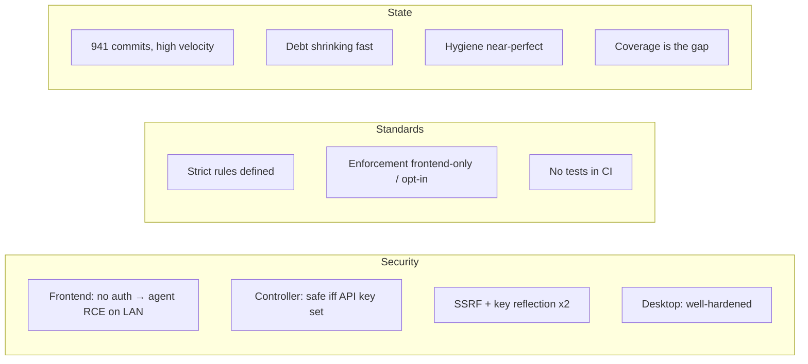

# vLLM Studio — Security, Standards & State

This is a companion wiki to [`droid-wiki/`](../droid-wiki/overview/index.md). Where
that wiki explains *what vLLM Studio is and how it works*, this one assesses
*how sound it is* — along three axes:

- **[Security](security/index.md)** — the codebase as an attack surface: trust
  boundaries, what an unauthenticated peer can reach, the agent-runtime RCE
  surface, SSRF paths, supply-chain risk, and a prioritized risk register.
- **[Standards](standards/index.md)** — the rules the project holds itself to
  (strict TS, banned effects, file-size caps, single-source contracts,
  conventional commits) and the gap between what is *defined* and what is
  *automatically enforced*.
- **[State](state/index.md)** — the measured condition today: size, momentum,
  debt, hygiene, and the open roadmap.

Every claim is grounded in the working tree at commit **`d9ede391`**
(2026-06-09, branch `main`) with file:line citations. Nothing here asserts a
guarantee the code does not show; where something could not be verified from
the repo, it says so.

## Executive summary

vLLM Studio is a fast-moving, unusually clean, local-first developer tool whose
security model is almost entirely about **reachability**. Its standards
apparatus is strong on paper; its enforcement is uneven. Its code health is
excellent and improving. The three sections expand each of these.

### What's strong

- **Code hygiene.** Zero `TODO`/`FIXME`/`HACK` across the tree, one
  `eslint-disable` in the whole frontend, one `any` in the controller. The
  largest non-data source file fell from 2,031 to 612 lines in the week before
  this audit.
- **The Electron desktop** is hardened correctly — context isolation, sandbox,
  no node integration, origin-locked navigation, an explicit IPC allowlist, a
  loopback-only embedded server, no custom protocol handlers.
- **Defensive controls that exist are real**: constant-time key comparison, a
  CORS allowlist, path-traversal confinement, an exemplary SSRF guard on the
  browser-fetch route, chat content never persisted, clean git secret hygiene,
  and a registry-only dependency graph with committed lockfiles.

### What needs attention

- **The frontend has no authentication.** Its in-process agent runtime, a
  direct terminal endpoint, and a file-read endpoint are reachable by anyone
  who can reach `:3000` — unauthenticated RCE in the documented LAN deployment.
  This is the dominant risk.
- **The controller is unauthenticated when no API key is set** (the loopback
  default), which turns its recipe-launch and runtime-upgrade endpoints into
  open code-execution primitives.
- **Two SSRF + credential-reflection paths** can send an API key to an
  attacker-controlled host.
- **`next ^16.1.6` carries a high-severity advisory cluster**; upgrading is the
  cheapest single win.
- **Enforcement is uneven**: local hooks gate the frontend only, no tests run
  in CI, the contracts validator runs nowhere automatic, and the controller
  typecheck is currently red.

The full, prioritized list with remediations is the
[risk register](security/risk-register.md), and the
[enforcement matrix](standards/enforcement-matrix.md) does the same for
standards.

## How this wiki was built

Five read-only analysis passes over the working tree fed these pages: a
controller security audit, a frontend + agent-runtime audit, a desktop / CLI /
supply-chain audit, a standards-and-process audit, and a state-and-metrics
measurement. Findings were cross-checked against the source and against the
existing `droid-wiki` before being written up here. The methodology and the
date are recorded so the analysis can be reproduced and re-dated.

## See also

- [`droid-wiki/`](../droid-wiki/overview/index.md) — the architecture and
  systems reference this wiki complements.
- [`droid-wiki/security.md`](../droid-wiki/security.md) — the
  intended-controls view of security; this wiki's
  [Security section](security/index.md) is the adversarial counterpart.
