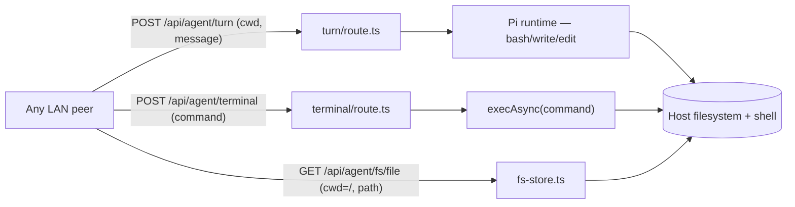

# Frontend and agent-runtime security

The frontend (`frontend/`, Next.js 16, default port `:3000`) serves the web UI,
the API routes behind it, and — most importantly — the **in-process Pi coding
agent** that runs inside the Next.js Node process and has file-read, file-write,
and shell-execution tools. This page describes that surface as of commit
`d9ede391` (2026-06-09), with file:line citations.

> **The headline.** There is **no authentication anywhere in the frontend.**
> There is no `middleware.ts`, and no route reads any token, cookie, or secret
> to gate access. Next.js runs in `output: "standalone"` mode
> (`next.config.ts:10`), which binds `0.0.0.0`, and the documented homelab
> deploy exposes it on the LAN at `:3000`. Every endpoint below is reachable by
> anyone who can reach the port. Combined with the agent's tools, that means
> **unauthenticated remote code execution on the host** for any peer on the
> network. This is the single dominant risk in the codebase.

## The agent runtime is unconfined RCE by design

The runtime (`frontend/src/lib/agent/`) drives the Pi SDK
(`@earendil-works/pi-coding-agent`). It is created with `noExtensions: true`
(`pi-sdk-runtime.ts:144`), which disables *user* drop-in extensions but **not**
the SDK's built-in tool suite — `bash`, `read`, `write`, `edit`, `find`,
`grep`, `ls` all load. The `bash` tool spawns a real shell
(`spawn(shell, [...args, command], { cwd, detached })`).

Three properties remove any confinement:

1. **The working directory is client-supplied per turn.**
   `AgentTurnRequest.cwd` (`contracts/turn.ts:23`) is resolved by
   `resolveAgentCwd` (`pi-runtime-helpers.ts:84-95`), which only checks that
   the path exists and is a directory. It can be `/`, `~`, or any directory on
   the host.
2. **There is no approval gate, confirmation, or read-only mode** in the server
   path. The only first-party policy extension,
   `vllm-studio-agent-policy.ts:18-23`, just appends an "artifact policy"
   string to the system prompt — it restricts no tool. The SDK's interactive
   approval is a TUI feature; the server calls `session.prompt(...)`
   non-interactively (`pi-sdk-runtime.ts:220`), so tools run autonomously.
3. **The invoking endpoint is unauthenticated.** `POST /api/agent/turn`
   (`turn/route.ts:138`) validates only JSON shape, then starts a session and
   runs the prompt.

So any LAN client can send a turn with an arbitrary `cwd`, an arbitrary
message, and a chosen model, and the in-process agent will read/write/edit
files and run shell commands on the frontend host with the server process's
privileges.

### Two routes are RCE/arbitrary-read even without the model

- **`POST /api/agent/terminal`** runs
  `execAsync(command, { cwd, maxBuffer: 2MB, timeout: 60s })`
  (`terminal/route.ts:42`). `command` is any string with no validation or
  allowlist (`contracts/terminal.ts:13-18`); `cwd` need only be an existing
  directory. Unauthenticated direct shell execution.
- **`GET /api/agent/fs/file`** reads files via `ensureInside`
  (`fs-store.ts:20-26`), which computes containment with
  `path.relative(rootCwd, target)` where `rootCwd` is the client-supplied
  `cwd`. Setting `cwd=/` and `path=etc/passwd` passes containment and reads
  `/etc/passwd`. The code comment claims symlink protection, but
  `path.resolve` does not resolve symlinks, so a symlink inside the root also
  escapes (`fs-store.ts:19,67`).

## Other unauthenticated routes worth privilege

None of the frontend's API routes require auth. Beyond the three above:

- **`POST /api/settings`** writes `backendUrl`/`apiKey`/`voiceUrl`/`voiceModel`
  to `~/.vllm-studio/api-settings.json` (`settings/route.ts:48`) — an attacker
  can repoint the backend or overwrite the stored API key. (GET masks the key,
  a positive.)
- **`POST /api/agent/git`** runs `git` via `execFile("git", args)` against any
  absolute `cwd` (`git/service.ts:45`) — `init`, `commit`, `push`,
  `checkout`, `createBranch` on any repo on the host. Uses an arg array, so no
  shell injection, but the actions themselves are privileged.
- The full `agent/*` control surface (`abort`, `compact`, `runtime/*`,
  `sessions`, `canvas`, `comments`, `git-diff`, `models`, `skills`, `plugins`)
  is open and reads disk metadata or drives the in-process runtime.

Two routes do a caller-origin check, but only via the spoofable `Host` header:
`agent/directories` (loopback-gated unless
`VLLM_STUDIO_ENABLE_REMOTE_DIRECTORY_BROWSER=1`, and root-confined — a genuine
positive) and `agent/browser/localhosts`.

## The proxy route: SSRF guard and its gaps

`frontend/src/app/api/proxy/[...path]/route.ts` forwards browser requests to
the controller and guards against pointing the proxy at internal hosts.
Mechanics: `normalizeBackendUrl` accepts only `http(s)` (`:67-78`);
`isPrivateUrl` blocks `localhost`, `127.0.0.1`, `::1`, `0.0.0.0`,
`.local`/`.internal`, and RFC1918/link-local IPv4 (`:109-134`), failing closed
on parse error; `isTrustedPrivateOverride` trusts all private IPs in desktop
mode and otherwise only allowlisted origins (`:136-144`). A private override
via header returns 403; via cookie it is silently dropped.

Real gaps:

- **Public-host override leaks the API key (high).** `isPrivateUrl` gates only
  *private* targets. A *public* `x-backend-url` is accepted with no allowlist,
  and the proxy attaches the server's configured key as `Authorization: Bearer`
  to it (`:208-209`, `:393-394`). One header sends the controller/upstream key
  to an attacker-controlled server.
- **DNS rebinding (medium).** `isPrivateUrl` inspects the literal hostname
  string (`:112`) and never resolves DNS, so a public hostname resolving to
  `127.0.0.1` or `169.254.169.254` passes and `fetch` (`:326`) connects to the
  private address.
- **Redirect following (medium).** The proxy uses bare `fetch` with the
  default `redirect: "follow"` and does not re-check `isPrivateUrl` per hop, so
  an upstream 3xx to a private/metadata URL is followed.
- **IPv6 gaps (info).** Only literal `::1` is blocked; ULA (`fc00::/7`),
  link-local (`fe80::`), and IPv4-mapped (`::ffff:127.0.0.1`) are not.

The contrast worth noting: the **`agent/browser/fetch`** route is exemplary —
it resolves DNS and pins the resolved IP through a custom `lookup`
(`browser/fetch/route.ts:185-189`), re-sanitizes every redirect, caps the body
at 512 KB, times out at 12 s, and strips `<script>/<style>/<iframe>/<svg>`. The
proxy route lacks all of these.

### Proxy positives

- The `api_key` query param is stripped and never forwarded as a query param —
  it is converted to a Bearer header only (`:367-376`).
- Forwarded request headers are allowlisted to `Accept`, `Content-Type`,
  `Authorization`; incoming `Cookie` and arbitrary headers are not forwarded.
- Per-path timeouts via `AbortController`; override values redacted in logs.

## Prompt injection compounds the agent surface

Because the agent can fetch web pages (`agent/browser/fetch`) and read files
(`read`/`grep`/`ls`), untrusted content re-enters the model context, and the
**same turn** can call `bash`/`write`/`edit` with no approval. A malicious web
page or a poisoned file in the working directory can steer the agent into
running commands. The only mitigation is the prompt-level artifact policy,
which is not a security control.

## Plugins / MCP: code-from-disk path

The MCP plugin loader reads a `.mcp.json` whose path derives from a
client-supplied plugin `path` and, for each entry, calls
`spawn(command, config.args, { cwd, env: {...process.env, ...config.env} })`
(`mcp-plugin.ts:124-128`) with no allowlist or integrity check; the spawned
child inherits the parent env, including the API key. In practice this is
subsumed by the terminal/agent RCE, but it is an independent path. The SDK's
extension loader is otherwise constrained by `noExtensions: true` and a
first-party-only extension path list.

## XSS, headers, and storage

XSS posture is actually reasonable, but rests on a thin margin:

- Markdown renders via `react-markdown` + `remark-gfm` **without `rehype-raw`**
  (`assistant-markdown.tsx:12-13`), so raw HTML in model output is not rendered
  — a strong positive.
- The four `dangerouslySetInnerHTML` sinks (`assistant-markdown.tsx:112`,
  `tool-block-view.tsx:220`, `filesystem-file-viewer.tsx:134`, plus a static
  theme script in `layout.tsx:84`) inject **highlight.js** output, which
  HTML-escapes its input (`highlight-cache.ts:35-50`). Safe today, but these
  are deliberate raw-HTML sinks whose safety depends entirely on that escaping.
- Terminal output renders via `@xterm/xterm` (canvas/DOM, no HTML execution).
- **There is no CSP, `X-Frame-Options`, `X-Content-Type-Options`, or HSTS** —
  `next.config.ts` defines no `headers()` function. So there is no backstop if
  any of the above sinks ever regresses, and the app is clickjackable.

Storage: the API key never reaches the client (masked in the settings GET) and
is stored server-side at `~/.vllm-studio/api-settings.json` with `chmod 0600`
(`api-settings.ts:43`) — **plaintext, but owner-only**. The
`vllmstudio_backend_url` cookie is JS-set (so not `httpOnly`) and `Secure` only
over HTTPS; it holds only a URL, but it is the same override the proxy honors,
so a script that sets it can redirect proxy traffic.

## See also

- [Controller security](controller.md) — the layer the proxy forwards to.
- [Threat model](threat-model.md)
- [Risk register](risk-register.md) — these findings, prioritized.
- droid-wiki: [Pi agent runtime](../../droid-wiki/systems/pi-agent-runtime.md),
  [Agent workspace](../../droid-wiki/systems/agent-workspace.md).
