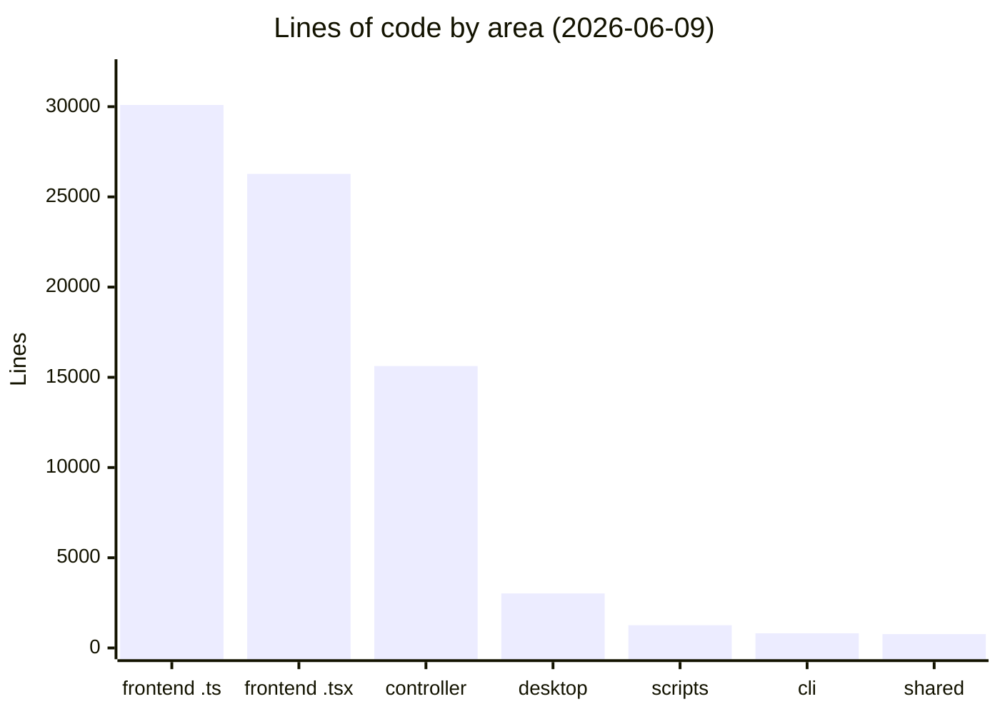
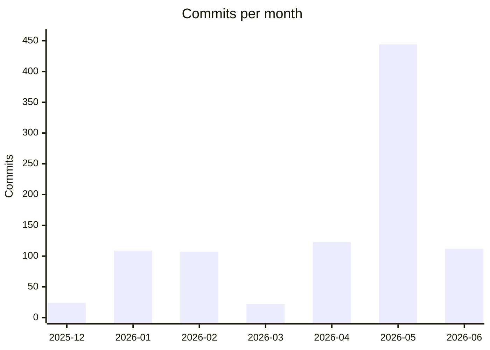

# By the numbers

Data collected on 2026-06-09 at commit `d9ede391` on `main`. Counts come from
read-only `git ls-files`, `wc -l`, and `grep` runs against tracked files. The
working tree carried two dirty files at measurement time (two one-line styling
tweaks in the agent timeline), so figures effectively reflect HEAD.

## Size

| Area | Files | Lines |
| --- | --- | --- |
| `controller/src` (`.ts`) | 128 | 15,625 |
| `frontend/src` (`.ts`) | 275 | 30,094 |
| `frontend/src` (`.tsx`) | 163 | 26,276 |
| `frontend/desktop` | 22 | 3,021 |
| `cli` | 13 | 812 |
| `shared` | 5 | 769 |
| `scripts` | 11 | 1,261 |

`frontend/src` totals 438 files and 56,370 lines — about 3.6× the controller.
The two main source trees together hold **71,995 lines** of TypeScript.
Compared with the 2026-06-02 snapshot (~75k including desktop), total size is
essentially flat while the file count rose: a week of heavy decomposition
split code into more, smaller files without net growth.

## Largest source files

Top of `git ls-files frontend/src controller/src | grep -E '\.(ts|tsx)$' | xargs wc -l | sort -rn`:

| Lines | File |
| --- | --- |
| 1452 | `frontend/src/lib/themes.ts` |
| 612 | `frontend/src/app/agent/_components/agent-browser.tsx` |
| 566 | `controller/src/modules/system/metrics-collector/metrics-collector.ts` |
| 559 | `frontend/src/lib/api/core.ts` |
| 537 | `frontend/src/app/api/proxy/[...path]/route.ts` |
| 536 | `frontend/src/app/agent/_components/timeline/session-pane-block-router.tsx` |
| 501 | `frontend/src/lib/agent/workspace/effects.ts` |

Only **seven** files in `frontend/src` + `controller/src` exceed the 500-line
lint cap, and the largest (`themes.ts`) is a data table with its own
`max-lines` exemption. On 2026-06-02 the largest file was
`chat-pane.tsx` at **2,031** lines; a week later the largest non-data file is
**612** lines. That is the single clearest before/after measurement of the
June decomposition campaign (see
[Activity and momentum](activity-and-momentum.md)).

## Commit history

**941 commits** total (`git rev-list --count HEAD`), first commit 2025-12-18.

June 2026 already shows 112 commits in nine days — on pace to rival May's
record 444 if sustained.

## Tests

| Location | Files | Test cases (`test(` / `it(`) |
| --- | --- | --- |
| `tests/controller` (integration) | 4 | 49 |
| `tests/frontend` (e2e) | 10 | 102 |
| `frontend/tests/e2e/ui-shell.spec.ts` | 1 | 2 |
| In-`src` unit tests | 0 | 0 |
| **Total** | **15** | **153** |

All testing is integration/e2e in dedicated test trees; nothing unit-level
lives beside the source. Source files outnumber test files roughly **39:1**.
This is the project's thinnest dimension and is an explicit, tracked backlog
item — see [Roadmap and open work](roadmap.md).

## Dependencies

Direct dependency counts per `package.json`:

| Package | `dependencies` | `devDependencies` |
| --- | --- | --- |
| root | 0 | 0 |
| `controller` | 7 | 12 |
| `frontend` | 17 | 21 |
| `cli` | 0 | 8 |

Key framework versions: Next.js `^16.1.6`, React `19.2.1`, Electron `^36.3.2`,
Hono `4.6.12`, Zod `3.25.76`, `@earendil-works/pi-coding-agent` `0.78.1`
(frontend) and `@earendil-works/pi-ai` `0.75.5` (controller), `prom-client`
`15.1.3`. The controller's runtime dependency list is deliberately lean —
seven packages. The root `package.json` is a scripts-only orchestrator with no
dependencies of its own.

## See also

- [Activity and momentum](activity-and-momentum.md)
- [Debt and hygiene](debt-and-hygiene.md)
- [Supply chain and CI](../security/supply-chain-and-ci.md)
