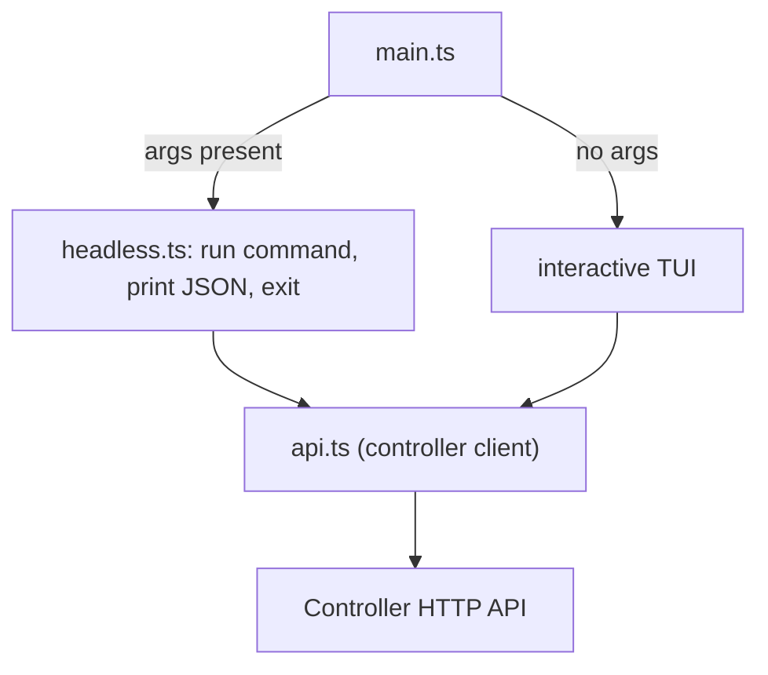

# CLI

The CLI is a Bun terminal client for a vLLM Studio controller. It has two modes: an interactive TUI (dashboard, recipes, status, config) that polls the controller every 2 seconds, and a headless command mode that prints JSON for scripting. It never spawns inference itself; it calls controller HTTP routes.

Active contributors: Sero

## Purpose

This page covers the CLI as a deployable unit: its entry point and mode split, the controller HTTP client, the TUI views and key handling, and configuration. It is a thin client over the [Controller](controller.md) API.

## Directory layout

```
cli/src/
├── main.ts        TUI entry; routes to headless if args present
├── headless.ts    arg-routed command handlers (JSON output)
├── api.ts         controller HTTP client + response normalization
├── types.ts       View, GPU, Recipe, Status, Config, AppState types
├── ansi.ts        color/clear/table/format helpers
├── render.ts      header/footer + view dispatch
├── input.ts       raw-mode TTY key parsing
└── views/
    ├── dashboard.ts   GPUs, lifetime metrics, status
    ├── recipes.ts     recipe list + selection
    ├── status.ts      running-model status
    └── config.ts      controller config
```

`cli/CLI_REFERENCE.md` documents the commands in more detail.

## Entry point and mode split

`cli/src/main.ts` decides the mode by argument count. If any CLI args are present (`process.argv.length > 2`), it dynamically imports `cli/src/headless.ts`, runs the command, and exits. With no args, it starts the interactive TUI.



## Interactive TUI

In TUI mode `main.ts` holds an `AppState` (`cli/src/types.ts`) and drives a render loop:

- **Polling**: a `setInterval` calls `refresh()` every 2000 ms. `refresh()` runs `Promise.allSettled` over `fetchGPUs`, `fetchRecipes`, `fetchStatus`, `fetchConfig`, and `fetchLifetimeMetrics`, updating `AppState` per result and surfacing the first failure as `state.error`. The timer is `unref()`'d so it does not keep the process alive on its own.
- **Rendering**: `render(state)` (`cli/src/render.ts`) draws a tabbed header, the active view, an optional error line, and a key-hint footer. Views dispatch by `state.view`: `renderDashboard`, `renderRecipes`, `renderStatus`, `renderConfig` (`cli/src/views/`). The dashboard shows a per-GPU table (VRAM/util/temp/power), lifetime tokens/requests/energy, and the launch status line (`cli/src/views/dashboard.ts`).
- **Input**: `setupInput` (`cli/src/input.ts`) puts stdin into raw mode (and exits if there is no TTY), maps escape sequences to logical keys, and forwards them to `handleKey` in `main.ts`.
- **Key handling** (`cli/src/main.ts`):
  - `1`–`4` switch views (dashboard/recipes/status/config).
  - `up`/`down` move `selectedIndex` within recipes.
  - `enter` on the recipes view launches the selected recipe (`api.launchRecipe`).
  - `e` evicts the running model when one is running (`api.evictModel`).
  - `r` forces a refresh; `q` or `ctrl-c` cleans up (clear interval, restore stdin, show cursor) and exits.

## Headless mode

`cli/src/headless.ts` maps the first argument to a handler in a `COMMANDS` table and prints JSON to stdout. A non-zero exit code signals failure; unknown commands and errors print to stderr and exit 1.

| Command | Action |
| --- | --- |
| `status` | Print model status JSON |
| `gpus` | Print GPU list JSON |
| `recipes` | Print recipe list JSON |
| `config` | Print controller config JSON |
| `metrics` | Print lifetime metrics JSON |
| `launch <id>` | Launch a recipe; exit 0/1 on success/failure |
| `evict` | Stop the running model; exit 0/1 |
| `help` | Print usage |

## Controller client

`cli/src/api.ts` is the single HTTP layer. `requestJson` builds the URL from the base URL, sets `Content-Type` for bodies and `X-API-Key` when `VLLM_STUDIO_API_KEY` is set, parses the response, and throws a typed `CliApiError` (with method/path/status) on network or non-2xx failures. Each fetcher normalizes the controller payload into the local types in `cli/src/types.ts` (for example `fetchStatus` flattens the nested `process` object into `model`/`backend`/`pid`/`port`, and `fetchLifetimeMetrics` maps `tokens_total`/`requests_total`/`energy_kwh` into the CLI's `total_*` fields). Endpoints used: `GET /gpus`, `GET /recipes`, `GET /status`, `GET /config`, `GET /lifetime-metrics`, `POST /launch/{id}`, `POST /evict`.

## Configuration

- `VLLM_STUDIO_URL` — controller base URL. Defaults to `http://localhost:8080`. A trailing slash is stripped (`cli/src/api.ts`).
- `VLLM_STUDIO_API_KEY` — optional. When set, sent as `X-API-Key` on every request, satisfying the controller's [mutating-request auth](controller.md#middleware-stack).

The CLI discovers nothing locally; runtime support follows whatever the connected controller exposes.

## Integration points

- **Controller**: the only dependency. The CLI consumes the same routes the frontend uses, so its capabilities track the [Controller](controller.md) API and the [engine lifecycle](../systems/engine-lifecycle.md).
- **Runtimes**: indirect. Which backends can launch/evict depends on the controller's [runtime backends](../systems/runtime-backends.md) discovery, not the CLI.

## Entry points for modification

- Add a headless command: add an entry to `COMMANDS` in `cli/src/headless.ts` and a fetcher in `cli/src/api.ts` if needed.
- Add a TUI key/action: extend `handleKey` in `cli/src/main.ts`.
- Add or change a view: add a renderer in `cli/src/views/` and wire it into `VIEWS` in `cli/src/render.ts`.
- Add a controller call: add a fetcher to `cli/src/api.ts` and a type to `cli/src/types.ts`.

## Key source files

| File | Purpose |
| --- | --- |
| `cli/src/main.ts` | TUI entry, mode split, polling, key handling |
| `cli/src/headless.ts` | Arg-routed headless commands and JSON output |
| `cli/src/api.ts` | Controller HTTP client and response normalization |
| `cli/src/types.ts` | View/state and payload types |
| `cli/src/render.ts` | Header/footer and view dispatch |
| `cli/src/input.ts` | Raw-mode TTY key parsing |
| `cli/src/views/dashboard.ts` | GPU table, lifetime metrics, status line |
| `cli/CLI_REFERENCE.md` | Command reference |
