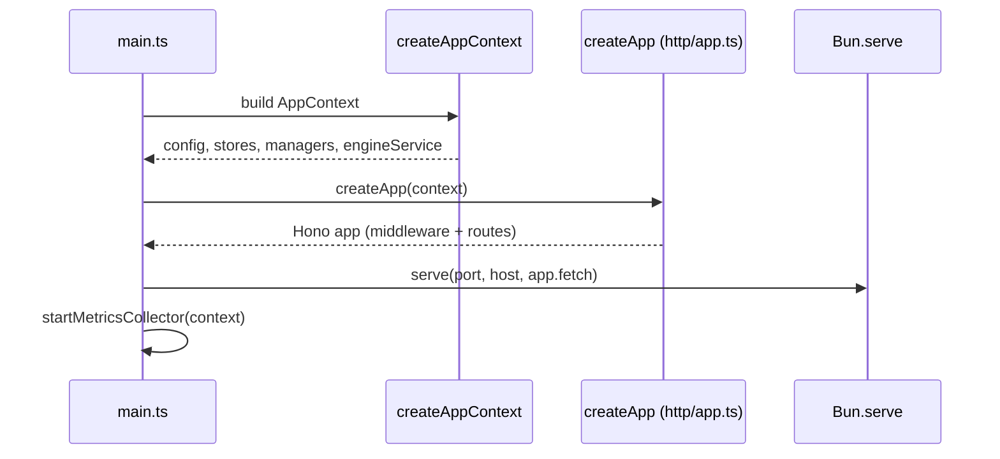

# Controller

The controller is the Bun + Hono HTTP API that owns model lifecycle, runtime backend discovery, the OpenAI-compatible inference proxy, downloads, metrics, logs, and settings. It is the only unit that spawns inference processes; the frontend, desktop shell, and CLI are all clients of it.

Active contributors: Sero

## Purpose

This page describes the controller as a deployable unit: how it boots, the middleware stack every request passes through, how module routes are mounted, the controller-to-controller routing passthrough, OpenAPI docs, the health endpoint, SQLite store wiring, and how it is run. Deep internals (the lifecycle state machine, proxy stream parsing, metrics collection) are cross-linked to systems pages rather than repeated here.

## Directory layout

```
controller/src/
├── main.ts                 process entry, Bun.serve, metrics collector
├── app-context.ts          builds shared AppContext (config, stores, managers)
├── config/env.ts           VLLM_STUDIO_* env parsing (Zod)
├── core/
│   ├── errors.ts           typed HttpStatus errors
│   └── logger.ts           file + SSE logger
├── http/
│   ├── app.ts              Hono app, middleware, route mounting
│   ├── security-middleware.ts    auth + rate limit
│   ├── observability-middleware.ts   per-request recording
│   └── openapi-spec.ts     OpenAPI 3.1 spec builder
├── modules/
│   ├── engines/routes.ts   launch/evict/status, recipes, runtime info
│   ├── models/routes.ts    recipe + model discovery
│   ├── proxy/routes.ts     OpenAI-compatible proxy
│   ├── studio/routes.ts    studio model/download surfaces
│   ├── system/routes.ts    status, gpus, config, metrics, events, logs
│   └── audio/routes.ts     STT/TTS
└── stores/                 SQLite-backed stores
```

## How it boots

Boot is a three-step chain. `controller/src/main.ts` builds the dependency container, constructs the Hono app, then serves it with `Bun.serve`.

1. `createAppContext()` (`controller/src/app-context.ts`) reads config via `createConfig()` (`controller/src/config/env.ts`), creates the data directory, opens the SQLite stores against `config.db_path`, and wires the event manager, logger, launch state, metrics registry, process manager, download manager, and engine coordinator into a single `AppContext`.
2. `createApp(context)` (`controller/src/http/app.ts`) builds the Hono app, installs middleware, and mounts module routes.
3. `main.ts` calls `Bun.serve({ port, hostname, fetch: app.fetch, idleTimeout: 120 })`, logs the listen address, and starts the background metrics collector unless `VLLM_STUDIO_DISABLE_METRICS` is set. `SIGINT`/`SIGTERM` stop the metrics collector and the server.



## Middleware stack

Every request flows through middleware registered in `controller/src/http/app.ts`, in this order:

1. **CORS** (`hono/cors`) — origin is allowed only if it is in `config.cors_origins` (defaults include localhost:3000/3001 and `host.docker.internal`, parsed in `controller/src/config/env.ts`). Exposes rate-limit headers and `Retry-After`.
2. **Debug request logging** — logs `METHOD path` at debug level, skipping `/health`, `/metrics`, `/events`, `/status`, `/api/docs`, `/api/spec`.
3. **Observability** (`controller/src/http/observability-middleware.ts`) — times each request and records method, path, status, duration, success, and error class/message to `controllerRequestStore`.
4. **Rate limit** (`createMutatingRateLimitMiddleware`, `controller/src/http/security-middleware.ts`) — applies only to mutating methods (POST/PUT/PATCH/DELETE), keyed by client IP + method + path. Default 120 requests per 60s; sets `X-RateLimit-*` headers and returns 429 with `Retry-After` when exceeded.
5. **Auth** (`createMutatingAuthMiddleware`) — if `config.api_key` is set, mutating requests must present a matching `Authorization: Bearer <key>` or `X-API-Key`, compared with `timingSafeEqual`. `/health` and `OPTIONS` are always public. With no API key configured, requests pass through.

Auth and rate limiting deliberately target only mutating requests; GET traffic (status, metrics, models) is not gated by the API key. The key requirement is enforced at config time: binding to a non-loopback host without an API key throws unless `VLLM_STUDIO_ALLOW_UNAUTHENTICATED=true` (`controller/src/config/env.ts`).

## Module route registration

After middleware, `createApp` mounts each module's routes by calling its `register*Routes(app, context)` function:

| Module | Registration | Representative routes |
| --- | --- | --- |
| System | `registerSystemRoutes` (`controller/src/modules/system/routes.ts`) | `/status`, `/gpus`, `/config`, `/events`, `/metrics`, logs |
| Engines | `registerEngineRoutes` (`controller/src/modules/engines/routes.ts`) | `/launch/{id}`, `/evict`, `/recipes`, `/runtime/*` |
| Models | `registerModelsRoutes` (`controller/src/modules/models/routes.ts`) | recipe + model discovery |
| Studio | `registerStudioRoutes` (`controller/src/modules/studio/routes.ts`) | studio model/download surfaces |
| Audio | `registerAudioRoutes` (`controller/src/modules/audio/routes.ts`) | STT/TTS |
| Proxy | `registerAllProxyRoutes` (`controller/src/modules/proxy/routes.ts`) | `/v1/*` OpenAI-compatible |

The deep behavior behind these routes lives in systems pages: [engine lifecycle](../systems/engine-lifecycle.md) for launch/evict/status, [runtime backends](../systems/runtime-backends.md) for `/runtime/*` discovery, [inference proxy](../systems/inference-proxy.md) for `/v1/*`, [downloads](../systems/downloads.md) for the download manager, [metrics and observability](../systems/metrics-and-observability.md) for `/metrics` and request recording, and [eventing and SSE](../systems/eventing-and-sse.md) for `/events` and log streaming.

## Controller-to-controller routing

`app.all("/controllers/route/*")` (`controller/src/http/app.ts`) is a passthrough that lets one controller forward a request to another. The target controller URL comes from the `target` query param or the `x-vllm-target-controller` header and must be `http(s)`. The path suffix after `/controllers/route/` is appended to the target, non-`target` query params are forwarded, the body is cloned for non-GET/HEAD methods, and the upstream response is returned with an added `x-vllm-routed-controller` header. This is how the frontend can drive a remote controller through a local one.

## OpenAPI docs and health

- `GET /api/spec` returns the OpenAPI 3.1 document built by `createOpenApiSpec(context)` (`controller/src/http/openapi-spec.ts`). The spec documents core endpoints (status, gpus, config, compat, `/runtime/*` info and upgrades, recipes, launch/evict, lifetime-metrics) and uses the live `config.port` for the server URL.
- `GET /api/docs` serves Swagger UI (`@hono/swagger-ui`) pointed at `/api/spec`.
- `GET /health` returns `{ status: "ok" }` and is the only path exempt from auth.

Error handling is centralized in `app.onError`: typed `HttpStatus` errors (`controller/src/core/errors.ts`) return their status and `detail`; client-disconnect/abort errors return a terminal 499 instead of logging as failures; anything else logs and returns 500. Unknown paths return a 404 `{ detail: "Not Found" }`.

## SQLite stores wiring

`createAppContext` opens all stores against a single SQLite file at `resolve(config.db_path)` (default `data/controller.db`) and exposes them on `context.stores`:

| Store | File | Role |
| --- | --- | --- |
| `recipeStore` | `controller/src/modules/models/recipes/recipe-store.ts` | Model launch recipes |
| `downloadStore` | `controller/src/modules/engines/downloads/download-store.ts` | Download records |
| `peakMetricsStore` | `controller/src/modules/system/metrics-store.ts` | Peak metric values |
| `lifetimeMetricsStore` | `controller/src/modules/system/metrics-store.ts` | Cumulative tokens/requests/energy |
| `inferenceRequestStore` | `controller/src/stores/inference-request-store.ts` | Inference accounting |
| `controllerSettingsStore` | `controller/src/stores/controller-settings-store.ts` | Persisted controller settings |
| `controllerRequestStore` | `controller/src/stores/controller-request-store.ts` | Per-request observability records |

`lifetimeMetricsStore.ensureFirstStarted()` is called at boot to seed the first-start timestamp. All stores use `bun:sqlite`.

## How it's run and deployed

- Local: `bun src/main.ts` (or `bun --watch src/main.ts`) from `controller/`. Defaults to `127.0.0.1:8080`.
- Remote: the controller runs natively under Bun on the GPU server; deploys go through `scripts/deploy-remote.sh` (see `AGENTS.md`). Host/port and secrets come from `.env.local` and `VLLM_STUDIO_*` env vars parsed in `controller/src/config/env.ts`.

## Integration points

- **Frontend / desktop**: call controller routes for status, runtime targets, recipes, proxy, and events. The Pi agent reaches models through the controller's `/v1/*` proxy.
- **CLI**: hits `/status`, `/gpus`, `/recipes`, `/config`, `/lifetime-metrics`, `/launch/{id}`, `/evict` (see [CLI](cli.md)).
- **Other controllers**: reachable via `/controllers/route/*`.
- **Inference processes**: spawned and supervised by the engine coordinator wired in `controller/src/app-context.ts`.

## Entry points for modification

- Add a route module: write `register*Routes(app, context)` and mount it in `controller/src/http/app.ts`.
- Change middleware/auth/rate limits: `controller/src/http/security-middleware.ts` and the middleware block in `controller/src/http/app.ts`.
- Add config/env: extend the Zod schema in `controller/src/config/env.ts` and the `Config` interface.
- Add a store: construct it in `controller/src/app-context.ts` and expose it on `context.stores`.
- Document an endpoint: add it to `controller/src/http/openapi-spec.ts`.

## Key source files

| File | Purpose |
| --- | --- |
| `controller/src/main.ts` | Process entry, `Bun.serve`, metrics collector start, shutdown |
| `controller/src/app-context.ts` | Builds `AppContext`: config, stores, managers, engine coordinator |
| `controller/src/http/app.ts` | Hono app, middleware stack, route mounting, `/controllers/route/*`, error handling |
| `controller/src/http/security-middleware.ts` | Mutating-request auth and rate limiting |
| `controller/src/http/observability-middleware.ts` | Per-request timing and recording |
| `controller/src/http/openapi-spec.ts` | OpenAPI 3.1 spec for `/api/spec` and `/api/docs` |
| `controller/src/config/env.ts` | `VLLM_STUDIO_*` config parsing and validation |
| `controller/src/core/errors.ts` | Typed `HttpStatus` errors used by `onError` |
