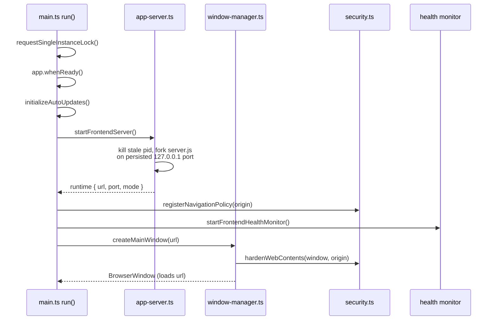

# Desktop app

`frontend/desktop/` is the Electron shell that turns the frontend into a native macOS/Windows/Linux app. The main process boots an embedded standalone Next server (the same `.next/standalone` build the web app uses), opens a single hardened window pointed at it, and exposes a small allowlisted IPC surface for projects, terminals, and updates. Because the app bundles its own copy of the frontend, web/remote deploys never update it.

**Active contributors: Sero** (GitHub [0xSero](https://github.com/0xSero) / seroxdesign)

## Purpose

- Run the frontend as a self-contained desktop app with no external server dependency (the controller is still reached over HTTP).
- Supervise an embedded standalone Next server: start it, monitor health, and restart it with backoff if it dies or hangs.
- Provide native capabilities the browser cannot: directory picker / projects store, PTY-backed terminals, auto-updates, durable preference files.
- Keep the renderer sandboxed and route every privileged call through an explicit IPC allowlist exposed by the preload bridge.

## Directory layout

```
frontend/desktop/
  main.ts                  Main process: boot, health monitor, IPC handlers, lifecycle
  app-identity.ts          Optional dev overrides for app name + userData dir
  configs.ts               DESKTOP_CONFIG, release channel, standalone/asset paths
  preload.ts               contextBridge "vllmStudioDesktop" IPC bridge
  interfaces.ts            DesktopBridge / IPC type contracts
  types.ts                 Shared desktop types (runtime, update snapshot, state)
  electron-builder.yml     Packaging config (appId, files, extraResources, signing)
  tsconfig.json            Builds desktop/*.ts → desktop/dist
  logic/
    app-server.ts          Start/stop the embedded standalone Next server
    window-manager.ts      Create the hardened BrowserWindow
    security.ts            Navigation policy + webContents hardening
    pty-manager.ts         node-pty terminal sessions
    update-manager.ts      electron-updater auto-update flow
    projects-store.ts      projects.json read/write + git metadata
  helpers/                 logger, ports, url helpers
  resources/               Bundled runtime resources (see below)
    pi-extensions/         Built-in Pi extensions (browser, canvas, mcp-plugin, ...)
    computer-use/          Computer-use MCP server + skills
    brave-bridge/          Brave/CDP browser bridge + extension
    skills/                Bundled agent skills
    icon.icns, entitlements.mac.plist
```

## Boot sequence

`frontend/desktop/main.ts` runs `run()` on load: it acquires a single-instance lock, wires lifecycle events, registers IPC handlers, waits for `app.whenReady()`, initializes auto-updates, then calls `bootstrap()`.



## Embedded standalone server

`frontend/desktop/logic/app-server.ts` owns the Next server lifecycle:

- In dev (`VLLM_STUDIO_DESKTOP_DEV_SERVER_URL` set) it skips spawning and points the window at the dev server (`mode: "dev-server"`).
- Otherwise it `fork`s `server.js` from the standalone build (`resolveStandaloneBaseDir()` in `configs.ts`; in packaged builds under `process.resourcesPath/app/frontend/.next/standalone`), in its own process group (`detached: true`) so stray signals to Electron's group don't kill it.
- The port is persisted to `embedded-frontend.port` in `userData` and reused on every launch, because the `http://127.0.0.1:<port>` origin is the storage key for all renderer state (selected controller, API key, sessions). A pid file (`embedded-frontend.pid`) lets it kill a stale server from a previous run.
- Child env sets `NODE_ENV=production`, `HOSTNAME=127.0.0.1`, `VLLM_STUDIO_DATA_DIR` (the desktop `userData` dir), `VLLM_STUDIO_RESOURCES_PATH`, `VLLM_STUDIO_AGENT_CWD` (defaults to `$HOME`), and `VLLM_STUDIO_FRONTEND_BASE`. Setting `VLLM_STUDIO_DATA_DIR` is what tells the proxy route to trust all private addresses (see [frontend](./frontend.md)).
- `waitForServer()` polls until the URL answers; `stopFrontendServer()` sends `SIGTERM` then `SIGKILL` after a grace period.

## Health monitor and restart

`main.ts` polls `${url}/api/desktop-health` every 5s with a 4s timeout. Any HTTP answer counts as alive; only a transport-level failure increments the failure count. After `HEALTH_FAILURE_THRESHOLD` (5) consecutive failures it restarts the server. `restartFrontendServer()` applies linear backoff (up to 15s) within a 60s window, reuses the persisted port, and reloads (or recreates) the window. `handleFrontendServerExit()` triggers the same restart path on unexpected exit, distinguishing expected stops via `expectedFrontendStopPids`.

## Window and navigation security

`frontend/desktop/logic/window-manager.ts` creates the single `BrowserWindow` with hardened `webPreferences`: `contextIsolation: true`, `nodeIntegration: false`, `sandbox: true`, `webSecurity: true`, `allowRunningInsecureContent: false`, a preload script, and `webviewTag: true` (DevTools gated by `VLLM_STUDIO_DESKTOP_DISABLE_DEVTOOLS`).

`frontend/desktop/logic/security.ts` locks navigation to the app origin:

- `hardenWebContents()` denies `window.open` (external `http(s)` URLs open in the system browser via `shell.openExternal`) and blocks `will-navigate` to any other origin.
- `registerNavigationPolicy()` applies to all created `WebContents`: it forces sandboxed webview preferences (`nodeIntegration=false`, `contextIsolation=true`, `sandbox=true`, no preload) and origin-locks navigation for window-owned contents while leaving guest/OOPIF iframes (e.g. the Computer sidebar) functional.

## IPC allowlist (preload bridge)

`frontend/desktop/preload.ts` exposes exactly one global, `vllmStudioDesktop`, via `contextBridge` — the renderer never gets raw Node APIs. Every method is an `ipcRenderer.invoke` to a named `desktop:*` channel handled in `main.ts` (`registerIpcHandlers`). The contract is typed in `frontend/desktop/interfaces.ts` (`DesktopBridge`).

| Bridge method | IPC channel | Handler area |
| --- | --- | --- |
| `getRuntime` | `desktop:get-runtime` | platform/version info |
| `openExternal` | `desktop:open-external` | open URL in system browser (http(s) only) |
| `getUpdateStatus` / `checkForUpdates` | `desktop:get-update-status` / `desktop:check-for-updates` | `update-manager.ts` |
| `openDirectory` / `addProject` / `removeProject` / `listProjects` | `desktop:open-directory` / `desktop:add-project` / `desktop:remove-project` / `desktop:list-projects` | `projects-store.ts` |
| `loadSessionPrefs` / `saveSessionPrefs` | `desktop:load-session-prefs` / `desktop:save-session-prefs` | atomic JSON file in `userData` |
| `loadUiPreferences` / `saveUiPreferences` | `desktop:load-ui-preferences` / `desktop:save-ui-preferences` | atomic JSON file in `userData` |
| `terminal.*` | `desktop:pty-status/open/write/resize/close` + `desktop:pty-data/exit` events | `pty-manager.ts` |
| `getPathForFile` | (none — `webUtils.getPathForFile`) | drag-drop file path resolution |

## PTY terminals

`frontend/desktop/logic/pty-manager.ts` backs the in-app terminal. It lazily loads `@lydell/node-pty` (capturing the failure into `ptyUnavailableReason()` if the native module is missing), spawns the user's login shell (`$SHELL -l`, or `cmd.exe` on Windows) in a validated cwd, and streams output to the renderer via `desktop:pty-data` events. Sessions are tracked per `WebContents` and torn down on close, exit, or window destruction; `killAllPtys()` runs on shutdown.

## Auto-updates

`frontend/desktop/logic/update-manager.ts` wraps `electron-updater`. The feed is generic and requires `VLLM_STUDIO_UPDATE_URL`; the channel comes from `DESKTOP_CONFIG.releaseChannel` (`stable`/`beta`/`alpha` via `VLLM_STUDIO_DESKTOP_CHANNEL`). When configured and packaged it auto-downloads, installs on quit, and tracks state through a `DesktopUpdateSnapshot` (idle/checking/available/downloading/downloaded/error) surfaced over IPC. `VLLM_STUDIO_DESKTOP_DISABLE_AUTO_UPDATE=true` disables it.

## App identity and config

`frontend/desktop/configs.ts` centralizes `DESKTOP_CONFIG` (app name "vLLM Studio", window sizes, 45s startup timeout, release channel, dev server URL, `userData` dir) and the packaged/dev path resolvers for the standalone build and static/public assets. `frontend/desktop/app-identity.ts` (imported first in `main.ts`) lets `VLLM_STUDIO_DESKTOP_APP_NAME` and `VLLM_STUDIO_DESKTOP_USER_DATA_DIR` override the app name and data dir — the mechanism behind the isolated beta app.

## Bundled resources

`frontend/desktop/resources/` ships runtime assets packaged via `extraResources`:

- `pi-extensions/` — built-in Pi extensions (`browser.ts`, `canvas.ts`, `parchi-browser.ts`, `cdp-browser.ts`, `mcp-plugin.ts`, `vllm-studio-timeouts.ts`).
- `computer-use/` — a computer-use MCP server (`server.mjs`) and skills.
- `brave-bridge/` — a Brave/CDP browser bridge (`bridge.mjs`), companion extension, and skills.
- `skills/` — bundled agent skills (`browser`, `canvas`).
- `icon.icns`, `entitlements.mac.plist`.

## Packaging and build modes

`frontend/desktop/electron-builder.yml` defines the bundle: `appId: org.vllm.studio.desktop`, `productName: vLLM Studio`, asar with `@lydell/**` native modules unpacked. `extraResources` copies `.next/standalone`, `.next/static` (into both the top-level and nested `frontend/` standalone roots), `public/`, and the `pi-extensions`/`skills` resources. macOS targets are signed DMG + ZIP (arm64, hardened runtime, Developer ID identity); Windows is NSIS x64; Linux is AppImage.

Build modes (from `frontend/package.json`):

- `npm run desktop:build:main` — compile `desktop/*.ts` → `desktop/dist`.
- `npm run desktop:pack` — `desktop:build` + `electron-builder --dir`: app directory only, fast, for local testing.
- `npm run desktop:dist` — `desktop:build` + full `electron-builder`: signed app plus DMG/ZIP, for release.
- `npm run desktop:dev` / `desktop:dev:beta` — run the dev server and launch Electron against it.

The desktop app must be rebuilt, reinstalled, and relaunched after any frontend change because it bundles its own frontend copy. The canonical install is `/Applications/vLLM Studio.app` (bundle id `org.vllm.studio.desktop`). Full steps are in [deployment](../deployment.md).

## Key abstractions

| Symbol | File | Description |
| --- | --- | --- |
| `bootstrap` / `run` | `frontend/desktop/main.ts` | Main-process boot, lifecycle wiring, IPC registration. |
| `startFrontendServer` / `stopFrontendServer` | `frontend/desktop/logic/app-server.ts` | Fork/teardown of the embedded standalone Next server. |
| `checkFrontendHealth` / `restartFrontendServer` | `frontend/desktop/main.ts` | Health watchdog + backoff restart. |
| `createMainWindow` | `frontend/desktop/logic/window-manager.ts` | Hardened `BrowserWindow` factory. |
| `hardenWebContents` / `registerNavigationPolicy` | `frontend/desktop/logic/security.ts` | Origin-locked navigation + sandboxed webviews. |
| `DesktopBridge` (preload) | `frontend/desktop/preload.ts`, `interfaces.ts` | Allowlisted IPC surface exposed as `window.vllmStudioDesktop`. |
| `openPty` / `killAllPtys` | `frontend/desktop/logic/pty-manager.ts` | node-pty terminal sessions. |
| `initializeAutoUpdates` / `checkForUpdates` | `frontend/desktop/logic/update-manager.ts` | electron-updater flow + state snapshot. |
| `listProjectsWithMeta` / `addProject` | `frontend/desktop/logic/projects-store.ts` | Project list persistence + git metadata. |
| `DESKTOP_CONFIG`, `resolveStandaloneBaseDir` | `frontend/desktop/configs.ts` | Config + packaged/dev path resolution. |

## Security hardening summary

- Renderer: `contextIsolation=true`, `sandbox=true`, `nodeIntegration=false`, `webSecurity=true`; no raw Node in the renderer.
- IPC: only the named `desktop:*` channels in `preload.ts`/`main.ts` are reachable; handlers validate argument types.
- Navigation: locked to the app origin; external links open in the system browser; webviews forced into sandboxed prefs.
- Server: embedded Next binds to `127.0.0.1` only; the health monitor restarts a dead/hung server.
- Single instance lock; deterministic logs under `userData/logs/desktop.log`.

See [security](../security.md) for the repo-wide model.

## Integration points

- **Frontend** — serves the same `.next/standalone` build; `VLLM_STUDIO_DATA_DIR` set by the shell changes proxy trust behavior. See [frontend](./frontend.md).
- **Controller** — reached over HTTP from the embedded frontend exactly as in the web app.
- **Pi runtime** — bundled `pi-extensions`/`skills` and the desktop terminal feed the agent; agent cwd defaults to `$HOME` or the most-recently-added project.
- **electron-updater** — generic update feed via `VLLM_STUDIO_UPDATE_URL`.

## Entry points for modification

- Server lifecycle / env passed to Next: `frontend/desktop/logic/app-server.ts`.
- New IPC capability: add a handler in `frontend/desktop/main.ts`, a method in `frontend/desktop/preload.ts`, and a type in `frontend/desktop/interfaces.ts`.
- Window/security policy: `frontend/desktop/logic/window-manager.ts` and `security.ts`.
- Packaging (files, signing, targets): `frontend/desktop/electron-builder.yml`.
- App identity / channels / paths: `frontend/desktop/configs.ts` and `app-identity.ts`.

## Key source files

| File | Description |
| --- | --- |
| `frontend/desktop/main.ts` | Boot, health monitor, IPC handlers, lifecycle. |
| `frontend/desktop/logic/app-server.ts` | Embedded standalone Next server start/stop. |
| `frontend/desktop/logic/window-manager.ts` | Hardened BrowserWindow creation. |
| `frontend/desktop/logic/security.ts` | Navigation policy + webContents hardening. |
| `frontend/desktop/logic/pty-manager.ts` | node-pty terminal sessions. |
| `frontend/desktop/logic/update-manager.ts` | electron-updater auto-update flow. |
| `frontend/desktop/logic/projects-store.ts` | projects.json persistence + git metadata. |
| `frontend/desktop/preload.ts` | contextBridge IPC bridge. |
| `frontend/desktop/interfaces.ts` | DesktopBridge / IPC type contracts. |
| `frontend/desktop/configs.ts` | DESKTOP_CONFIG + path resolution. |
| `frontend/desktop/app-identity.ts` | Dev app-name / userData overrides. |
| `frontend/desktop/electron-builder.yml` | Packaging + signing config. |

## Related pages

- [Frontend](./frontend.md)
- [Deployment](../deployment.md)
- [Security](../security.md)
