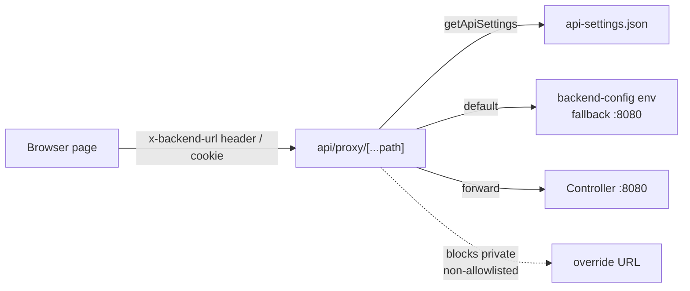
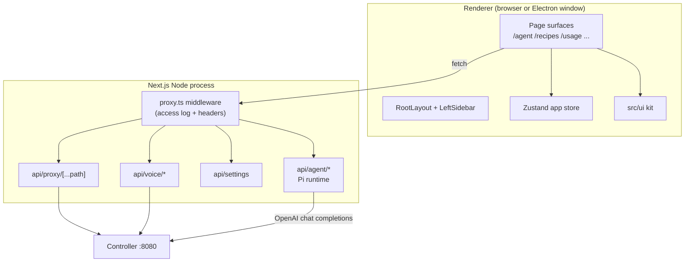

# Frontend

The `frontend/` package is a Next.js 16 App Router application that is both the web UI and a backend-for-frontend: its `src/app/api/*` routes host the in-process Pi coding-agent runtime and proxy every controller call. The same build is packaged into the Electron desktop shell (an embedded standalone Next server), so the frontend is the single source of UI and agent logic for both targets.

**Active contributors: Sero** (GitHub [0xSero](https://github.com/0xSero) / seroxdesign)

## Purpose

- Render the App Router page surfaces (`/agent`, `/recipes`, `/usage`, `/settings`, `/logs`, `/setup`, `/discover`, `/configs`, `/server`, plus the `/` status dashboard) inside a shared layout with a left sidebar.
- Host the Pi coding-agent runtime in the Next.js Node process under `src/app/api/agent/*` (no subprocess, no bundled CLI).
- Proxy all controller traffic through `src/app/api/proxy/[...path]/route.ts` so the browser never talks to the controller directly and credentials stay server-side.
- Choose which controller to talk to (env defaults, saved controllers, per-request overrides) and persist that choice across reloads.

## Directory layout

```
frontend/
  src/
    app/                      App Router pages + API routes
      layout.tsx              Root layout: fonts, theme bootstrap, LeftSidebar
      page.tsx                "/" → dashboard page
      providers.tsx           Client providers wrapper
      agent/                  /agent chat workspace (AgentWorkspace)
      recipes/                /recipes (labelled "Models" in the sidebar)
      usage/                  /usage analytics (provider + Pi sessions)
      settings/               /settings (config + setup wizard fallback)
      configs/                /configs → redirects to /settings
      discover/               /discover model catalog + downloads
      setup/                  /setup first-run wizard
      logs/                   /logs inference log browser
      server/                 /server controller health + API docs
      api/                    Route handlers (see below)
    lib/                      Non-UI logic (agent/, api/, theme/, recipes/, ...)
      backend-url.ts          Client-side controller URL storage (localStorage + cookie)
      controllers.ts          Saved controllers list + URL normalization
      backend-config.ts       Server-side env-based backend URL resolution
      api-settings.ts         Persisted backendUrl/apiKey/voice settings
      proxy-timeouts.ts       Per-path upstream timeout policy
    proxy.ts                  Next.js middleware (access logging + security headers)
    store/                    Zustand app store (theme, sidebar, UI prefs)
    ui/                       Standardized UI kit + page surfaces
    hooks/                    React hooks (effects live in *-effects.ts)
    components/dashboard/     "/" status dashboard
  scripts/start-standalone.mjs  Standalone production server launcher
  desktop/                    Electron shell (see apps/desktop.md)
  package.json                Scripts + dependencies
```

## Page surfaces

| Route | Entry file | What it is |
| --- | --- | --- |
| `/` | `frontend/src/app/page.tsx` → `frontend/src/components/dashboard/page/dashboard-page.tsx` | Status dashboard (controller + inference health). |
| `/agent` | `frontend/src/app/agent/page.tsx` | Pi coding-agent chat workspace. See [agent chat](../features/agent-chat.md). |
| `/recipes` | `frontend/src/app/recipes/page.tsx` | Saved launch configurations; sidebar label "Models". |
| `/usage` | `frontend/src/app/usage/page.tsx` | Usage analytics with `provider` and `pi-sessions` tabs. |
| `/discover` | `frontend/src/app/discover/page.tsx` | Model catalog search + download management. |
| `/settings` | `frontend/src/app/settings/page.tsx` | Controller/config settings; falls back to the setup wizard when the backend is offline and unconfigured. |
| `/configs` | `frontend/src/app/configs/page.tsx` | Redirects to `/settings`. |
| `/setup` | `frontend/src/app/setup/page.tsx` | First-run setup wizard. |
| `/logs` | `frontend/src/app/logs/page.tsx` | Inference/session log browser. |
| `/server` | `frontend/src/app/server/page.tsx` | Controller health panel + embedded OpenAPI docs iframe. |

Navigation is defined in `frontend/src/ui/left-sidebar.tsx`; `/settings` is treated as active for both `/settings` and `/configs`, and `/` covers `/` and `/discover`.

## API route groups

All route handlers live under `frontend/src/app/api/`.

| Group | Path | Role |
| --- | --- | --- |
| Agent runtime | `frontend/src/app/api/agent/*` | Hosts the Pi coding-agent: `turn`, `runtime`, `sessions`, `models`, `plugins`, `extensions`, `skills`, `fs`, `git`, `git-diff`, `terminal`, `browser`, `canvas`, `projects`, `directories`, `prompt-templates`, `compact`, `abort`, `comments`, `setup-checks`. See [Pi agent runtime](../systems/pi-agent-runtime.md), [agent workspace](../systems/agent-workspace.md), [agent tools](../features/agent-tools.md). |
| Controller proxy | `frontend/src/app/api/proxy/[...path]/route.ts` | Catch-all proxy to the active controller (GET/POST/PUT/DELETE). |
| Settings | `frontend/src/app/api/settings/route.ts` | Read/write persisted `backendUrl`, `apiKey` (masked on read), voice settings. |
| Voice | `frontend/src/app/api/voice/*` | `speak` (TTS) and `transcribe` (STT); target resolved by `voice-target.ts`. |
| Desktop health | `frontend/src/app/api/desktop-health/route.ts` | Liveness probe (`{ ok, ts }`) for the desktop supervisor's watchdog. |

## Choosing a controller

The frontend never hardcodes the controller; resolution differs between server and client.

Server-side defaults (`frontend/src/lib/backend-config.ts`) read env in priority order and fall back to `http://localhost:8080`:

- `resolveApiServerBaseUrl()` — `BACKEND_URL` → `NEXT_PUBLIC_BACKEND_URL` → `VLLM_STUDIO_BACKEND_URL`.
- `resolveSettingsDefaultBackendUrl()` — `BACKEND_URL` → `NEXT_PUBLIC_API_URL` → `NEXT_PUBLIC_BACKEND_URL`.
- `resolveControllerEventsBaseUrl()` — `NEXT_PUBLIC_BACKEND_URL` → `VLLM_STUDIO_BACKEND_URL` → `BACKEND_URL`, else `/api/proxy`.

Persisted settings (`frontend/src/lib/api-settings.ts`) store `backendUrl`/`apiKey`/voice config in a settings file under the data dir; the proxy reads these via `getApiSettings()`.

Client-side override (`frontend/src/lib/backend-url.ts`) keeps the user-selected controller in `localStorage` and a mirrored `vllmstudio_backend_url` cookie, dispatching a `vllm:backend-url-changed` event on change. Saved controllers (URL + optional API key/name) live in `localStorage` via `frontend/src/lib/controllers.ts`, whose `normalizeControllerUrl()` strips trailing slashes and `/v1`.



## The proxy route

`frontend/src/app/api/proxy/[...path]/route.ts` is the only path from browser to controller:

- Resolves the target from (in order) the `x-backend-url` header, the `vllmstudio_backend_url` cookie, or the persisted default.
- Blocks private/local override URLs unless allowlisted via `VLLM_STUDIO_PROXY_OVERRIDE_ALLOWLIST` (header overrides return 403; cookie overrides are silently ignored and cleared). The desktop app (`VLLM_STUDIO_DATA_DIR` set) trusts all private addresses.
- Injects auth as a bearer token (per-request `Authorization` wins, else the configured API key) and strips any `api_key` query param so credentials never reach the controller as query strings.
- Streams `text/event-stream` responses back unbuffered, forwards `X-Run-Id`, applies per-path timeouts from `frontend/src/lib/proxy-timeouts.ts`, retries idempotent GET/HEAD once on a dropped socket, and can fall back to the default backend on a 404/network error from a non-strict override.

Separately, `frontend/src/proxy.ts` is the Next.js middleware (it exports a `config.matcher`): it logs access lines when `VLLM_STUDIO_ACCESS_LOGS=true` and sets `X-Content-Type-Options`, `X-Frame-Options`, `X-XSS-Protection`, and `Referrer-Policy` on responses.

## Key abstractions

| Symbol | File | Description |
| --- | --- | --- |
| `RootLayout` | `frontend/src/app/layout.tsx` | Wraps pages in `Providers` + `LeftSidebar`; injects the theme bootstrap script and `--app-height` sizing. |
| `handleRequest` | `frontend/src/app/api/proxy/[...path]/route.ts` | Core proxy logic: target resolution, SSRF guard, auth injection, streaming, fallback. |
| `proxy` (middleware) | `frontend/src/proxy.ts` | Access logging + security response headers; `config.matcher` scopes it. |
| `getStoredBackendUrl` / `setStoredBackendUrl` | `frontend/src/lib/backend-url.ts` | Read/write the client controller URL (localStorage + cookie + change event). |
| `normalizeControllerUrl`, `loadSavedControllers` | `frontend/src/lib/controllers.ts` | Saved controllers list and URL canonicalization. |
| `resolveApiServerBaseUrl` and siblings | `frontend/src/lib/backend-config.ts` | Server-side env-based backend URL defaults. |
| `getApiSettings` / `saveApiSettings` | `frontend/src/lib/api-settings.ts` | Persisted `backendUrl`/`apiKey`/voice settings (`apiKey` masked on read). |
| `useAppStore` | `frontend/src/store/app-store.ts` | Zustand store for theme, fonts, sidebar, file-viewer prefs (persisted to localStorage + desktop file backup). |
| UI kit barrel | `frontend/src/ui/index.ts` | Standardized components (`Button`, `Modal`, `Tabs`, `AppPage`, `LeftSidebar`, settings/model adapters). |

## UI kit and app store

`frontend/src/ui/` is the standardized component library (primitives like `Button`/`Badge`/`Input`, compound components like `Modal`/`Tabs`/`Table`, and page surfaces such as `AppPage`, `LeftSidebar`, and the per-page `configs/`, `discover/`, `usage/`, `recipes/`, `logs/`, `setup/` folders). Everything is re-exported from `frontend/src/ui/index.ts` so library swaps happen in one place; `scripts/validate-ui-structure.mjs` (run by `check:ui-structure`) enforces the structure.

`frontend/src/store/` is the Zustand app store. `app-store.ts` composes an app slice and a theme slice, persists a subset (`themeId`, fonts, sidebar state, file-viewer prefs) under the `vllm-studio-state` key, and hydrates from a desktop file-backed UI-preferences backup on launch. Because ESLint bans React effect hooks, side effects live in external stores like this one and in `*-effects.ts` modules consumed via `useSyncExternalStore`. Theming details are in [theming](../features/theming.md).

## How it works



## Build and run modes

Scripts live in `frontend/package.json`:

- `npm run dev` — `next dev` development server (default port 3000; Mac verification uses `PORT=3001`).
- `npm run build` — `next build --webpack`, producing `.next/` including the standalone server output.
- `npm run start` — `node scripts/start-standalone.mjs`: copies `public/` and `.next/static` into the standalone server root (handling the nested `frontend/` layout) and launches `server.js` with `VLLM_STUDIO_AGENT_CWD` defaulting to the repo root.
- `npm run start:next` — plain `next start`.
- Desktop builds (`desktop:build`, `desktop:pack`, `desktop:dist`) reuse this same `.next/standalone` output. See [desktop app](./desktop.md) and [deployment](../deployment.md).
- Quality gate: `npm run check:quality` (lint, typecheck, cycles, UI structure, cleanup, build).

## Integration points

- **Controller** — all model/runtime/usage/log data comes through `api/proxy` to the controller (`http://localhost:8080` by default).
- **Pi coding-agent SDK** — `@earendil-works/pi-coding-agent` runs inside `api/agent/*`. See [Pi agent runtime](../systems/pi-agent-runtime.md).
- **Desktop shell** — `frontend/desktop/` embeds the standalone build and sets `VLLM_STUDIO_DATA_DIR`, which flips the proxy into all-private-trusted mode. See [desktop app](./desktop.md).
- **Voice services** — `api/voice/*` resolves an STT/TTS target (controller-local or external) via `voice-target.ts`.

## Entry points for modification

- Add a page: create `frontend/src/app/<route>/page.tsx` and add a nav item in `frontend/src/ui/left-sidebar.tsx`.
- Change controller selection/defaults: `frontend/src/lib/backend-config.ts` (server env) and `frontend/src/lib/backend-url.ts` / `controllers.ts` (client).
- Change proxy behavior (SSRF rules, auth, streaming, timeouts): `frontend/src/app/api/proxy/[...path]/route.ts` and `frontend/src/lib/proxy-timeouts.ts`.
- Add/adjust a shared component: `frontend/src/ui/` and re-export from `frontend/src/ui/index.ts`.
- Persisted UI/theme state: `frontend/src/store/app-store.ts` (and see [theming](../features/theming.md)).

## Key source files

| File | Description |
| --- | --- |
| `frontend/src/app/layout.tsx` | Root layout, theme bootstrap, sidebar mount. |
| `frontend/src/app/page.tsx` | `/` status dashboard entry. |
| `frontend/src/proxy.ts` | Next.js middleware: access logging + security headers. |
| `frontend/src/app/api/proxy/[...path]/route.ts` | Controller proxy with SSRF guard, auth, streaming, fallback. |
| `frontend/src/lib/backend-url.ts` | Client controller URL storage and change event. |
| `frontend/src/lib/controllers.ts` | Saved controllers + URL normalization. |
| `frontend/src/lib/backend-config.ts` | Server-side env backend URL resolution. |
| `frontend/src/lib/api-settings.ts` | Persisted backend/api-key/voice settings. |
| `frontend/src/store/app-store.ts` | Zustand app store (theme, sidebar, UI prefs). |
| `frontend/src/ui/index.ts` | Standardized UI kit barrel. |
| `frontend/scripts/start-standalone.mjs` | Standalone production server launcher. |
| `frontend/package.json` | Scripts and dependencies. |

## Related pages

- [Desktop app](./desktop.md)
- [Pi agent runtime](../systems/pi-agent-runtime.md)
- [Agent workspace](../systems/agent-workspace.md)
- [Agent chat](../features/agent-chat.md)
- [Agent tools](../features/agent-tools.md)
- [Theming](../features/theming.md)
