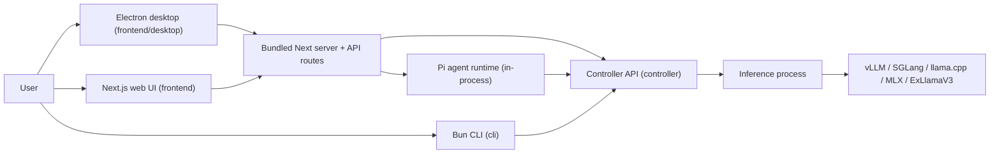

# Apps

vLLM Studio ships four deployable units from one monorepo: the controller API, the Next.js web frontend, an Electron desktop shell that embeds that frontend, and a Bun CLI. The controller owns all model lifecycle and inference; the frontend, desktop shell, and CLI are clients that talk to it over HTTP.

Active contributors: Sero

## Purpose

This page maps the repo's runnable units to their directories, runtimes, and roles, and links to the per-app pages. Read the [architecture overview](../overview/architecture.md) first for the end-to-end request lifecycle; this page is the inventory and entry point into each app.

## The four units

- **Controller** (`controller/`) — Bun + Hono HTTP API. The only unit that spawns inference processes and discovers runtime backends. Everything else is a client of it. See [Controller](controller.md).
- **Web frontend** (`frontend/`) — Next.js 16 app. Serves the web UI plus the API routes that host the in-process Pi agent runtime. Calls the controller for model/runtime data; runs the agent in the Next.js Node process. See `frontend/README.md`.
- **Desktop shell** (`frontend/desktop/`) — Electron main process that boots a bundled standalone Next server and renders it. It is the same frontend code packaged as a macOS app, not a separate UI. See `frontend/README.md`.
- **CLI** (`cli/`) — Bun terminal UI plus a headless command mode for scripting against a controller. See [CLI](cli.md).

A fifth directory, `shared/contracts/`, is not runnable but is the single source of truth for cross-process types consumed by all of the above.

## How they relate



The frontend, desktop shell, and CLI never spawn inference directly; they call the controller. The desktop shell is the web frontend wrapped in Electron. The Pi agent runs inside the Next.js server and reaches models through the controller's [inference proxy](../systems/inference-proxy.md).

## App map

| App | Directory | Runtime | Purpose |
| --- | --- | --- | --- |
| Controller | `controller/` | Bun + Hono | Model lifecycle, runtime discovery, OpenAI-compatible proxy, downloads, metrics, logs, settings, audio |
| Web frontend | `frontend/` | Next.js 16 (Node) | Web UI plus API routes hosting the in-process Pi agent runtime |
| Desktop shell | `frontend/desktop/` | Electron | macOS app embedding a standalone Next server |
| CLI | `cli/` | Bun | Terminal UI and headless commands targeting a controller |
| Shared contracts | `shared/contracts/` | n/a (types) | Cross-process type contracts used by all apps |

## Directory layout

```
vllm-studio/
├── controller/        Bun + Hono controller API
│   └── src/
│       ├── main.ts            server boot
│       ├── app-context.ts     shared dependency wiring
│       ├── http/app.ts        Hono app + route mounting
│       ├── modules/           engines, models, proxy, studio, system, audio
│       └── stores/            SQLite-backed stores
├── frontend/          Next.js app, API routes, agent workspace
│   └── desktop/       Electron main process + desktop build config
├── cli/               Bun terminal UI + headless commands
│   └── src/
│       ├── main.ts            TUI entry + headless router
│       ├── headless.ts        arg-routed commands
│       ├── api.ts             controller HTTP client
│       └── views/             dashboard, recipes, status, config
└── shared/contracts/  Cross-process type contracts (source of truth)
```

## Related pages

- [Architecture overview](../overview/architecture.md) — components and request flows
- [Engine lifecycle](../systems/engine-lifecycle.md) — launch/evict/status state
- [Runtime backends](../systems/runtime-backends.md) — vLLM/SGLang/llama.cpp/MLX/ExLlamaV3 discovery
- [Inference proxy](../systems/inference-proxy.md) — OpenAI-compatible passthrough
- [Eventing and SSE](../systems/eventing-and-sse.md) — controller/runtime event streaming

## Key source files

| File | Purpose |
| --- | --- |
| `controller/src/main.ts` | Controller process entry and `Bun.serve` boot |
| `frontend/README.md` | Web frontend and desktop shell overview |
| `frontend/desktop/` | Electron main process and packaging |
| `cli/src/main.ts` | CLI TUI entry and headless dispatch |
| `shared/contracts/` | Cross-process type contracts |
