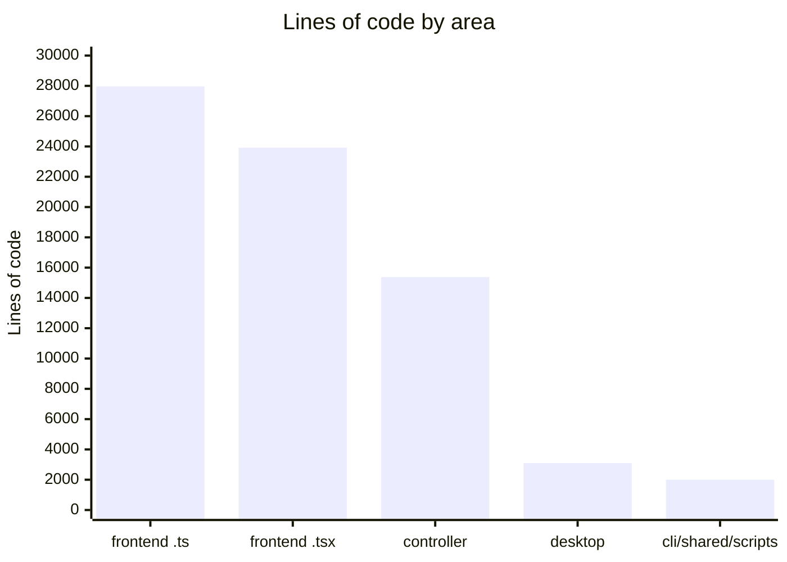
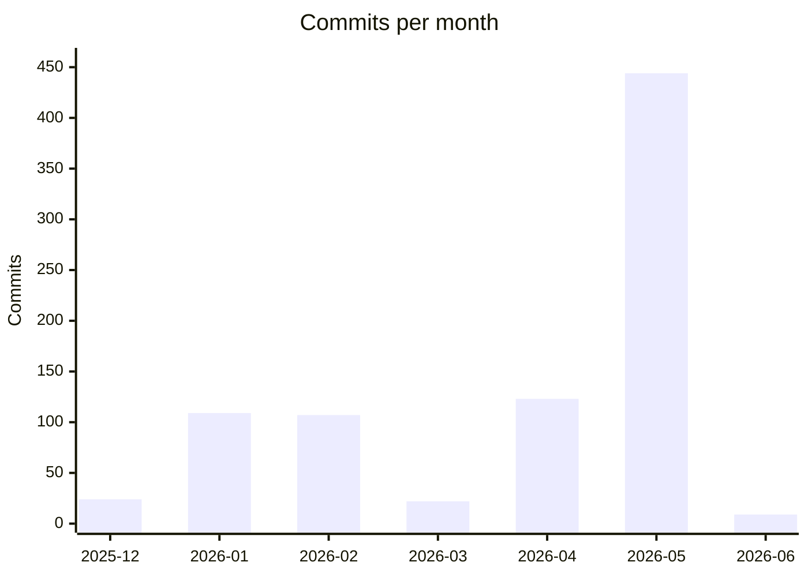

# By the numbers

Data collected on 2026-06-02.

This page is a snapshot of the vLLM Studio repository measured at commit
`61c0f002`. Counts come from read-only `git`, `find`, `wc`, and `grep`
commands run against the working tree, so they reflect tracked source plus the
small set of uncommitted working-tree changes present on that date. For how the
codebase is organized, see [architecture](overview/architecture.md).

## Size

The repository is a TypeScript monorepo with four runnable surfaces plus shared
contracts and tooling:

- `controller/` — Bun + Hono API that fronts the inference engines.
- `frontend/` — Next.js app, the Electron desktop shell, and the in-process Pi
  agent runtime.
- `cli/` — Bun TUI.
- `shared/contracts/` — cross-process types shared by the other surfaces.
- `scripts/` — deploy and release tooling.

Lines of code by area (TypeScript and TSX, source only):

Total tracked TypeScript is roughly 75,000 lines. The frontend dominates: its
`.ts` and `.tsx` together are about 52,000 lines, more than three times the
controller. A single `wc -l` across `controller/src`, `frontend/src`, `cli`,
and `shared` totals 68,938 lines; the ~75k figure adds the desktop shell under
`frontend/desktop/` and the loose `cli`/`shared`/`scripts` files.

### File counts

| Category | Count | Where |
| --- | --- | --- |
| Controller source (`.ts`) | 126 | `controller/src` |
| Frontend source (`.ts` + `.tsx`) | 393 | `frontend/src` |
| CLI source (`.ts`) | 11 | `cli/` |
| Test files | 13 | `tests/` |
| Config files (`.json`/`.yaml`/`.mjs`/`.cjs`) | ~45 | repo root and per-package, excluding `package-lock.json` |

Source files outnumber test files by more than 40 to 1. Test coverage is
concentrated in `tests/controller/integration`, `tests/controller/e2e`, and
`tests/frontend/e2e`; the open testing work is tracked in
`STATUS.md`.

### Modules and apps

The four surfaces above are the top-level apps. Within the controller, source
is split into modules under `controller/src/modules/` (for example
`controller/src/modules/proxy`, `controller/src/modules/chat/agent`,
`controller/src/modules/system/metrics-collector`). Within the frontend, the
agent surface lives under `frontend/src/app/agent/` and the agent runtime/logic
under `frontend/src/lib/agent/`.

## Activity

The repository's first commit is dated 2025-12-18 (`vLLM Studio v0.2.0`) and
the most recent on this snapshot is 2026-06-02 (`tokenized theming engine,
standardized UI kit, appearance redesign`). There are 838 commits total.

The May 2026 total of 444 is by far the largest month and lines up with the
cleanup and refactor work narrated in [lore](lore.md). The March 2026 dip to 22
and the renewed pace in April 2026 (123) bracket that surge. June 2026 shows
only 9 commits because the snapshot was taken on 2026-06-02.

### Churn hotspots (last 90 days)

Directories changed most often by commit, measured with
`git log --since="90 days ago" --name-only`:

| Path | Changes |
| --- | --- |
| `frontend/src/app/agent/_components` | 377 |
| `frontend/src/lib/agent` | 313 |
| `STATUS.md` | 132 |
| `frontend/src/components` | 115 |
| `controller/src/modules/chat/agent` | 106 |
| `frontend/src/lib/agent/sessions` | 105 |
| `frontend/src/lib/agent/workspace` | 101 |
| `frontend/src/components/dashboard/control-panel` | 88 |
| `frontend/src/app/agent/_components/timeline` | 75 |

The agent UI and the agent runtime are the two busiest areas of the codebase,
consistent with their size. `STATUS.md` ranks high because it is updated nearly
every working session as a running mission log.

## Bot-attributed commits

Commits carrying a `Co-authored-by: ... [bot]` Git trailer: **0**. Commits
carrying any `Co-authored-by` trailer at all: **0**.

Caveat: this project is heavily AI-assisted. `AGENTS.md`, plus the `.factory`,
`.claude`, and `.pi` configuration directories, show day-to-day work done with
agent tooling. That assistance is simply not recorded as Git co-author
trailers, so the trailer-based count is 0 and should not be read as "no AI
involvement." The release workflow does commit as `github-actions[bot]`, but
only to create tags and GitHub Releases, not source changes.

## Complexity

### Largest source files

| Lines | File |
| --- | --- |
| 2031 | `frontend/src/app/agent/_components/chat-pane.tsx` |
| 1452 | `frontend/src/lib/themes.ts` |
| 844 | `frontend/src/components/dashboard/control-panel/status-section.tsx` |
| 644 | `frontend/src/lib/agent/sessions/engine.ts` |
| 628 | `frontend/src/app/agent/_components/filesystem-panel.tsx` |
| 614 | `frontend/src/app/agent/_components/plugins-panel.tsx` |
| 569 | `frontend/src/app/agent/_components/use-workspace.ts` |
| 566 | `controller/src/modules/system/metrics-collector/metrics-collector.ts` |
| 563 | `controller/src/modules/proxy/tool-call-stream.ts` |
| 557 | `frontend/src/lib/api/core.ts` |

### The 500-line cap and the legacy allowlist

`frontend/eslint.config.mjs` enforces `max-lines` and
`max-lines-per-function` at **500 lines** (errors, blank lines and comments
skipped). Files that already exceeded the cap when the rule landed are not
exempted outright; they are listed in an explicit legacy allowlist where the
rule is downgraded to a warning, with a comment instructing that each entry be
removed once the file drops under 500 lines. `chat-pane.tsx` at 2031 lines is
the largest of those tracked offenders. `src/lib/themes.ts` is separately
exempted from `max-lines` (it is a large data table, not control flow).

This is the mechanism behind the codebase's deepest complexity debt. The
refactor backlog is tracked in
`STATUS.md`, and
[patterns and conventions](how-to-contribute/patterns-and-conventions.md)
documents the rules new code must follow.

### Deepest and most-churned directories

The two most-churned directories, `frontend/src/app/agent/_components` and
`frontend/src/lib/agent`, are also among the deepest in the tree. The agent
runtime nests several levels — for example
`frontend/src/lib/agent/workspace`, `frontend/src/lib/agent/sessions`, and
`frontend/src/lib/agent/plugins/sources`. High churn plus depth in the same
area is the clearest signal of where the project's complexity is concentrated.

### Comment hygiene

A repo-wide grep for `TODO`, `FIXME`, and `HACK` across `controller/src`,
`frontend/src`, `cli`, `shared`, and `scripts` returns **0** matches. See
[fun facts](fun-facts.md) for context on how that is maintained.
