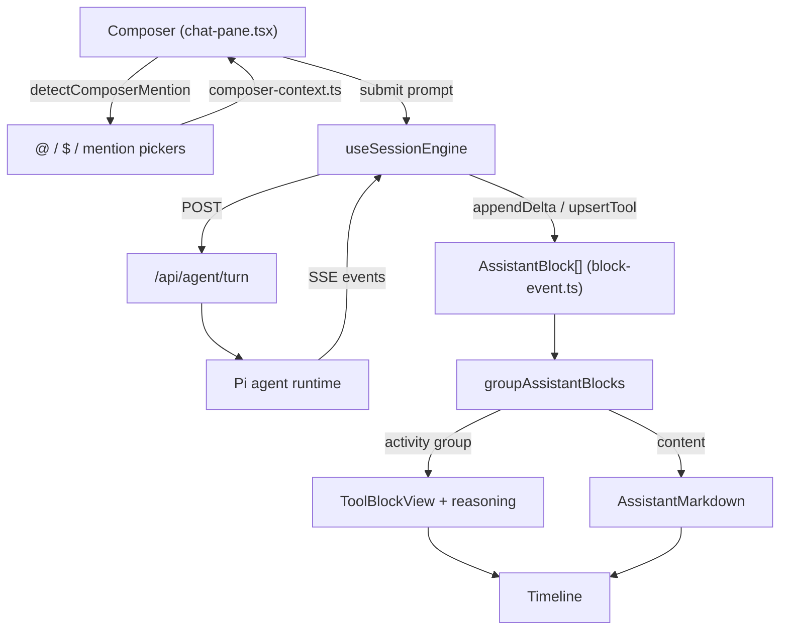

# Agent chat

The end-to-end chat experience on `/agent`: a chat pane per session with a composer that supports file/prompt/command mentions, a streaming timeline that groups reasoning and tool activity, queued follow-ups, and per-session compaction and metadata. This page covers the user-facing surface; the runtime that produces the events lives in [Pi agent runtime](../systems/pi-agent-runtime.md) and the pane/session model in [Agent workspace](../systems/agent-workspace.md).

**Active contributors: Sero** (GitHub [0xSero](https://github.com/0xSero) / seroxdesign)

## Purpose

- Present one chat session per pane: header, scrolling timeline, and a composer.
- Let the user compose prompts with `@` file/plugin, `$` skill, and `/` prompt-template or `/plugins` mention pickers.
- Render a streaming transcript that separates the final answer from interleaved reasoning and tool calls.
- Queue follow-up messages while a turn is running and keep durable session title/pin/hide preferences.
- Offer compaction to shrink a long transcript's context while preserving selected composer context.

## Directory layout

```
frontend/src/app/agent/_components/
  chat-pane.tsx              the per-pane chat surface: header, composer, mention pickers
  chat-attachments.ts        file/image attachment model used by the composer
  assistant-markdown.tsx     markdown renderer for assistant content (code, file-ref chips, links)
  timeline/
    timeline.tsx             scroller + per-message memoized rendering, "Thinking…" indicator
    message-view.tsx         thin per-message entry
    session-pane-block-router.tsx  groups assistant blocks into activity vs content
    tool-block-view.tsx      renders one tool call (icon, label, args, result, previews)
    tool-metadata.ts         tool name → kind/label/detail classification
frontend/src/lib/agent/
  composer-context.ts        mention detection, plugin/skill/template refs, selected-context prompt
  prompt-templates-store.ts  discovers `/template` prompt files from disk
  session/
    message-content.ts       builds assistant blocks from per-call content snapshots
    block-event.ts           applies streaming deltas / events to blocks
    replay.ts                rebuilds a transcript from a session's JSONL log
    prefs.ts                 durable per-session title/pinned/hidden prefs
    types.ts                 ChatMessage, AssistantBlock, ToolBlock, ...
  session-summary.ts         SessionSummary shape used for listing/metadata
frontend/src/app/api/agent/
  compact/route.ts           server-side transcript compaction endpoint
  turn/                      turn submission endpoint
  sessions/                  session listing/loading endpoints
```

## Key abstractions

| Symbol | File | Description |
| --- | --- | --- |
| `ChatPane` (`Props`) | `frontend/src/app/agent/_components/chat-pane.tsx` | The per-pane surface: model selector, git summary, tabs, composer, timeline, mention pickers; wires `useSessionEngine`. |
| `detectComposerMention` | `frontend/src/lib/agent/composer-context.ts` | Parses the text before the caret into a `@`/`$`/`/` mention, with `/plugins` winning over generic `/` templates. |
| `consumeComposerMention` / `selectedContextPrompt` | `frontend/src/lib/agent/composer-context.ts` | Removes a mention token after selection; prepends selected plugin/skill context to the prompt. |
| `byQuery` | `frontend/src/lib/agent/composer-context.ts` | Fuzzy ranks plugin/skill/template rows for the mention dropdown. |
| `discoverPromptTemplates` | `frontend/src/lib/agent/prompt-templates-store.ts` | Reads `.md` prompt templates from `<dataDir>/pi-agent/prompts`, `~/.pi`, `~/.claude`, `~/.codex`. |
| `Timeline` | `frontend/src/app/agent/_components/timeline/timeline.tsx` | Filters out `system` messages, renders memoized message blocks, sticks to bottom, shows the running indicator. |
| `groupAssistantBlocks` | `frontend/src/app/agent/_components/timeline/session-pane-block-router.tsx` | Splits a turn's blocks into an activity group (reasoning + tools) and content bubbles (final answer only). |
| `ToolBlockView` / `toolMeta` | `frontend/src/app/agent/_components/timeline/tool-block-view.tsx` | Renders one tool call with a kind icon, humanized label, args, and result (including HTML previews). |
| `AssistantMarkdown` | `frontend/src/app/agent/_components/assistant-markdown.tsx` | Markdown + GFM rendering with fenced highlighting and `CopyablePathChip` file references. |
| `blocksFromTurnSnapshots` | `frontend/src/lib/agent/session/message-content.ts` | Rebuilds assistant blocks each frame from per-LLM-call content snapshots so React keys stay stable. |
| `appendDelta` / `upsertTool` | `frontend/src/lib/agent/session/block-event.ts` | Apply streaming text/thinking deltas and tool updates to a block list. |
| `patchSessionPref` / `copySessionPref` | `frontend/src/lib/agent/session/prefs.ts` | Durable title/pinned/hidden prefs in localStorage with an Electron file backup. |

## How it works



### Composer and mentions

`detectComposerMention` in `frontend/src/lib/agent/composer-context.ts` inspects the text before the caret. `@` opens the file/plugin picker, `$` opens the skill picker, and a leading `/` opens the prompt-template picker — except `/plugins`, `/plugin`, `/extensions`, `/extension` route to the Pi-extensions toggle picker (`parseExtensionSlash`). `byQuery` fuzzy-ranks rows; selecting one calls `consumeComposerMention` to strip the token. Attachments (files/images) use `frontend/src/app/agent/_components/chat-attachments.ts`. On submit, `selectedContextPrompt` prepends a "Composer context" block describing enabled plugins and loaded skills so the runtime sees the selection.

### Timeline rendering

`Timeline` drops `system` messages and renders each remaining message through a memoized `MessageView`; only the last message is marked `live` while running, and a "Thinking…" indicator shows during a turn. Inside an assistant message, `groupAssistantBlocks` (`session-pane-block-router.tsx`) walks the block list and emits an **activity group** for all reasoning and tool calls plus a **content** bubble only for the trailing call that made no tool calls. Tool blocks render through `ToolBlockView`, which classifies the tool (`tool-metadata.ts`) into edit/search/read/exec/browser kinds, picks an icon and label, and can preview HTML results. Final-answer text renders through `AssistantMarkdown`.

### Streaming and replay

Live turns build blocks from per-LLM-call content snapshots: `blocksFromTurnSnapshots` (`message-content.ts`) rebuilds the block list each frame with deterministic ids derived from `(callOrdinal, contentIndex, kind)`, so nothing remounts mid-stream. Incremental updates also flow through `appendDelta`/`upsertTool` in `block-event.ts`. A resumed or reloaded session is reconstructed from its JSONL log by `replay.ts` using the same block builders, so live and replayed transcripts render identically.

### Queue, follow-up, compaction, and metadata

A `Session` carries an optional `queue` of `QueuedMessage`s (`frontend/src/lib/agent/sessions/types.ts`); follow-ups typed while a turn runs are queued and drained by the engine. Compaction is triggered from the chat surface and the [computer status panel](./agent-tools.md), calling `POST /api/agent/compact` (`frontend/src/app/api/agent/compact/route.ts`); `selectedContextInstructions` in `composer-context.ts` asks the runtime to preserve the selected composer context after compaction. Durable per-session preferences (title, pinned, hidden) are stored by `prefs.ts` in localStorage with an Electron file backup; `SessionSummary` (`session-summary.ts`) is the metadata shape used when listing sessions.

## Integration points

- **Session engine** — the composer submits turns through `useSessionEngine` (`frontend/src/lib/agent/sessions/engine.ts`), which streams runtime events into the session's message/block state. See [Agent workspace](../systems/agent-workspace.md).
- **Runtime** — turns and tool calls are produced by the in-process Pi SDK. See [Pi agent runtime](../systems/pi-agent-runtime.md).
- **Tools** — tool blocks in the timeline correspond to the panels documented in [Agent tools](./agent-tools.md).
- **Plugins / skills / prompts** — the composer's `@`/`$`/`/` pickers are populated from installed Pi resources. See [Plugins and extensions](../systems/plugins-and-extensions.md).
- **Multi-pane and side-chat** — panes and the right-side panel are owned by the workspace shell (`agent-workspace-shell.tsx`); a chat pane is mounted per leaf of the split tree. See [Agent workspace](../systems/agent-workspace.md).

## Entry points for modification

- Change composer mention parsing or selected-context: `frontend/src/lib/agent/composer-context.ts`.
- Add a prompt-template source directory: `defaultPromptTemplateSources` in `frontend/src/lib/agent/prompt-templates-store.ts`.
- Change how a turn's blocks group into activity vs content: `groupAssistantBlocks` in `frontend/src/app/agent/_components/timeline/session-pane-block-router.tsx`.
- Add a tool kind icon/label: `frontend/src/app/agent/_components/timeline/tool-metadata.ts` and `tool-block-view.tsx`.
- Change streaming block construction: `frontend/src/lib/agent/session/message-content.ts` and `block-event.ts`.
- Change durable session prefs: `frontend/src/lib/agent/session/prefs.ts`.

## Key source files

| File | Description |
| --- | --- |
| `frontend/src/app/agent/_components/chat-pane.tsx` | Per-pane chat surface, composer, mention pickers, header. |
| `frontend/src/app/agent/_components/chat-attachments.ts` | File/image attachment model for the composer. |
| `frontend/src/lib/agent/composer-context.ts` | Mention detection, plugin/skill/template refs, selected-context prompt. |
| `frontend/src/lib/agent/prompt-templates-store.ts` | `/template` prompt-file discovery. |
| `frontend/src/app/agent/_components/timeline/timeline.tsx` | Timeline scroller and memoized message rendering. |
| `frontend/src/app/agent/_components/timeline/session-pane-block-router.tsx` | Activity-vs-content block grouping. |
| `frontend/src/app/agent/_components/timeline/tool-block-view.tsx` | Single tool-call rendering and previews. |
| `frontend/src/app/agent/_components/timeline/tool-metadata.ts` | Tool name classification. |
| `frontend/src/app/agent/_components/assistant-markdown.tsx` | Assistant markdown rendering with file-ref chips. |
| `frontend/src/lib/agent/session/message-content.ts` | Snapshot-driven block construction. |
| `frontend/src/lib/agent/session/block-event.ts` | Streaming delta / event application to blocks. |
| `frontend/src/lib/agent/session/replay.ts` | Transcript reconstruction from JSONL. |
| `frontend/src/lib/agent/session/prefs.ts` | Durable per-session title/pin/hide prefs. |
| `frontend/src/app/api/agent/compact/route.ts` | Transcript compaction endpoint. |

## Related pages

- [Agent tools](./agent-tools.md)
- [Pi agent runtime](../systems/pi-agent-runtime.md)
- [Agent workspace](../systems/agent-workspace.md)
- [Plugins and extensions](../systems/plugins-and-extensions.md)
