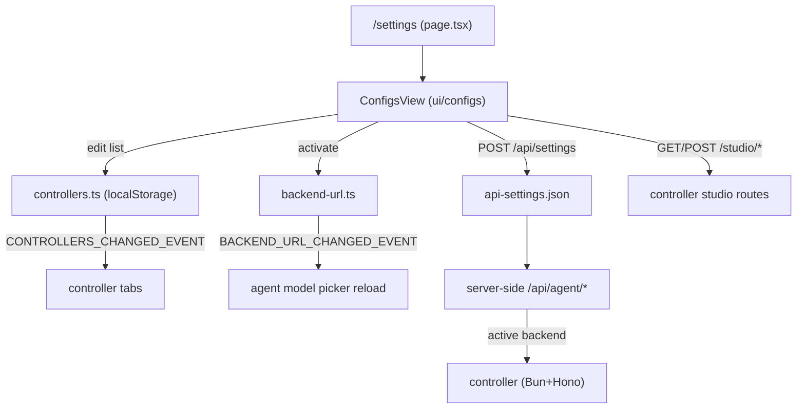

# Controllers and settings

Connecting the UI to one or more controllers and the settings surface at `/settings`. A controller is a backend instance (Bun+Hono) the frontend talks to; the user can save several, switch the active one, and configure connection details, API keys, models directory, and providers. The proxy mechanics are in [Inference proxy](../systems/inference-proxy.md).

**Active contributors: Sero** (GitHub [0xSero](https://github.com/0xSero) / seroxdesign)

## Purpose

- Persist a list of saved controllers (URL, API key, name) and an active backend URL.
- Render each saved controller as a dashboard tab and switch the active one without restarting.
- Reload the agent's model picker against the new backend when the active controller changes.
- Expose connection/API settings (`/settings`) and persist them to `api-settings.json` so server-side `/api/agent/*` routes hit the right backend.
- Manage controller-side studio settings: models directory, UI preferences, and inference providers.

## Directory layout

```
frontend/src/app/settings/page.tsx          settings route: setup wizard vs ConfigsView
frontend/src/ui/configs/                     connection settings UI (engines-section, etc.)
frontend/src/app/api/settings/route.ts       GET/POST app API settings (masks API key)
frontend/src/lib/
  controllers.ts                             saved-controller list (localStorage) + events
  backend-url.ts                             active backend URL (localStorage + cookie)
  backend-config.ts                          env-based default/fallback backend URLs
  api-settings.ts                            api-settings.json read/write (server side)
  api-key.ts                                 resolve API key (env → runtime → per-controller)
  desktop-ui-preferences.ts                  durable localStorage mirror via Electron bridge
controller/src/modules/studio/routes.ts      /studio/settings, /diagnostics, /storage, /providers
controller/src/config/persisted-config.ts    persisted models_dir / ui_preferences / providers
```

## Key abstractions

| Symbol | File | Description |
| --- | --- | --- |
| `SavedController` | `frontend/src/lib/controllers.ts` | `{ url, apiKey?, name? }` saved controller entry. |
| `loadSavedControllers` / `saveSavedControllers` | `frontend/src/lib/controllers.ts` | Read/write the controller list in localStorage, dedupe by URL, fire `CONTROLLERS_CHANGED_EVENT`. |
| `normalizeControllerUrl` | `frontend/src/lib/controllers.ts` | Strip trailing slashes and `/v1` so URLs compare equal. |
| `getStoredBackendUrl` / `setStoredBackendUrl` | `frontend/src/lib/backend-url.ts` | Active backend URL in localStorage + cookie; fires `BACKEND_URL_CHANGED_EVENT` on change. |
| `getControllerApiKey` | `frontend/src/lib/controllers.ts` | Look up the saved API key for a given controller URL. |
| `getApiKey` | `frontend/src/lib/api-key.ts` | Resolve the key from env, runtime memory, or the active controller. |
| `ApiSettings` / `getApiSettings` / `saveApiSettings` | `frontend/src/lib/api-settings.ts` | `api-settings.json` shape and read/write; key written `0600`. |
| `resolveSettingsDefaultBackendUrl` | `frontend/src/lib/backend-config.ts` | First-run default backend URL from env, else `http://localhost:8080`. |
| `GET/POST /api/settings` | `frontend/src/app/api/settings/route.ts` | App settings API; masks the API key in responses, validates URLs. |
| `/studio/settings` and `/studio/providers` | `controller/src/modules/studio/routes.ts` | Controller-side models dir / UI prefs and provider CRUD. |
| durable-keys mirror | `frontend/src/lib/desktop-ui-preferences.ts` | Mirrors `vllm-studio.*` localStorage keys (including controllers) to an Electron file. |

## How it works



### Saved controllers and active backend

The controller list lives in localStorage under `vllm-studio.controllers` (`controllers.ts`), deduped by normalized URL; writes fire `CONTROLLERS_CHANGED_EVENT` plus a `storage` event. The active backend URL is held separately in `backend-url.ts` (localStorage key `vllmstudio_backend_url` plus a one-year cookie) and fires `BACKEND_URL_CHANGED_EVENT` when it changes. Per the changelog, the dashboard renders every saved controller as a compact tab (status dot, name, state, GPU count, model); switching the active controller reloads the agent's model picker against the new backend, and a chip on the picker shows the active controller. The full list is preserved across switches, and controller rows commit on blur (no per-keystroke storage writes).

### App settings and server-side resolution

`/settings` renders the setup wizard on first run (backend offline and no config) or otherwise `ConfigsView`. Connection settings POST to `/api/settings` (`frontend/src/app/api/settings/route.ts`), which validates URLs and never echoes the raw key — it masks via `maskApiKey` and only overwrites the key when a non-masked value is sent. `api-settings.ts` reads/writes `api-settings.json` (key file mode `0600`) so server-side `/api/agent/*` routes resolve the right backend without an env var or restart. When no file exists yet, `backend-config.ts` supplies an env-based default, falling back to `http://localhost:8080`. `api-key.ts` resolves the key from env first, then in-memory runtime state, then the saved key for the active controller.

### Controller-side studio settings

The controller exposes studio routes (`controller/src/modules/studio/routes.ts`): `GET/POST /studio/settings` for the models directory and UI preferences (persisted via `persisted-config.ts` and the controller settings store), `GET /studio/diagnostics` and `/studio/storage` for host/GPU/disk info, and `GET/POST/PUT/DELETE /studio/providers` for inference provider config (id, name, base URL, API key, enabled), with keys never returned in full (`has_api_key`).

### Desktop durability

`desktop-ui-preferences.ts` mirrors durable `vllm-studio.*` / `vllmstudio_*` localStorage keys (including the controllers list and active backend URL) to a file via the Electron bridge, so the saved controllers and active backend survive an app restart or crash.

## Integration points

- **Inference proxy** — the active controller fronts the running model; the UI's chat/model calls route to it. See [Inference proxy](../systems/inference-proxy.md).
- **Recipes** — recipes are listed and launched against the active controller. See [Recipes](./recipes.md).
- **Usage** — analytics are read from the active controller's metrics endpoints. See [Usage](./usage.md).
- **Agent model picker** — switching controllers reloads the picker; the chip shows the active controller. See [Agent chat](./agent-chat.md).
- **Configuration reference** — environment variables and config file locations are summarized in the project README and `CONTEXT.md`.

## Entry points for modification

- Change the saved-controller shape or dedupe rules: `frontend/src/lib/controllers.ts`.
- Change active-backend storage or change events: `frontend/src/lib/backend-url.ts`.
- Change app settings validation/masking: `frontend/src/app/api/settings/route.ts` and `frontend/src/lib/api-settings.ts`.
- Change the connection settings UI: `frontend/src/ui/configs/` (e.g. `engines-section.tsx`).
- Change controller-side studio settings/providers: `controller/src/modules/studio/routes.ts` and `controller/src/config/persisted-config.ts`.
- Change which keys survive desktop restarts: `frontend/src/lib/desktop-ui-preferences.ts`.

## Key source files

| File | Description |
| --- | --- |
| `frontend/src/app/settings/page.tsx` | Settings route: setup wizard vs ConfigsView. |
| `frontend/src/lib/controllers.ts` | Saved-controller list + change events. |
| `frontend/src/lib/backend-url.ts` | Active backend URL (localStorage + cookie). |
| `frontend/src/lib/backend-config.ts` | Env-based default/fallback backend URLs. |
| `frontend/src/lib/api-settings.ts` | `api-settings.json` read/write (server side). |
| `frontend/src/lib/api-key.ts` | API key resolution order. |
| `frontend/src/app/api/settings/route.ts` | App settings GET/POST with key masking. |
| `frontend/src/lib/desktop-ui-preferences.ts` | Durable localStorage mirror via Electron. |
| `frontend/src/ui/configs/engines-section.tsx` | Connection settings UI section. |
| `controller/src/modules/studio/routes.ts` | Studio settings, diagnostics, storage, providers. |
| `controller/src/config/persisted-config.ts` | Persisted models_dir / ui_preferences / providers. |

## Related pages

- [Inference proxy](../systems/inference-proxy.md)
- [Recipes](./recipes.md)
- [Usage](./usage.md)
- [Agent chat](./agent-chat.md)
