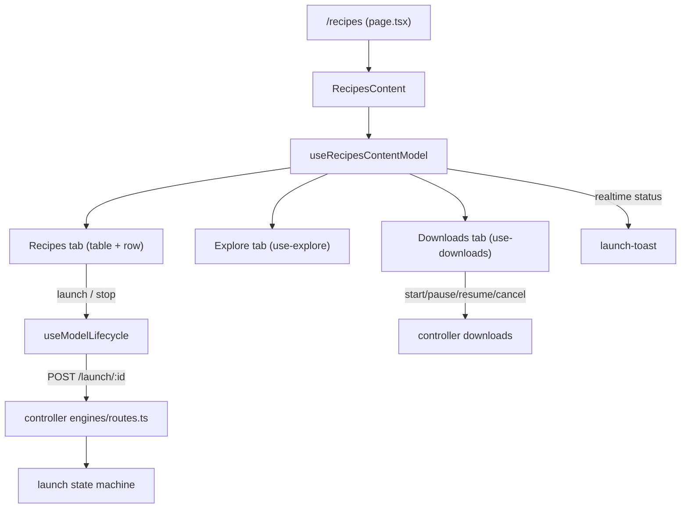

# Recipes

The `/recipes` screen: discover models, manage launch recipes, and run model downloads. A recipe is a saved launch configuration (backend, model, flags) that the controller can start as a running model. This page covers the user feature; the launch state machine is in [Engine lifecycle](../systems/engine-lifecycle.md), the backends in [Runtime backends](../systems/runtime-backends.md), and downloads in [Downloads](../systems/downloads.md).

**Active contributors: Sero** (GitHub [0xSero](https://github.com/0xSero) / seroxdesign)

## Purpose

- List saved recipes with live status (running / starting) and pin frequently used ones.
- Create and edit recipes through a modal, including backend selection and extra launch args.
- Launch a recipe (and evict the running model) from the table, with progress feedback.
- Explore available local and remote models and start downloads, tracked with progress.

## Directory layout

```
frontend/src/app/recipes/page.tsx          route entry; renders RecipesContent in Suspense
frontend/src/ui/recipes/
  recipes-content.tsx                       wires the model to the view
  recipes-content/
    recipes-content-model.ts                tabs (recipes/explore/downloads), launch, pins, modal state
    recipes-content-view.tsx                layout of tabs, table, modal, delete confirm
    recipes-tab.tsx, recipes-table.tsx, recipe-row.tsx   saved-recipe list
    explore-tab.tsx, explore-model-row.tsx, use-explore.ts  model discovery
    downloads-tab.tsx                        download list + progress
    use-recipes-derived.ts                   sorting/derived recipe view
  recipe-modal/                             create/edit recipe modal
frontend/src/lib/recipes/
  recipe-command.ts                         builds the launch command from a recipe + extra args
  recipe-utils.ts, recipe-labels.ts         normalize/save helpers, labels
  llamacpp-options.ts                       llama.cpp-specific option model
frontend/src/components/dashboard/
  use-dashboard-recipes.ts                  dashboard recipe list + log session selection
  launch-toast.tsx, launch-toast-model.ts   launch progress toast
  control-panel/                            dashboard control panel
frontend/src/hooks/
  use-downloads.ts                          download list, start/pause/resume/cancel, polling
  use-model-lifecycle.ts                    start/stop a recipe + status
controller/src/modules/engines/routes.ts   recipes CRUD + /launch + /launch/:id/cancel
controller/src/modules/models/             model browser, recipe serializer/matching
```

## Key abstractions

| Symbol | File | Description |
| --- | --- | --- |
| `RecipesContent` | `frontend/src/ui/recipes/recipes-content.tsx` | Connects `useRecipesContentModel` to `RecipesContentView`. |
| `useRecipesContentModel` | `frontend/src/ui/recipes/recipes-content/recipes-content-model.ts` | Holds tab state (`recipes`/`explore`/`downloads`), recipes, pins, launch, and modal state. |
| `useExplore` | `frontend/src/ui/recipes/recipes-content/use-explore.ts` | Model discovery for the explore tab. |
| `useDownloads` | `frontend/src/hooks/use-downloads.ts` | Polls `getDownloads` and exposes start/pause/resume/cancel plus `downloadsByModel`. |
| `useModelLifecycle` | `frontend/src/hooks/use-model-lifecycle.ts` | Starts/stops a recipe and tracks `idle`/`starting`/`ready`/`error`. |
| `useDashboardRecipes` | `frontend/src/components/dashboard/use-dashboard-recipes.ts` | Dashboard recipe list + chooses the right log session for the running model. |
| `appendExtraArgsToCommand` | `frontend/src/lib/recipes/recipe-command.ts` | Renders a recipe's extra args into CLI flags, skipping internal keys. |
| `recipes` routes | `controller/src/modules/engines/routes.ts` | `GET/POST/PUT/DELETE /recipes`, `POST /launch/:recipeId`, `POST /launch/:recipeId/cancel`. |

## How it works



The route renders `RecipesContent` inside a `Suspense` boundary. `useRecipesContentModel` owns the three tabs (`RecipesContentTab = "recipes" | "explore" | "downloads"`), the recipe list, pinned-recipe persistence (localStorage `vllm-studio-pinned-recipes`), the create/edit modal, and launch state, subscribing to realtime launch progress via `useRealtimeStatus`. Launching a recipe goes through `useModelLifecycle`/the model's `POST /launch/:recipeId`; the controller rejects a launch when another is in flight or a model is already running and must be evicted first (`controller/src/modules/engines/routes.ts`). A recipe's command is built from its fields plus extra args by `recipe-command.ts`, which skips internal keys (`venv_path`, `env_vars`, `visible_devices`, …) and renders the rest as `--flags`. The explore tab discovers models; the downloads tab uses `useDownloads`, which polls `getDownloads` every few seconds and exposes start/pause/resume/cancel keyed by `model_id`. On the dashboard, `useDashboardRecipes` keeps a parallel recipe list and selects the log session matching the running process.

## Integration points

- **Engine lifecycle** — launch/cancel/evict and the running-model state are owned by the controller. See [Engine lifecycle](../systems/engine-lifecycle.md).
- **Runtime backends** — a recipe targets a backend (vLLM, SGLang, llama.cpp, …); the command builder and backend options reflect that. See [Runtime backends](../systems/runtime-backends.md).
- **Downloads** — the downloads tab drives the controller's download orchestration. See [Downloads](../systems/downloads.md).
- **Controllers** — recipes are read from and launched against the active controller. See [Controllers and settings](./controllers-and-settings.md).
- **Realtime status** — launch progress and running status arrive via the SSE status stream. See [Eventing and SSE](../systems/eventing-and-sse.md).

## Entry points for modification

- Add a recipes tab or change tab state: `frontend/src/ui/recipes/recipes-content/recipes-content-model.ts`.
- Change the recipe table/row UI: `recipes-table.tsx`, `recipe-row.tsx` under `frontend/src/ui/recipes/recipes-content/`.
- Change the create/edit modal: `frontend/src/ui/recipes/recipe-modal/`.
- Change how a recipe becomes a launch command: `frontend/src/lib/recipes/recipe-command.ts` (and `recipe-utils.ts`).
- Change download behavior: `frontend/src/hooks/use-downloads.ts` and the controller downloads module.
- Change recipes CRUD / launch endpoints: `controller/src/modules/engines/routes.ts`.

## Key source files

| File | Description |
| --- | --- |
| `frontend/src/app/recipes/page.tsx` | Route entry, Suspense wrapper. |
| `frontend/src/ui/recipes/recipes-content.tsx` | Model-to-view wiring. |
| `frontend/src/ui/recipes/recipes-content/recipes-content-model.ts` | Tabs, recipes, pins, launch, modal state. |
| `frontend/src/ui/recipes/recipes-content/use-explore.ts` | Explore-tab model discovery. |
| `frontend/src/ui/recipes/recipes-content/downloads-tab.tsx` | Downloads tab UI. |
| `frontend/src/lib/recipes/recipe-command.ts` | Recipe → launch command builder. |
| `frontend/src/lib/recipes/recipe-utils.ts` | Recipe normalize/save helpers. |
| `frontend/src/hooks/use-downloads.ts` | Download list + actions + polling. |
| `frontend/src/hooks/use-model-lifecycle.ts` | Start/stop a recipe + status. |
| `frontend/src/components/dashboard/use-dashboard-recipes.ts` | Dashboard recipe list + log selection. |
| `frontend/src/components/dashboard/launch-toast.tsx` | Launch progress toast. |
| `controller/src/modules/engines/routes.ts` | Recipes CRUD + launch/cancel endpoints. |

## Related pages

- [Engine lifecycle](../systems/engine-lifecycle.md)
- [Runtime backends](../systems/runtime-backends.md)
- [Downloads](../systems/downloads.md)
- [Controllers and settings](./controllers-and-settings.md)
