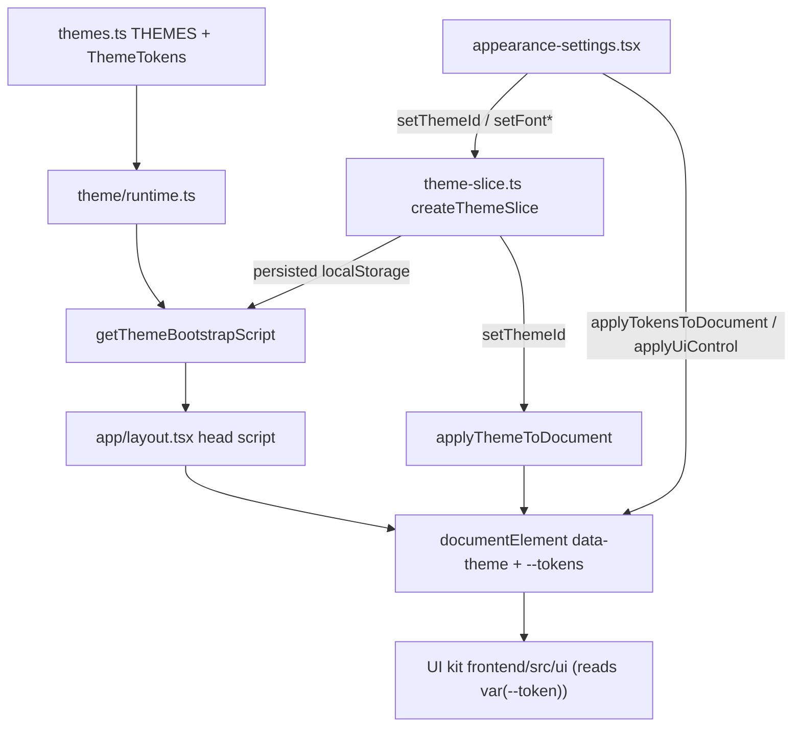

# Theming

Theming is a tokenized system: a fixed set of CSS variable tokens defines every theme, the selected theme is applied to `document.documentElement` as both a `data-theme` attribute and inline custom properties, and the standardized UI kit reads those tokens instead of hard-coded colors. A bootstrap script applies the persisted theme before hydration to avoid a flash of the wrong colors.

Active contributors: Sero ([0xSero / seroxdesign](https://github.com/0xSero))

## Purpose

This page documents the theming engine and the appearance UI that drives it: the theme token catalog, the runtime that applies tokens to the DOM, the Zustand slice that persists the active theme/font, the pre-hydration bootstrap script, and the appearance editor. It explains the CSS variable token model, the default theme (`omlx-dark`), and how the UI kit consumes tokens. For the broader frontend, see [Frontend](../apps/frontend.md).

## Directory layout

```
frontend/src/lib/
├── themes.ts              ThemeTokens shape, ThemeId union, THEMES catalog, fonts
├── theme/
│   └── runtime.ts         apply*ToDocument, getThemeBootstrapScript, UI-token derivation
└── colors.ts              getModelColor: deterministic per-model accent

frontend/src/store/
└── theme-slice.ts         ThemeSlice: themeId / fontFamilyId / fontSizeId + setters

frontend/src/app/
├── layout.tsx             injects bootstrap script in <head>, sets data-theme
└── configs/               settings route that hosts the appearance editor

frontend/src/ui/configs/
├── appearance-settings.tsx   theme picker, mode toggle, color fields, sliders
├── configs-view.tsx          settings layout with the Appearance section
└── engines-section.tsx       other token-consuming settings sections
```

## Key abstractions

| Symbol | File | Description |
| --- | --- | --- |
| `ThemeTokens` | `frontend/src/lib/themes.ts` | The 10 core color tokens every theme defines: `bg`, `fg`, `dim`, `border`, `surface`, `accent`, `hl1`, `hl2`, `hl3`, `err`. |
| `ThemeMeta` / `THEMES` | `frontend/src/lib/themes.ts` | Per-theme metadata (`id`, `name`, `description`, `group`, `swatches`, `tokens`); `THEMES` is the full catalog and `THEME_BY_ID` the lookup map. |
| `ThemeId` | `frontend/src/lib/themes.ts` | Union of all built-in theme ids (70+), e.g. `omlx-dark`, `omlx-light`, `nord`, `dracula`. |
| `FontFamilyId` / `FontSizeId` | `frontend/src/lib/themes.ts` | Font option ids with CSS values in `FONT_FAMILY_OPTIONS` / `FONT_SIZE_OPTIONS`. |
| `applyThemeToDocument` | `frontend/src/lib/theme/runtime.ts` | Sets `data-theme` and writes all tokens (plus derived UI tokens) as `--*` custom properties. |
| `deriveThemeUiTokens` | `frontend/src/lib/theme/runtime.ts` | Computes secondary tokens (`surface-2`, `rail`, `hover`, `composer`, shadows) from the base tokens and the theme's lightness. |
| `getThemeBootstrapScript` | `frontend/src/lib/theme/runtime.ts` | Serializes all theme/font token maps into an IIFE string applied in `<head>` before hydration. |
| `applyUiControl` / `applyStoredUiControls` | `frontend/src/lib/theme/runtime.ts` | Persists and re-applies master scale/shape CSS variables the appearance editor controls. |
| `createThemeSlice` | `frontend/src/store/theme-slice.ts` | Zustand slice holding `themeId` / `fontFamilyId` / `fontSizeId`; setters call the `apply*ToDocument` functions. |
| `getModelColor` | `frontend/src/lib/colors.ts` | Hashes a model name to a stable HSL color for status display. |
| `AppearanceSettings` | `frontend/src/ui/configs/appearance-settings.tsx` | The appearance editor: theme picker, light/dark/system mode, per-token color fields, scale sliders. |

## How it works



### Token model

Each theme is a `ThemeTokens` object of 10 color strings (`bg`, `fg`, `dim`, `border`, `surface`, `accent`, `hl1`, `hl2`, `hl3`, `err`). `applyThemeToDocument` writes each as a CSS custom property (`--bg`, `--fg`, and so on) on `documentElement`. On top of the base tokens, `deriveThemeUiTokens` computes a set of secondary tokens (`surface-2`, `surface-3`, `rail`, `border`, `separator`, `hover`, `active`, `composer`, `composer-footer`, `composer-shadow`) using `color-mix` and the theme's measured lightness, so light and dark themes get appropriate overlays from the same base palette. The UI kit under `frontend/src/ui/` and the route components reference these via Tailwind's `var(--token)` syntax (for example `text-(--fg)`, `bg-(--surface)`, `border-(--border)`) rather than literal colors, so swapping the token values re-themes everything uniformly.

### Default theme

The default theme id is `omlx-dark`, declared as `DEFAULT_THEME_ID` in `frontend/src/lib/theme/runtime.ts` and as the initial `themeId` in `createThemeSlice` (`frontend/src/store/theme-slice.ts`). `frontend/src/app/layout.tsx` also hard-codes `data-theme="omlx-dark"` on the `<html>` element so the first paint matches the default before the bootstrap script runs.

### Bootstrap before hydration

`getThemeBootstrapScript` serializes the token maps (`themeTokensById`, `themeUiTokensById`, `fontFamilyCssById`, `fontSizeCssById`) and the defaults into a self-invoking script string. `frontend/src/app/layout.tsx` injects it into `<head>` via `dangerouslySetInnerHTML` so it runs before React hydrates. The script reads the persisted Zustand state from `localStorage` (key `vllm-studio-state`), resolves the saved `themeId` (falling back to `omlx-dark` if unknown), and sets `data-theme` plus all token, UI-token, and font custom properties synchronously. This prevents a flash of the default theme when a user has chosen a different one. `<html>` carries `suppressHydrationWarning` because the script mutates attributes before hydration.

### Persistence and live editing

`createThemeSlice` holds `themeId`, `fontFamilyId`, and `fontSizeId`; its setters call `applyThemeToDocument`, `applyFontFamilyToDocument`, and `applyFontSizeToDocument` so a change updates the DOM immediately, and the slice is persisted to `localStorage` under `vllm-studio-state` for the next bootstrap. The appearance editor (`frontend/src/ui/configs/appearance-settings.tsx`, hosted by `frontend/src/app/configs/`) drives those setters; it also supports a custom palette via `applyTokensToDocument` (stored under `vllm-studio.customThemeTokens`) and master scale/shape knobs via `applyUiControl` (stored under `vllm-studio.uiControls` and re-applied by `applyStoredUiControls`).

## Integration points

- **Layout**: `frontend/src/app/layout.tsx` injects the bootstrap script and sets the initial `data-theme`.
- **Store**: `createThemeSlice` is part of the app Zustand store and is persisted to `localStorage`.
- **UI kit**: components under `frontend/src/ui/` consume `var(--token)` values; changing tokens re-themes them without code changes.
- **Settings**: the appearance editor lives in the configs settings surface (`frontend/src/ui/configs/`, `frontend/src/app/configs/`).

## Entry points for modification

- Add or edit a theme: add a `createTheme(...)` entry to `THEMES` in `frontend/src/lib/themes.ts` (and its `ThemeId` to the union).
- Add a new base or derived token: extend `ThemeTokens` and `deriveThemeUiTokens` in `frontend/src/lib/theme/runtime.ts`, then reference it in the UI kit.
- Change the default theme: update `DEFAULT_THEME_ID` in `frontend/src/lib/theme/runtime.ts`, the slice default in `frontend/src/store/theme-slice.ts`, and the `data-theme` on `<html>` in `frontend/src/app/layout.tsx`.
- Change the pre-hydration behavior: `getThemeBootstrapScript` in `frontend/src/lib/theme/runtime.ts` and its injection in `frontend/src/app/layout.tsx`.
- Change the appearance editor: `frontend/src/ui/configs/appearance-settings.tsx`.

## Key source files

| File | Purpose |
| --- | --- |
| `frontend/src/lib/themes.ts` | `ThemeTokens`, `ThemeId`, `THEMES` catalog, font options |
| `frontend/src/lib/theme/runtime.ts` | Apply tokens/fonts to DOM, derive UI tokens, bootstrap script |
| `frontend/src/store/theme-slice.ts` | Persisted Zustand slice for theme and font selection |
| `frontend/src/app/layout.tsx` | Injects the bootstrap script; sets initial `data-theme` |
| `frontend/src/lib/colors.ts` | Deterministic per-model color for status display |
| `frontend/src/ui/configs/appearance-settings.tsx` | Appearance editor (theme/mode/color/scale) |
| `frontend/src/ui/configs/configs-view.tsx` | Settings layout hosting the Appearance section |
| `frontend/src/app/configs/` | Settings route that renders the configs view |

## See also

- [Frontend](../apps/frontend.md) — the Next.js + Electron app that hosts the theming engine and UI kit.
