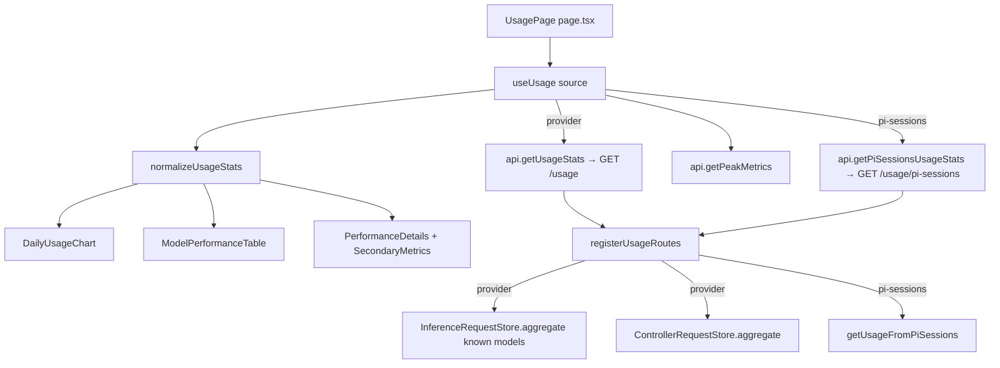

# Usage analytics

The `/usage` surface is the analytics dashboard for token, request, and latency activity. It has two sources: provider usage aggregated from the controller's per-inference-request log, and Pi session usage aggregated from the coding-agent JSONL files. Both render through the same React page and stat components.

Active contributors: Sero ([0xSero / seroxdesign](https://github.com/0xSero))

## Purpose

This page documents the usage dashboard: the frontend page and its hook/normalizer, the standardized usage chart and table components, and the controller endpoints that back them. It explains where the numbers come from (the inference request store and the Pi sessions JSONL aggregator) and how the two analytics tabs differ. The underlying collection and storage is owned by the controller; see [metrics and observability](../systems/metrics-and-observability.md).

## Directory layout

```
frontend/src/app/usage/
├── page.tsx                       UsagePage: tabs, header stats, composes UI components
├── hooks/
│   └── use-usage.ts               useUsage(source): fetch, normalize, sort, expand state
└── lib/
    └── normalize-usage-stats.ts   normalizeUsageStats: fills defaults / guards shape

frontend/src/ui/usage/
├── daily-usage-chart.tsx          DailyUsageChart: daily tokens, optionally per model
├── model-performance-table.tsx    ModelPerformanceTable: sortable per-model rows
├── model-performance-table-model.ts   row view-model helpers
├── model-performance-table/       table subcomponents
├── performance-details.tsx        PerformanceDetails: latency / TTFT panel
└── secondary-metrics.tsx          SecondaryMetrics: cache, week-over-week, peaks

controller/src/modules/system/
├── usage-routes.ts                GET /usage, GET /usage/pi-sessions
└── usage/
    ├── pi-sessions.ts             getUsageFromPiSessions: reads ~/.pi/agent/sessions JSONL
    ├── usage-utilities.ts         emptyResponse, calcChange helpers
    └── index.ts                   barrel

controller/src/stores/
├── inference-request-store.ts     per-inference-request log; source of /usage
└── controller-request-store.ts    controller HTTP + function-call records
```

## Key abstractions

| Symbol | File | Description |
| --- | --- | --- |
| `UsagePage` | `frontend/src/app/usage/page.tsx` | Top-level page: source tabs (`provider`, `pi-sessions`), header stat grid, and composed chart/table/detail sections. |
| `useUsage` | `frontend/src/app/usage/hooks/use-usage.ts` | Fetches usage + peak metrics for the selected source, normalizes, and exposes sorting, row expansion, and chart-ready derivations. |
| `normalizeUsageStats` | `frontend/src/app/usage/lib/normalize-usage-stats.ts` | Guards an incoming `UsageStats` payload, filling missing sections with defaults so the UI never reads `undefined`. |
| `DailyUsageChart` | `frontend/src/ui/usage/daily-usage-chart.tsx` | Renders the daily token series, optionally broken down by model. |
| `ModelPerformanceTable` | `frontend/src/ui/usage/model-performance-table.tsx` | Sortable per-model table driven by `SortField` / `SortDirection`. |
| `registerUsageRoutes` | `controller/src/modules/system/usage-routes.ts` | Registers `GET /usage` and `GET /usage/pi-sessions` on the Hono app. |
| `getUsageFromPiSessions` | `controller/src/modules/system/usage/pi-sessions.ts` | Aggregates all Pi coding-agent activity from the sessions JSONL directory. |
| `InferenceRequestStore.aggregate` | `controller/src/stores/inference-request-store.ts` | Builds provider `UsageStats` from per-request rows, restricted to known models. |
| `ControllerRequestStore.aggregate` | `controller/src/stores/controller-request-store.ts` | Builds the `ControllerUsageStats` block merged into `/usage`. |

## How it works



### Two analytics sources

The page exposes two tabs via `useUsage(source)`:

- **Provider** (`GET /usage`) aggregates the controller's own inference traffic. `registerUsageRoutes` first builds a `knownModels` set from recipes (served model name, id, name) plus the currently running inference process, then calls `InferenceRequestStore.aggregate(knownModels)` so the dashboard only counts models this controller actually serves. The controller's HTTP/function stats from `ControllerRequestStore.aggregate()` are merged in as the `controller` block (`ControllerUsageStats`).
- **Pi sessions** (`GET /usage/pi-sessions`) aggregates all Pi coding-agent activity regardless of model, so external models used by the agent are also visible. `getUsageFromPiSessions` reads JSONL files from `PI_CODING_AGENT_DIR/sessions` or `~/.pi/agent/sessions` and rolls them up into the same `UsageStats` shape.

Both endpoints fall back to `emptyResponse()` (`controller/src/modules/system/usage/usage-utilities.ts`) on error so the page always receives a well-formed payload, and both calls are wrapped in `observeControllerFunction` for observability.

### Client-side shaping

`useUsage` fetches the selected source plus peak metrics in parallel, runs the result through `normalizeUsageStats`, and derives:

- `sortedModels` — `by_model` sorted by the active `SortField` and `SortDirection`.
- `modelsForChart` / `dailyByModel` — series for the daily chart, grouped by model.
- `expandedRows` and `toggleRow` — per-model row expansion in the performance table.

The page itself reads the normalized totals to render the header stat grid (tokens, requests, prompt/completion split, success rate, 24h requests, average tokens, cache hit rate).

## Integration points

- **Controller stores**: provider usage comes from `InferenceRequestStore`, written by the [inference proxy](../systems/inference-proxy.md); controller stats come from `ControllerRequestStore` via the observability middleware (see [metrics and observability](../systems/metrics-and-observability.md)).
- **Recipes**: the `knownModels` filter is built from recipes registered in the controller; see [controllers and settings](controllers-and-settings.md).
- **Contracts**: response shapes are the shared `UsageStats` and `ControllerUsageStats`, with `SortField` / `SortDirection` driving the table. All live in `shared/contracts/usage.ts`; peak metrics use `PeakMetrics` from `shared/contracts/observability.ts`.

## Entry points for modification

- Add a header stat or chart: `frontend/src/app/usage/page.tsx` and the relevant component in `frontend/src/ui/usage/`.
- Change client fetching, sorting, or chart derivations: `frontend/src/app/usage/hooks/use-usage.ts`.
- Change default-filling / shape guards: `frontend/src/app/usage/lib/normalize-usage-stats.ts`.
- Change provider aggregation or the `knownModels` filter: `controller/src/modules/system/usage-routes.ts` and `controller/src/stores/inference-request-store.ts`.
- Change Pi session aggregation: `controller/src/modules/system/usage/pi-sessions.ts`.
- Change the wire shape: `shared/contracts/usage.ts` (then update the mirror barrels; see [primitives](../primitives/index.md)).

## Key source files

| File | Purpose |
| --- | --- |
| `frontend/src/app/usage/page.tsx` | Usage dashboard page: tabs, header stats, composed sections |
| `frontend/src/app/usage/hooks/use-usage.ts` | Fetch, normalize, sort, and expand-state hook |
| `frontend/src/app/usage/lib/normalize-usage-stats.ts` | Default-filling and shape guard for `UsageStats` |
| `frontend/src/ui/usage/daily-usage-chart.tsx` | Daily token chart (optionally per model) |
| `frontend/src/ui/usage/model-performance-table.tsx` | Sortable per-model performance table |
| `frontend/src/ui/usage/performance-details.tsx` | Latency / TTFT detail panel |
| `frontend/src/ui/usage/secondary-metrics.tsx` | Cache, week-over-week, and peak metrics panel |
| `controller/src/modules/system/usage-routes.ts` | `GET /usage` and `GET /usage/pi-sessions` |
| `controller/src/modules/system/usage/pi-sessions.ts` | Pi coding-agent JSONL aggregation |
| `controller/src/stores/inference-request-store.ts` | Per-inference-request log; provider source of truth |
| `controller/src/stores/controller-request-store.ts` | Controller HTTP + function-call records |
| `shared/contracts/usage.ts` | `UsageStats`, `ControllerUsageStats`, `SortField`, `SortDirection` |

## See also

- [Metrics and observability](../systems/metrics-and-observability.md) — how the underlying request and metric data is collected and stored.
- [Controllers and settings](controllers-and-settings.md) — recipes and controller configuration that define known models.
- [Primitives](../primitives/index.md) — the shared contract types used by the usage payloads.
