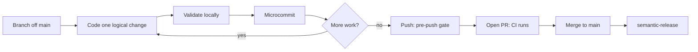

# Development workflow

The development cycle is: branch off the latest `main`, make one logical change, validate locally, commit with a conventional-commit message, open a PR, and merge. Merging to `main` triggers an automated release. This page describes each step and the local commands per app.

## The cycle



## Branch

Start from the latest `main` and keep one logical change per branch (`CONTRIBUTING.md`). Avoid broad formatting-only rewrites.

## Code

Follow the lint-enforced rules in [patterns and conventions](patterns-and-conventions.md) — the React effect-hook ban, the 500-line file/function caps, the layer boundaries, typed `HttpStatus` errors, and shared contracts as the single source of truth. New code that violates these fails CI.

## Run each app locally

For prerequisites and first-run details, see [getting started](../overview/getting-started.md). Quick reference:

- **Controller** (Bun + Hono, default `http://localhost:8080`): `cd controller && bun install && bun src/main.ts` (`controller/package.json`).
- **Frontend** (Next.js, default `http://localhost:3000`, agent surface at `/agent`): `cd frontend && npm ci && npm run dev`. The project convention for local browser verification is port 3001: `cd frontend && PORT=3001 npm run dev` (`frontend/package.json`, `AGENTS.md`).
- **Desktop** (Electron): the desktop app bundles its own copy of the frontend, so remote/web deploys never update it. For iterative UI work, run Electron against the dev server with `npm run desktop:build:main` then `VLLM_STUDIO_DESKTOP_DEV_SERVER_URL=http://127.0.0.1:3001 npm run desktop:start` (`frontend/package.json`, `frontend/desktop/AGENTS.md`).
- **CLI** (Bun TUI): `cd cli && bun install && bun src/main.ts status`. No arguments launches the interactive terminal UI; any argument routes to headless mode (`cli/package.json`).

## Validate

Run the repo gate before committing (`package.json`):

```bash
npm run check      # contracts + frontend quality gate + controller + cli typechecks
npm run test:e2e   # controller integration + frontend e2e
```

`npm run check` runs `check:contracts` (`scripts/validate-shared-contracts.mjs`), `check:frontend` (the frontend `check:quality` gate), `check:controller` (`bun run typecheck`), and `check:cli` (`bun run typecheck`). See [tooling](tooling.md) for what each tool does and [testing](testing.md) for the test commands.

## Commit (microcommit flow)

The frontend addendum (`frontend/AGENTS.md`) requires a microcommit on every turn that changes files: one logical change, staged narrowly. The required turn-close flow is:

1. `git add <files-changed-this-turn>` — stage only the files changed in that turn.
2. `npm run precommit` (run from `frontend/`) — runs `lint-staged` against staged files plus a typecheck (`frontend/package.json`). The `.githooks/pre-commit` hook runs the same `precommit` script.
3. If checks fail, fix the issues and rerun.
4. `git commit -m "type(scope): summary"` — conventional commit. `micro` is an allowed type for microcommits.

Conventional commits are validated by `scripts/check-conventional-commits.mjs`: the type must be one of the allowed set (`build`, `chore`, `ci`, `docs`, `feat`, `fix`, `micro`, `perf`, `refactor`, `release`, `revert`, `style`, `test`), the summary must be at least 8 characters, start lowercase, and not end with a period. The `.githooks/commit-msg` hook checks each message as you commit.

Never bypass hooks with `--no-verify`, and never batch unrelated work into one commit (`frontend/AGENTS.md`).

## Push (the pre-push gate)

`.githooks/pre-push` is the production quality gate. It validates conventional commits over the push range (`scripts/check-conventional-commits.mjs`) and then runs the frontend quality gate:

```bash
npm --prefix frontend run check:quality
```

Hooks are wired via `npm run setup:git-hooks` (`package.json`), which sets `core.hooksPath` to `.githooks`.

## Open a PR

Push your branch and open a PR against `main`. CI runs the per-app jobs in `.github/workflows/ci.yml` (controller, cli, frontend typecheck/lint/cleanup), plus secret scanning and CodeQL in `.github/workflows/security.yml`. Include the PR details listed in [how to contribute](index.md#pull-request-expectations).

## Release on merge to main

Maintainers merge to `main`. `.github/workflows/release.yml` runs semantic-release, which reads conventional commits and (per `release.config.cjs`) maps them to version bumps:

- `feat` → minor
- `fix`, `perf`, `refactor`, `micro`, `release` → patch
- any `breaking` change → major

It creates a GitHub Release and Git tag with generated notes. There is no npm publish (protected `main`, no root npm package). See [tooling](tooling.md) for the build and CI tooling involved.
