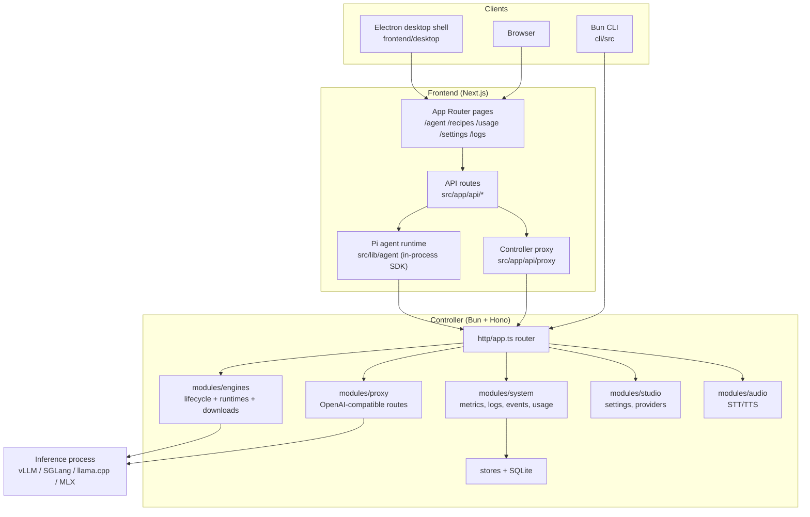
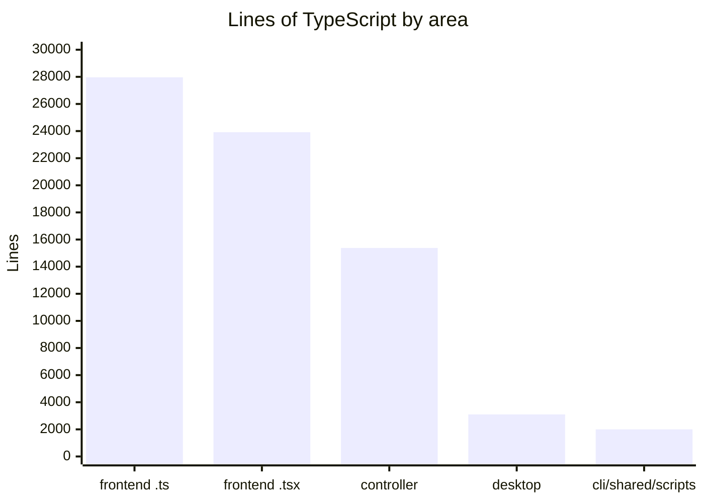
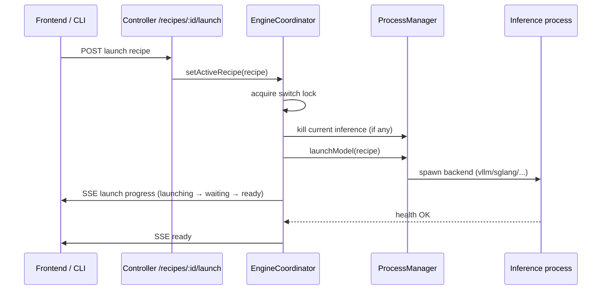
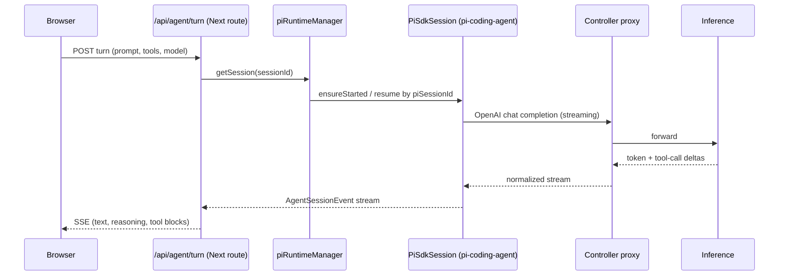

# Architecture

vLLM Studio is a monorepo of three deployable units that share one type contract. The controller is the backend authority for everything model- and runtime-related; the frontend is both a UI and a backend-for-frontend (its Next.js API routes host the agent runtime and proxy to the controller); the CLI is a thin terminal client. This page traces the components and the main request paths.

## Components

## Code size by area

Roughly 75k lines of TypeScript across the repo. The frontend dominates because it carries both the UI and the agent runtime.

See [by the numbers](../by-the-numbers.md) for the full breakdown.

## Request lifecycle: launching a model

A recipe is a saved launch configuration. Launching one is the controller's central state machine, guarded by a lock so only one model loads at a time.

The coordinator lives in `controller/src/modules/engines/engine-coordinator.ts`; process spawning is in `controller/src/modules/engines/process/process-manager.ts`. Progress is streamed as controller events (see below). Details: [engine lifecycle](../systems/engine-lifecycle.md).

## Request lifecycle: an agent chat turn

The agent runtime is unusual — it runs inside the Next.js Node process, not as a subprocess and not in the controller.

The turn route is `frontend/src/app/api/agent/turn/route.ts`; the runtime singleton is `frontend/src/lib/agent/pi-runtime.ts` backed by `frontend/src/lib/agent/pi-sdk-runtime.ts`. If the browser disconnects, the runtime keeps going and the client reattaches via `/api/agent/runtime/events`. Details: [Pi agent runtime](../systems/pi-agent-runtime.md) and [agent workspace](../systems/agent-workspace.md).

## Eventing and real-time state

The controller publishes domain events (launch progress, downloads, metrics, log lines) through an in-process event manager and exposes them as Server-Sent Events. The frontend subscribes and updates UI stores; the CLI polls REST every two seconds instead.

- Controller event bus: `controller/src/modules/system/event-manager.ts`, event names in `shared/contracts/controller-events.ts`.
- SSE plumbing: `controller/src/http/sse.ts`.
- Frontend consumers: `frontend/src/hooks/use-controller-events.ts` and `frontend/src/hooks/realtime-status-store.ts`.

## Persistence

The controller keeps state in a single SQLite database (`data/controller.db`) accessed through `bun:sqlite`. Stores wrap each table: recipes, downloads, peak/lifetime metrics, inference requests (observability), controller settings, and controller request logs. See `controller/src/stores/` and [data models](../reference/data-models.md).

Frontend agent state (sessions, projects, plugin config, Pi session JSONL) lives under the data directory in `pi-agent/` and `agentfs/`, written by the Next.js API routes — not in SQLite.

## Trust boundaries

- The controller binds to loopback by default. Binding to a non-loopback host requires `VLLM_STUDIO_API_KEY` (or an explicit `VLLM_STUDIO_ALLOW_UNAUTHENTICATED=true`). Mutating requests are bearer-authenticated and rate-limited (`controller/src/http/security-middleware.ts`).
- CORS is allow-listed to known local origins.
- The Electron shell runs with `contextIsolation=true`, `sandbox=true`, `nodeIntegration=false`, and an IPC allowlist (`frontend/desktop/logic/security.ts`).

See [security](../security.md) for the full model.

## Shared contracts

Cross-process types live once in `shared/contracts/` and are mirrored into per-app barrels. `scripts/validate-shared-contracts.mjs` fails the build if a contract type is declared outside its allowed file or if any exported type/interface name is duplicated. This keeps the controller, frontend, and CLI in agreement about wire shapes. See [primitives](../primitives/index.md).
