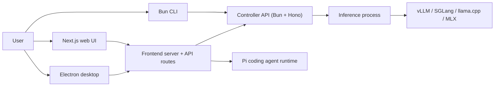

# vLLM Studio

vLLM Studio is a local-first workstation for running, managing, and using self-hosted LLM backends. One machine launches inference servers (vLLM, SGLang, llama.cpp, MLX), watches GPU and runtime state, proxies OpenAI-compatible chat, and runs an in-browser coding agent against local or remote controllers.

## What it does

The product has three runnable pieces and a shared type contract:

- **Controller** (`controller/`) — a Bun + Hono HTTP server that owns model lifecycle (launch, evict, status), runtime backend discovery, an OpenAI-compatible inference proxy, downloads, GPU/runtime metrics, logs, and settings. It talks to the inference process it spawns.
- **Frontend** (`frontend/`) — a Next.js 16 app that serves the web UI and the API routes behind it, plus an Electron desktop shell that embeds a standalone Next server. The headline surface is `/agent`, an agent workspace built on the `@earendil-works/pi-coding-agent` SDK running in the Next.js Node process.
- **CLI** (`cli/`) — a small Bun terminal UI for inspecting and operating a controller (dashboard, recipes, status, config), plus a headless mode for scripting.
- **Shared contracts** (`shared/contracts/`) — the single source of truth for cross-process types (recipes, system/runtime info, controller events, usage). A validation script forbids duplicate declarations elsewhere.

## Who uses it

People running their own GPU box (or a homelab GPU server) who want a single app to: pick and download a model, launch a serving backend, monitor utilization, and then chat with or code against that model through an OpenAI-compatible endpoint and an embedded agent.

## How the pieces talk



The frontend and CLI never spawn inference directly; they call the controller. The agent runtime is the exception — it runs in-process inside the Next.js server (no separate agent subprocess) and reaches models through the controller's proxy.

## Quick links

- [Architecture](architecture.md) — components, data flows, and the request lifecycle.
- [Getting started](getting-started.md) — prerequisites, install, run, and validate.
- [Glossary](glossary.md) — controller, recipe, runtime target, session, pane, and other domain terms.
- [Apps](../apps/index.md) — the controller, web frontend, desktop shell, and CLI in depth.
- [Systems](../systems/index.md) — engine lifecycle, runtime backends, inference proxy, Pi runtime, agent workspace.
- [Features](../features/index.md) — agent chat, agent tools, recipes, controllers/settings, usage, theming.
- [Reference](../reference/index.md) — configuration, data models, dependencies.

## Repository layout

```
vllm-studio/
├── controller/        Bun + Hono controller API
├── frontend/          Next.js app, API routes, agent workspace, Electron desktop
├── cli/               Bun terminal UI + headless commands
├── shared/contracts/  Cross-process type contracts (source of truth)
├── scripts/           Deploy, daemon, release, contract-validation scripts
├── tests/             Controller integration + frontend e2e tests
└── data/              Local runtime state (gitignored, machine-local)
```
