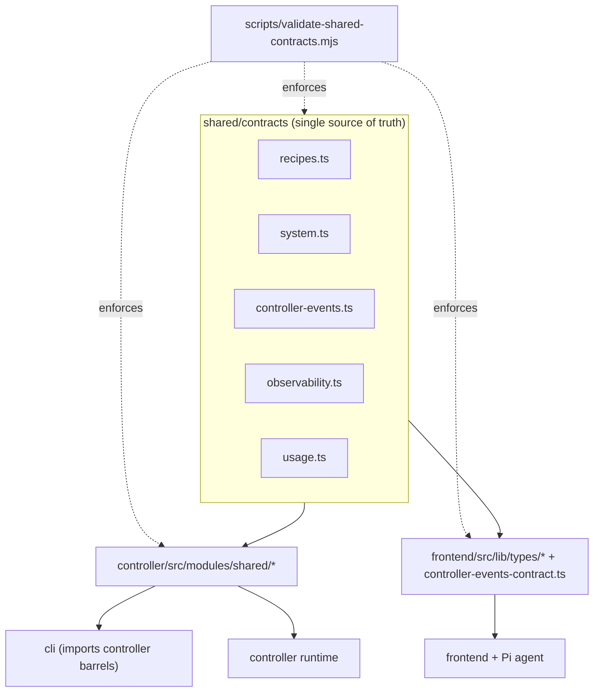

# Primitives

The primitives are the shared contract types that cross process boundaries between the controller, the frontend, and the CLI. They are defined exactly once under `shared/contracts/` and mirrored into per-app barrels, with a validation script enforcing that no contract type is declared anywhere else and that no exported type name is duplicated across the repo.

Active contributors: Sero ([0xSero / seroxdesign](https://github.com/0xSero))

## Purpose

This page documents the cross-process type system: which files in `shared/contracts/` define which types, the mirror barrels that re-export them per app, and the `scripts/validate-shared-contracts.mjs` guard that keeps the contracts single-sourced. For the data persisted behind these contracts, see [data models](../reference/data-models.md); for the conventions that govern adding or changing them, see [patterns and conventions](../how-to-contribute/patterns-and-conventions.md).

## Directory layout

```
shared/contracts/
├── recipes.ts            recipe, download, model, and storage shapes
├── system.ts             runtime targets, engine jobs, system config, compatibility
├── controller-events.ts  event type/domain/channel maps + helpers
├── observability.ts      GPU, metrics, diagnostics, peak/log shapes
└── usage.ts              usage and controller-usage aggregation shapes

controller/src/modules/shared/   controller-side mirror barrels
frontend/src/lib/types/          frontend-side mirror barrels
frontend/src/lib/controller-events-contract.ts   frontend event barrel

scripts/validate-shared-contracts.mjs   single-source + duplicate-export guard
```

## Key abstractions

| Contract file | Defines |
| --- | --- |
| `shared/contracts/recipes.ts` | `Backend`, `RecipeBase`, `RecipePayload`, `DownloadStatus`, `DownloadFileStatus`, `DownloadFileInfo`, `ModelDownload`, `StorageInfo`, `ModelInfo`. |
| `shared/contracts/system.ts` | `ServiceInfo`, `SystemConfig`, `EnvironmentInfo`, `RuntimeBackendInfo`, `EngineBackend`, `RuntimeKind`, `RuntimeTarget`, `EngineJob`, `RuntimePlatformKind`, `RuntimeRocmSmiTool`, `RuntimeGpuMonitoringTool`, `RuntimeCudaInfo`, `RuntimeRocmInfo`, `RuntimeTorchBuildInfo`, `RuntimePlatformInfo`, `RuntimeGpuMonitoringInfo`, `RuntimeGpuInfoSummary`, `CompatibilitySeverity`, `CompatibilityCheck`, `SystemRuntimeInfo`, `CompatibilityReport`, `ConfigData`, `RuntimeUpgradeResult`. |
| `shared/contracts/controller-events.ts` | `CONTROLLER_EVENTS` map, `ControllerEventType`, `ControllerStreamEventType`, `ControllerEventDomain`, `ControllerBrowserEventChannel`, plus `getControllerEventDomain` / `getBrowserEventChannelForControllerEvent` / `isControllerStreamEventType` helpers. |
| `shared/contracts/observability.ts` | `GPU`, `Metrics`, `VRAMCalculation`, `PeakMetrics`, `ProcessInfo`, `LogSession`, `StudioSettings`, `StudioDiagnostics`. |
| `shared/contracts/usage.ts` | `UsageStats`, `ControllerUsageStats`, `SortField`, `SortDirection`. |

## How it works



### Single source, mirrored barrels

A contract type is declared only in its `shared/contracts/` file. Each app re-exports the types it needs from a thin barrel (`export type { ... } from "../../../../shared/contracts/..."`), so application code imports from a local path while the definition stays single-sourced. The controller barrels live under `controller/src/modules/shared/`; the frontend barrels live under `frontend/src/lib/types/` (plus `frontend/src/lib/controller-events-contract.ts` for the event helpers, which are runtime values, not just types). The CLI does not import `shared/contracts/` directly; it consumes the controller barrels (for example `cli/src/types.ts` imports `Backend` and `RecipePayload` from `controller/src/modules/shared/recipe-types`).

### Contract-to-barrel mapping

| Contract file | Controller barrel(s) | Frontend barrel(s) |
| --- | --- | --- |
| `shared/contracts/recipes.ts` | `controller/src/modules/shared/recipe-types.ts` | `frontend/src/lib/types/recipes/recipes.ts`, `frontend/src/lib/types/recipes/downloads.ts`, `frontend/src/lib/types/recipes/models.ts` |
| `shared/contracts/system.ts` | `controller/src/modules/shared/system-types.ts` | `frontend/src/lib/types/system/config.ts`, `frontend/src/lib/types/recipes/runtime.ts` |
| `shared/contracts/controller-events.ts` | `controller/src/modules/shared/controller-events.ts` | `frontend/src/lib/controller-events-contract.ts` |
| `shared/contracts/observability.ts` | (consumed in controller modules) | `frontend/src/lib/types/system/metrics.ts`, `logs.ts`, `process.ts`, `studio.ts` |
| `shared/contracts/usage.ts` | (consumed in controller usage routes/stores) | `frontend/src/lib/types/system/usage.ts` |

### The validation script

`scripts/validate-shared-contracts.mjs` walks `shared`, `controller/src`, and `frontend/src` and enforces two rules:

1. **Single source**: it holds a `contractNames` list (every exported contract type name) and an `allowedFiles` set (the five `shared/contracts/` files plus every mirror barrel). If a file outside `allowedFiles` declares `export interface`/`export type` for a contract name, the run fails with instructions to move the declaration into `shared/contracts`.
2. **No duplicate exports**: it collects every exported `type`/`interface` name across the scanned roots and fails if any name is declared in more than one file, directing the author to export once and re-export aliases from a barrel.

Both `contractNames` and `allowedFiles` must be updated when a contract type is added or a barrel is introduced, otherwise the script either misses a new type or rejects its barrel. The check passes silently with `Shared contract check passed`.

## Integration points

- **Controller** reads contracts through `controller/src/modules/shared/*` and uses them in routes, stores, and process management.
- **Frontend** reads contracts through `frontend/src/lib/types/*` and `frontend/src/lib/controller-events-contract.ts`, including inside the Pi agent runtime.
- **CLI** reads contracts transitively via the controller barrels (`cli/src/types.ts`).
- **Validation** runs as part of the quality gate (`npm --prefix frontend run check:quality` / pre-push), so a contract added in the wrong place or duplicated fails CI.

## Entry points for modification

- Add or change a cross-process type: edit the matching file in `shared/contracts/`.
- Register the new type for enforcement: add its name to `contractNames` in `scripts/validate-shared-contracts.mjs`.
- Expose it to an app: add a re-export to the relevant barrel and, if a new barrel file is introduced, add it to `allowedFiles` in the validation script.
- Resolve a duplicate-export failure: keep one declaration and re-export from a barrel rather than redeclaring.

## Key source files

| File | Purpose |
| --- | --- |
| `shared/contracts/recipes.ts` | Recipe, download, model, and storage contracts |
| `shared/contracts/system.ts` | Runtime, engine job, system config, and compatibility contracts |
| `shared/contracts/controller-events.ts` | Event type/domain/channel maps and helper functions |
| `shared/contracts/observability.ts` | GPU, metrics, diagnostics, peak, and log contracts |
| `shared/contracts/usage.ts` | Usage and controller-usage aggregation contracts |
| `scripts/validate-shared-contracts.mjs` | Single-source and duplicate-export enforcement |
| `controller/src/modules/shared/recipe-types.ts` | Controller recipe barrel |
| `controller/src/modules/shared/system-types.ts` | Controller system barrel |
| `controller/src/modules/shared/controller-events.ts` | Controller events barrel |
| `frontend/src/lib/types/system/usage.ts` | Frontend usage barrel |
| `frontend/src/lib/controller-events-contract.ts` | Frontend events barrel (types + helpers) |
| `cli/src/types.ts` | CLI types derived from controller barrels |

## See also

- [Patterns and conventions](../how-to-contribute/patterns-and-conventions.md) — rules for adding and changing shared contracts.
- [Data models](../reference/data-models.md) — the persisted shapes behind these contracts.
