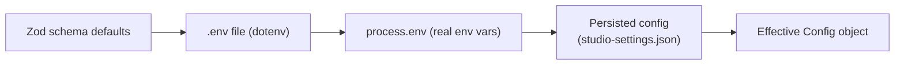

# Configuration

This page catalogues every configuration input across vLLM Studio: controller environment variables, the controller's persisted config file, frontend and desktop variables, the CLI, and the deploy script. Variables are grouped by area. For a task-oriented walkthrough see [getting started](../overview/getting-started.md); for the index of reference pages see [reference](./index.md).

## Configuration resolution

The controller resolves its config in `controller/src/config/env.ts` via `createConfig()`. Order of precedence, lowest to highest:

- `loadDotEnvironment()` loads the first `.env` found at the cwd, one level up, or two levels up.
- `process.env` is parsed against a Zod schema that supplies defaults.
- `loadPersistedConfig(data_dir)` reads `<data_dir>/studio-settings.json`. If it sets `models_dir` or `providers`, those override the env-derived values (`controller/src/config/persisted-config.ts`).

A safety check throws at startup if the controller binds to a non-loopback host without an API key and without `VLLM_STUDIO_ALLOW_UNAUTHENTICATED` (`controller/src/config/env.ts`).

## Controller environment variables

Parsed in `controller/src/config/env.ts` unless noted otherwise.

| Variable | Default | Meaning |
| --- | --- | --- |
| `VLLM_STUDIO_HOST` | `127.0.0.1` | Bind host for the controller HTTP server. Non-loopback values require an API key (or the allow-unauthenticated flag). |
| `VLLM_STUDIO_PORT` | `8080` | Controller HTTP port. Coerced to a positive integer. |
| `VLLM_STUDIO_API_KEY` | unset | Bearer/API key required to call the controller. Mandatory when `VLLM_STUDIO_HOST` is non-loopback. |
| `VLLM_STUDIO_ALLOW_UNAUTHENTICATED` | `false` | When truthy (`1/true/yes/on`), allows binding a non-loopback host with no API key. Intended for trusted local networks only. |
| `VLLM_STUDIO_CORS_ORIGINS` | built-in localhost/127.0.0.1/host.docker.internal list on ports 3000/3001 | Comma-separated browser origin allowlist for direct controller access. Each entry is normalized to its URL origin. |
| `VLLM_STUDIO_INFERENCE_HOST` | `localhost` | Host of the managed inference backend (vLLM/SGLang/etc.). |
| `VLLM_STUDIO_INFERENCE_PORT` | `8000` | Port of the managed inference backend. Coerced to a positive integer. |
| `VLLM_STUDIO_DATA_DIR` | `./data` (or `../data` when cwd is `controller/` and a parent `data/` exists) | Root data directory for SQLite, recipes, downloads, persisted config, and agent state. Resolved to an absolute path. |
| `VLLM_STUDIO_DB_PATH` | `<data_dir>/controller.db` | SQLite database file path. Resolved to an absolute path. |
| `VLLM_STUDIO_MODELS_DIR` | `/models` | Directory scanned for model weights. Overridden by `models_dir` in persisted config when present. |
| `VLLM_STUDIO_SGLANG_PYTHON` | unset | Python interpreter for the SGLang backend. Only needed when using SGLang. |
| `VLLM_STUDIO_TABBY_API_DIR` | unset | TabbyAPI / ExLlamaV3 install directory. Only needed for that backend. |
| `VLLM_STUDIO_LLAMA_BIN` | unset | Path to `llama-server` when it is not on `PATH`. |
| `VLLM_STUDIO_MLX_PYTHON` | unset | Python interpreter for the MLX backend (Apple Silicon). |
| `VLLM_STUDIO_STRICT_OPENAI_MODELS` | `false` | When truthy, only configured recipes are routable through the controller's OpenAI-compatible endpoint. |

### Controller behavior flags (read outside the Zod schema)

These are read directly from `process.env` elsewhere, not through `createConfig()`.

| Variable | Default | Meaning | Source |
| --- | --- | --- | --- |
| `VLLM_STUDIO_DISABLE_METRICS` | `false` | When truthy (`1/true/yes/on`), the background metrics collector does not start. | `controller/src/main.ts` |
| `VLLM_STUDIO_MOCK_INFERENCE` | `false` | Enables mock inference so the UI/E2E flows work without a real LLM backend. | `.env.example` |
| `VLLM_STUDIO_EXLLAMAV3_COMMAND` | unset | Full launch command template for an ExLlamaV3 server (binary plus flags). | `.env.example` |
| `VLLM_STUDIO_AGENT_FS_LOCAL_FALLBACK` | `false` | Lets agent file tools fall back to the local filesystem when the sandbox backend is unavailable. | `.env.example` |
| `VLLM_STUDIO_OPENAI_MODEL_ACTIVATION_POLICY` | `load_if_idle` | OpenAI proxy model-activation policy: `load_if_idle` (reuse running model, rewrite request model) or `switch_on_request` (switch active model first). | `CHANGELOG.md` (v1.13.0) |

> The flag list above traces to `.env.example`, `controller/src/main.ts`, and the changelog. `VLLM_STUDIO_OPENAI_MODEL_ACTIVATION_POLICY` is documented from the changelog; confirm the exact reader in the proxy module before relying on it.

### Credentials and search

| Variable | Default | Meaning |
| --- | --- | --- |
| `EXA_API_KEY` | unset | Exa AI key used by the chat web-search / research path (`.env.example`). |
| HuggingFace token env vars (`HF_TOKEN` / `HUGGING_FACE_HUB_TOKEN`) | unset | Authenticate HuggingFace downloads. These follow standard HuggingFace tooling conventions rather than a `VLLM_STUDIO_` name; verify the exact variable your download path reads. |

## Persisted controller config

Stored as JSON at `<data_dir>/studio-settings.json` and managed by `controller/src/config/persisted-config.ts`. The file and its directory are written with hardened permissions (`0700` dir, `0600` file). The `PersistedConfig` shape:

| Field | Type | Meaning |
| --- | --- | --- |
| `models_dir` | `string?` | Overrides `VLLM_STUDIO_MODELS_DIR` when set. |
| `providers` | `ProviderConfig[]?` | Saved upstream OpenAI-compatible providers. Each has `id`, `name`, `base_url`, `api_key`, `enabled`. |
| `ui_preferences` | `Record<string, string>?` | Renderer UI preference snapshot. |
| `selected_runtime_target_ids` | `Partial<Record<"vllm"\|"sglang"\|"llamacpp"\|"mlx", string>>?` | Per-backend selected runtime target id. |

## Frontend variables

The frontend chooses a controller through these variables (default `http://localhost:8080`), plus a saved controller setting persisted via `/api/settings`. See [getting started](../overview/getting-started.md).

| Variable | Meaning |
| --- | --- |
| `BACKEND_URL` | Server-side controller base URL used by `/api/*` routes. |
| `NEXT_PUBLIC_BACKEND_URL` | Client-visible controller base URL. |
| `VLLM_STUDIO_BACKEND_URL` | Alternate controller base URL variable. |
| `PORT` | Next.js dev/start port. Project convention uses `3001` for local browser verification. |
| `VLLM_STUDIO_ENABLE_SERVICE_WORKER` | When `"true"`, registers `/sw.js`; otherwise the boot script unregisters service workers and clears `vllm-studio-` caches (`frontend/src/app/layout.tsx`). |
| `ANALYZE` | When `true`, `next build` runs the bundle analyzer (`frontend/package.json`). |

> The three backend-URL variables are documented from `.env.example`/`getting-started` and the resolver in the frontend's API layer. If you need the exact precedence among them, check the frontend backend-resolution helper.

## Desktop (Electron) variables

Read in `frontend/desktop/configs.ts` and `frontend/desktop/app-identity.ts`, and used by the `desktop:*` scripts in `frontend/package.json`.

| Variable | Default | Meaning |
| --- | --- | --- |
| `VLLM_STUDIO_DESKTOP_DEV_SERVER_URL` | `http://127.0.0.1:3000` | URL the packaged/dev Electron shell loads instead of the embedded standalone server. Set to `:3001` for the verification dev server. |
| `VLLM_STUDIO_DESKTOP_CHANNEL` | `stable` | Release channel: `stable`, `beta`, or `alpha`. `beta`/`alpha` allow prerelease updates. |
| `VLLM_STUDIO_DESKTOP_DISABLE_AUTO_UPDATE` | `false` | When `"true"`, disables electron-updater auto-update. |
| `VLLM_STUDIO_DESKTOP_APP_NAME` | unset | Overrides the Electron app name and process title (used for an isolated beta build). |
| `VLLM_STUDIO_DESKTOP_USER_DATA_DIR` | Electron default `userData` | Overrides the user-data directory (used for an isolated beta build). |

The canonical installed app is `/Applications/vLLM Studio.app` with bundle id `org.vllm.studio.desktop`. See [deployment](../deployment.md) for the rebuild/reinstall flow.

## CLI variables

The CLI (`cli/`) targets a controller. Defaults match the controller's loopback bind.

| Variable | Default | Meaning |
| --- | --- | --- |
| `VLLM_STUDIO_URL` | `http://localhost:8080` | Controller base URL the CLI talks to. |
| `VLLM_STUDIO_API_KEY` | unset | API key sent with CLI requests when the controller requires auth. |

## Deploy script variables

Loaded from `.env.local` (gitignored) by `scripts/deploy-remote.sh`.

| Variable | Required | Meaning |
| --- | --- | --- |
| `REMOTE_HOST` | yes | Remote GPU server hostname/IP. |
| `REMOTE_USER` | yes | SSH username on the remote. |
| `REMOTE_PATH` | yes | Deploy directory on the remote. |
| `REMOTE_SSH_KEY` | no (default `~/.ssh/id_ed25519`) | SSH private key for the connection. |
| `REMOTE_URL` | no | Public URL of the deployed instance, used for verification messaging. |
| `VLLM_STUDIO_UID` / `VLLM_STUDIO_GID` | no (default `1000`) | Frontend container user/group, to help write `./data` on Linux hosts (`.env.example`). |

## Notes

- `.env.local` holds sensitive deployment values and is never committed.
- The Zod schema in `controller/src/config/env.ts` only coerces and defaults the variables listed in the [controller environment variables](#controller-environment-variables) table; the behavior flags are read ad hoc and so accept any truthy `1/true/yes/on` form their reader implements.
