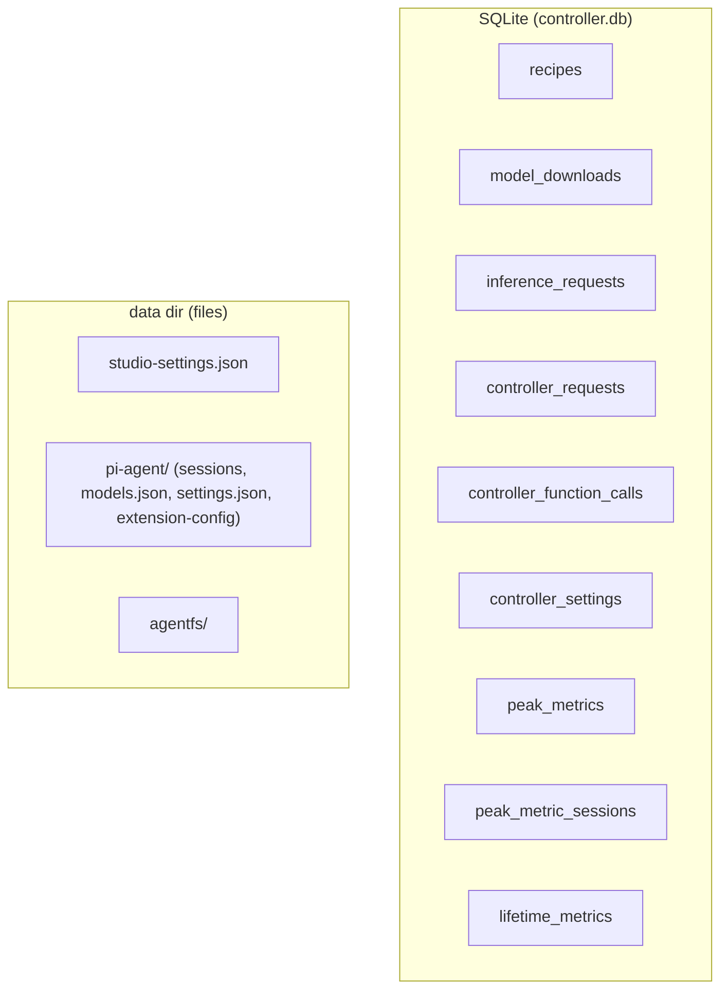

# Data models

This page catalogues persistent and wire data shapes: the controller SQLite tables, the shared contract types exchanged between processes, and the agent state the frontend keeps on disk. For runtime behavior see [metrics and observability](../systems/metrics-and-observability.md); for the cross-cutting building blocks see [primitives](../primitives/index.md).

## Storage overview

All tables share one SQLite file opened by `controller/src/stores/sqlite.ts` (`openSqliteDatabase`), which sets `PRAGMA busy_timeout = 5000` and drops a list of obsolete legacy tables (`jobs`, `chat_sessions`, `chat_messages`, `chat_runs`, `chat_usage`, `sessions`, `messages`, `runs`, `usage`) on open.

## SQLite tables

### `recipes`

Defined in `controller/src/modules/models/recipes/recipe-store.ts`. Stores launch recipes as serialized JSON.

| Column | Type | Notes |
| --- | --- | --- |
| `id` | `TEXT PRIMARY KEY` | Recipe id. |
| `data` | `TEXT NOT NULL` | Serialized recipe JSON. Legacy databases may use a `json` column instead; the store detects which column exists. |
| `created_at` | `TEXT` | `CURRENT_TIMESTAMP` default. |
| `updated_at` | `TEXT` | `CURRENT_TIMESTAMP` default. |

At startup `normalizeVllmRecipes()` rewrites stale `python_path` values on vLLM recipes.

### `model_downloads`

Defined in `controller/src/modules/engines/downloads/download-store.ts`. One row per download, serialized as JSON.

| Column | Type | Notes |
| --- | --- | --- |
| `id` | `TEXT PRIMARY KEY` | Download id. |
| `data` | `TEXT NOT NULL` | Serialized `ModelDownload` JSON (see [shared contracts](#model-downloads-recipests)). |
| `created_at` | `TEXT` | `CURRENT_TIMESTAMP` default. |
| `updated_at` | `TEXT` | `CURRENT_TIMESTAMP` default; bumped on every save. List order is by `updated_at DESC`. |

### `inference_requests`

Defined in `controller/src/stores/inference-request-store.ts`. The source of truth for the `/usage` analytics dashboard; one row per request through the OpenAI proxy.

| Column | Type | Notes |
| --- | --- | --- |
| `id` | `INTEGER PRIMARY KEY AUTOINCREMENT` | Row id. |
| `created_at` | `TEXT` | `CURRENT_TIMESTAMP` default. Indexed. |
| `model` | `TEXT NOT NULL` | Model/recipe name. Indexed with `created_at`. |
| `source` | `TEXT` | Request source label. |
| `session_id` | `TEXT` | Originating session. |
| `provider` | `TEXT` | Upstream provider. |
| `prompt_tokens` | `INTEGER` | Default 0. |
| `completion_tokens` | `INTEGER` | Default 0. |
| `reasoning_tokens` | `INTEGER` | Default 0. |
| `cache_read_tokens` | `INTEGER` | Default 0. |
| `cache_write_tokens` | `INTEGER` | Default 0. |
| `total_tokens` | `INTEGER` | Default 0; stored as prompt + completion. |
| `ttft_ms` | `INTEGER` | Nullable. |
| `duration_ms` | `INTEGER` | Nullable. |
| `status` | `INTEGER` | Default 200. |
| `streamed` | `INTEGER` | Default 0 (boolean). |

### `controller_requests` and `controller_function_calls`

Both defined in `controller/src/stores/controller-request-store.ts`. HTTP-route and function-call observability.

`controller_requests`:

| Column | Type | Notes |
| --- | --- | --- |
| `id` | `INTEGER PRIMARY KEY AUTOINCREMENT` | Row id. |
| `created_at` | `TEXT` | `CURRENT_TIMESTAMP` default. Indexed. |
| `method` | `TEXT NOT NULL` | Stored uppercase. |
| `path` | `TEXT NOT NULL` | Route path. Indexed with `created_at`. |
| `status` | `INTEGER NOT NULL` | HTTP status. Indexed with `created_at`. |
| `duration_ms` | `INTEGER NOT NULL` | Request duration. |
| `success` | `INTEGER NOT NULL` | Boolean. |
| `error_class` | `TEXT` | Nullable. |
| `error_message` | `TEXT` | Nullable. |
| `user_agent` | `TEXT` | Nullable. |

`controller_function_calls`:

| Column | Type | Notes |
| --- | --- | --- |
| `id` | `INTEGER PRIMARY KEY AUTOINCREMENT` | Row id. |
| `created_at` | `TEXT` | `CURRENT_TIMESTAMP` default. Indexed. |
| `function_name` | `TEXT NOT NULL` | Indexed with `created_at`. |
| `duration_ms` | `INTEGER NOT NULL` | Call duration. |
| `success` | `INTEGER NOT NULL` | Boolean. |
| `error_class` | `TEXT` | Nullable. |
| `error_message` | `TEXT` | Nullable. |

### `controller_settings`

Defined in `controller/src/stores/controller-settings-store.ts`. A small key/value store; currently holds the renderer UI preference snapshot under key `ui_preferences`.

| Column | Type | Notes |
| --- | --- | --- |
| `key` | `TEXT PRIMARY KEY` | Setting key. |
| `value` | `TEXT NOT NULL` | JSON-encoded value. |
| `updated_at` | `TEXT NOT NULL` | `CURRENT_TIMESTAMP` default; bumped on upsert. |

### `peak_metrics`, `peak_metric_sessions`, `lifetime_metrics`

Defined in `controller/src/modules/system/metrics-store.ts` (`PeakMetricsStore`).

`peak_metrics` (best observed values per model, monotonic):

| Column | Type | Notes |
| --- | --- | --- |
| `model_id` | `TEXT PRIMARY KEY` | Model id. |
| `prefill_tps` | `REAL` | Best prefill tokens/sec. |
| `generation_tps` | `REAL` | Best generation tokens/sec. |
| `ttft_ms` | `REAL` | Best (lowest) time-to-first-token. |
| `total_tokens` | `INTEGER` | Default 0. |
| `total_requests` | `INTEGER` | Default 0. |
| `updated_at` | `TEXT` | `CURRENT_TIMESTAMP` default. |

`peak_metric_sessions` (best values per runtime session):

| Column | Type | Notes |
| --- | --- | --- |
| `session_id` | `TEXT PRIMARY KEY` | Runtime session id. |
| `model_id` | `TEXT NOT NULL` | Model id. Indexed with `updated_at`. |
| `peak_prefill_tps` | `REAL` | Session best prefill tps. |
| `peak_generation_tps` | `REAL` | Session best generation tps. |
| `best_ttft_ms` | `REAL` | Session best ttft. |
| `started_at` | `TEXT` | `CURRENT_TIMESTAMP` default. |
| `updated_at` | `TEXT` | `CURRENT_TIMESTAMP` default. |

`lifetime_metrics` (cumulative counters, key/value):

| Column | Type | Notes |
| --- | --- | --- |
| `key` | `TEXT PRIMARY KEY` | Counter name. |
| `value` | `REAL NOT NULL` | Default 0. |
| `updated_at` | `TEXT` | `CURRENT_TIMESTAMP` default. |

Seeded keys include `tokens_total`, `prompt_tokens_total`, `completion_tokens_total`, `energy_wh`, `uptime_seconds`, and `requests_total`.

## Shared contract types

These types live under `shared/contracts/` and are exchanged across controller, frontend, and CLI.

### Recipes (`recipes.ts`)

`Backend` is one of `vllm` | `sglang` | `llamacpp` | `mlx`.

`RecipeBase` — canonical recipe wire shape. Selected fields:

| Field | Type | Notes |
| --- | --- | --- |
| `id`, `name`, `model_path` | `string` | Identity and weights path. |
| `backend` | `Backend` | Serving backend. |
| `env_vars` | `Record<string,string> \| null` | Extra environment for the launch. |
| `tensor_parallel_size`, `pipeline_parallel_size` | `number` | Parallelism. |
| `max_model_len`, `max_num_seqs` | `number` | Context and concurrency limits. |
| `gpu_memory_utilization` | `number` | Fraction of VRAM to use. |
| `kv_cache_dtype`, `dtype`, `quantization` | `string` / nullable | Precision settings. |
| `trust_remote_code` | `boolean` | Allow custom model code. |
| `tool_call_parser`, `reasoning_parser` | `string \| null` | Parser selection. |
| `enable_auto_tool_choice` | `boolean` | Auto tool-choice toggle. |
| `host`, `port` | `string` / `number` | Bind target. |
| `served_model_name`, `python_path` | `string \| null` | Override names/interpreter. |
| `extra_args` | `Record<string, unknown>` | Free-form launch args. |
| `max_thinking_tokens` | `number \| null` | Thinking budget. |
| `thinking_mode` | `string` | Thinking mode label. |

`RecipePayload` = `Pick<RecipeBase, "id" \| "name" \| "model_path">` plus `Partial` of the rest; the controller defaults omitted fields server-side.

`ModelDownload` — `id`, `model_id`, `revision`, `status` (`DownloadStatus`: `queued` | `downloading` | `paused` | `completed` | `failed` | `canceled`), `source`, timestamps (`created_at`, `updated_at`, `completed_at`), `target_dir`, `total_bytes`, `downloaded_bytes`, `speed_bytes_per_second`, `files: DownloadFileInfo[]`, `error`. Each `DownloadFileInfo` has `path`, `size_bytes`, `downloaded_bytes`, and `status` (`DownloadFileStatus`: `pending` | `downloading` | `completed` | `error`).

`StorageInfo` — `models_dir`, `model_count`, `model_bytes`, and a `disk` object (`path`, `total_bytes`, `free_bytes`, `available_bytes`).

`ModelInfo` — `path`, `name`, optional `size_bytes`, `modified_at`, `architecture`, `quantization`, `context_length`, `recipe_ids`, `has_recipe`, `num_hidden_layers`, `num_kv_heads`, `hidden_size`, `head_dim`.

### System (`system.ts`)

`SystemConfig` — `host`, `port`, `inference_port`, `api_key_configured`, `models_dir`, `data_dir`, `db_path`, `sglang_python`, `tabby_api_dir`, `llama_bin`, `mlx_python`.

`EngineBackend` = `vllm` | `sglang` | `llamacpp` | `mlx`. `RuntimeKind` = `venv` | `docker` | `binary` | `system`.

`RuntimeTarget` — `id`, `backend`, `kind`, `label`, `installed`, `active`, `version`, optional `pythonPath`/`binaryPath`/`dockerImage`, `source` (`configured` | `discovered` | `running` | `bundled`), a `capabilities` object (`canLaunch`, `canUpdate`, `canInspectOptions`, `supportsDocker`), a `health` object (`status`: `ok` | `warning` | `error` | `unknown`, optional `message`), and an optional `update` block.

`EngineJob` — `id`, `backend`, optional `targetId`, `type` (`install` | `update` | `download` | `inspect`), `status` (`queued` | `running` | `success` | `error` | `cancelled`), optional `progress`, `message`, optional `command`, `startedAt`, optional `finishedAt`, `outputTail`, `error`.

Related system shapes also defined here: `ServiceInfo`, `EnvironmentInfo`, `RuntimeBackendInfo`, `SystemRuntimeInfo`, `CompatibilityReport`/`CompatibilityCheck`, `ConfigData`, and the platform/GPU info types.

### Usage (`usage.ts`)

`UsageStats` — the `/usage` analytics aggregate: `totals` (tokens, requests, success rate, unique sessions/users), `latency` (avg/p50/p95/p99/min/max), `ttft`, `tokens_per_request`, `cache`, `week_over_week`, `recent_activity`, `peak_days`, `peak_hours`, `by_model[]`, `daily[]`, optional `daily_by_model[]`, `hourly_pattern[]`, and an optional embedded `controller: ControllerUsageStats`.

`ControllerUsageStats` — controller HTTP/function observability: `totals`, `latency`, `recent_activity`, `by_path[]`, `by_status[]`, `recent_errors[]`, and an optional `function_calls` block with its own `totals`, `latency`, `by_function[]`, and `recent_errors[]`.

### Observability and metrics (`observability.ts`)

This file holds GPU and metrics shapes (despite the name).

| Type | Purpose |
| --- | --- |
| `GPU` | Per-GPU stats: index, name, memory totals/used/free (bytes and `_mb` variants), utilization, temperature, power draw/limit. |
| `Metrics` | Live and aggregated serving metrics, including request/token counters, throughput, TTFT, KV-cache usage, VRAM, and many `session_*`, `peak_*`, and `lifetime_*` fields. |
| `VRAMCalculation` | VRAM fit estimate with a `breakdown` (model weights, KV cache, activations, per-GPU, total). |
| `PeakMetrics` | Per-model peak summary: `model_id`, `prefill_tps`, `generation_tps`, `ttft_ms`, best-session fields, `total_tokens`, `total_requests`. |
| `ProcessInfo` | A serving process: `pid`, `backend`, `model_path`, `port`, optional `served_model_name`. |
| `LogSession` | A log/run record: `id`, recipe/model/backend labels, timestamps, `status` (`running` | `stopped` | `crashed`). |
| `StudioSettings` | `config_path` plus persisted and effective settings snapshots. |
| `StudioDiagnostics` | System diagnostics: app version, platform/arch, CPU/memory, `gpus: GPU[]`, runtime info, disks, and embedded `SystemConfig`. |

## On-disk agent state (frontend)

The Pi agent runtime persists under `<data_dir>/pi-agent` (see `frontend/AGENTS.md` and [Pi agent runtime](../systems/pi-agent-runtime.md)):

| Path | Contents |
| --- | --- |
| `<data_dir>/pi-agent/` (session JSONL) | Per-session event logs; resume locates the JSONL via `findSessionFile`. |
| `<data_dir>/pi-agent/models.json` | Model catalogue written by `refreshPiModels`. |
| `<data_dir>/pi-agent/settings.json` | SDK settings (colocated with `auth.json`); installed Pi packages persist here. |
| `<data_dir>/pi-agent/extension-config/enabled.json` | Per-package on/off overrides applied as a runtime filter. |
| `<data_dir>/pi-agent/extension-config/<sanitizedKey>.json` | Per-package JSON config. |
| `<data_dir>/pi-agent/extensions/` | Auto-discovered drop-in extensions. |
| `<data_dir>/agentfs/` | Local-only agent file system for in-chat file read/write (see repo `AGENTS.md`). |
