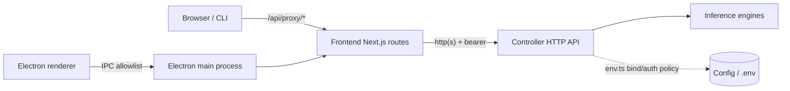
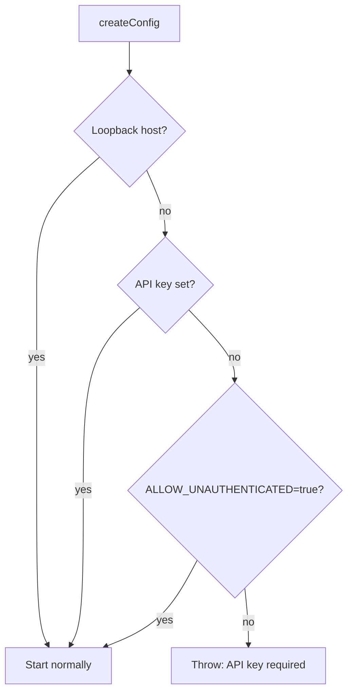

# Security

This page describes the security controls that exist in the codebase: how the controller decides whether to require authentication, how mutating requests are authenticated and rate-limited, how cross-origin and proxied requests are restricted, how the Electron app is hardened, and how secrets are handled. It describes what the code actually does; it does not claim guarantees beyond that.

## Trust boundaries

The main boundaries are: the browser/CLI to the frontend, the frontend proxy to the controller, the controller to engine processes, and the Electron renderer to the main process.

## Controller bind and auth policy

The controller's bind/auth policy is enforced when config is built in `controller/src/config/env.ts`:

- The controller binds `127.0.0.1` by default (`VLLM_STUDIO_HOST`).
- If the host is **non-loopback** and no `VLLM_STUDIO_API_KEY` is set, config construction throws unless `VLLM_STUDIO_ALLOW_UNAUTHENTICATED=true` is explicitly set. Loopback hosts (`127.0.0.1`, `localhost`, `::1`) are exempt.

This means a controller exposed on a non-loopback interface refuses to start without either an API key or an explicit opt-out.

## Mutating-request auth and rate limiting

`controller/src/http/security-middleware.ts` is mounted globally in `controller/src/http/app.ts` and applies to mutating methods (`POST`, `PUT`, `PATCH`, `DELETE`).

**Auth** (`createMutatingAuthMiddleware`):

- `OPTIONS` and `/health` are public.
- If no API key is configured, the middleware passes the request through (this is the loopback/unauthenticated case allowed by `env.ts`).
- Otherwise the request must present the key as `Authorization: Bearer <token>` or `X-API-Key`. Comparison uses `node:crypto` `timingSafeEqual` (via `safeTokenEquals`), with a length check first. A mismatch returns `401` with a `WWW-Authenticate` header.

Note that this middleware gates mutating methods only; `GET` reads are not authenticated by it.

**Rate limiting** (`createMutatingRateLimitMiddleware`):

- Applies to mutating methods only.
- Default budget is 120 requests per 60-second window, keyed by `clientIp:METHOD:path`.
- The client IP is derived from `x-forwarded-for`, then `cf-connecting-ip` / `x-real-ip`, falling back to `"unknown"`.
- Responses carry `X-RateLimit-Limit`, `X-RateLimit-Remaining`, and `X-RateLimit-Reset`; over-budget requests get `429` with `Retry-After`. The store is an in-memory `Map` that is opportunistically pruned past 10,000 entries.

## CORS

CORS is configured in `controller/src/http/app.ts`. The `origin` callback only echoes an origin back if it is in the configured allowlist (`config.cors_origins`), otherwise it returns `null`. The allowlist is built in `controller/src/config/env.ts` (`parseCorsOrigins`) and defaults to local origins (`localhost`/`127.0.0.1`/`host.docker.internal` on ports `3000`/`3001`); it can be overridden with `VLLM_STUDIO_CORS_ORIGINS`. Allowed methods include the mutating verbs and `OPTIONS`; allowed headers include `Authorization`, `Content-Type`, and `X-API-Key`.

## Frontend proxy SSRF guard

The frontend proxy route `frontend/src/app/api/proxy/[...path]/route.ts` forwards browser requests to the controller and guards against pointing the proxy at arbitrary internal hosts:

- Backend override URLs (from the `x-backend-url` header or `vllmstudio_backend_url` cookie) are normalized and must be `http`/`https` (`normalizeBackendUrl`).
- `isPrivateUrl` flags `localhost`, `127.0.0.1`, `::1`, `0.0.0.0`, `.local`/`.internal` suffixes, and private IPv4 ranges (`10/8`, `172.16–31`, `192.168/16`, `169.254/16`).
- A private override is only honored if it is trusted: when running as the desktop app (`VLLM_STUDIO_DATA_DIR` set) all private addresses are trusted; otherwise the origin must appear in the default backend origin or the `VLLM_STUDIO_PROXY_OVERRIDE_ALLOWLIST` allowlist (`isTrustedPrivateOverride`).
- A blocked private override supplied via header returns `403` and clears the override cookie; one supplied via cookie is silently ignored and cleared.
- Credentials are never forwarded as query params: an incoming `api_key` query param is stripped and instead applied as a bearer header.

## Cross-controller passthrough

The controller's `/controllers/route/*` handler in `controller/src/http/app.ts` forwards to another controller identified by a `target` query param or `x-vllm-target-controller` header. The target URL is parsed and rejected with `400` unless its protocol is `http:` or `https:`. The `target` param is not appended to the forwarded query string.

## Electron hardening

The desktop main process is hardened in `frontend/desktop/logic/security.ts` and `frontend/desktop/preload.ts`:

- **Navigation policy** (`registerNavigationPolicy`): on `web-contents-created`, attached webviews have their `preload` deleted and are forced to `nodeIntegration=false`, `contextIsolation=true`, `sandbox=true`. `will-navigate` is origin-locked to the app origin for window-owned contents (guest/OOPIF contents are exempted so cross-origin iframes still load).
- **Window open handler** (`hardenWebContents`): `setWindowOpenHandler` denies new windows; `http(s)` URLs are opened externally via the system browser instead. `will-navigate` away from the app origin is prevented and redirected to the external browser.
- **IPC allowlist** (`preload.ts`): the renderer only receives an explicit `vllmStudioDesktop` bridge exposed through `contextBridge`. Every capability is a named `ipcRenderer.invoke` channel (`desktop:*`) plus scoped terminal event listeners; no raw Node or Electron APIs are exposed.

The desktop notes in `frontend/desktop/AGENTS.md` reinforce keeping `contextIsolation=true`, `sandbox=true`, `nodeIntegration=false`, and routing everything through explicit IPC allowlists.

## Secrets handling

- `.env.local` holds deployment connection values (`REMOTE_HOST`, `REMOTE_USER`, `REMOTE_PATH`, `REMOTE_SSH_KEY`) and is gitignored. `AGENTS.md` states sensitive data must never be committed.
- `.env.example` documents variable **names** only, with empty or placeholder values (for example `VLLM_STUDIO_API_KEY=` and `EXA_API_KEY=your-exa-api-key-here`).
- The proxy redacts override URLs in its warning logs and never logs the API key.

### Hugging Face token resolution

`resolveHfToken` in `controller/src/modules/engines/routes.ts` resolves a Hugging Face token with this precedence:

1. Request body `hf_token`.
2. Header `x-hf-token` or `x-huggingface-token`.
3. Environment: `VLLM_STUDIO_HF_TOKEN`, then `HF_TOKEN`, then `HUGGINGFACE_TOKEN`.

The first non-empty source wins; otherwise the result is `null`.

## CI security scanning

`.github/workflows/security.yml` runs on pull requests, pushes to `main`, and a weekly schedule:

- **TruffleHog** secret scanning (`--only-verified`).
- **CodeQL** analysis for JavaScript/TypeScript.
- **Dependency review** on pull requests, failing on moderate+ severity and denying `GPL-3.0`/`AGPL-3.0` licenses.

## See also

- [Controller](apps/controller.md)
- [Desktop app](apps/desktop.md)
- [Configuration](reference/configuration.md)
- [Deployment](deployment.md)
- [API](api/index.md)
