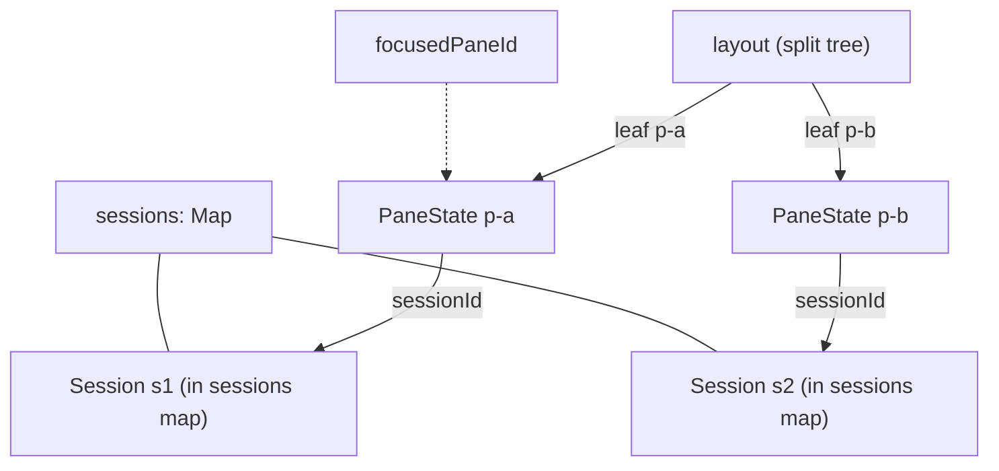
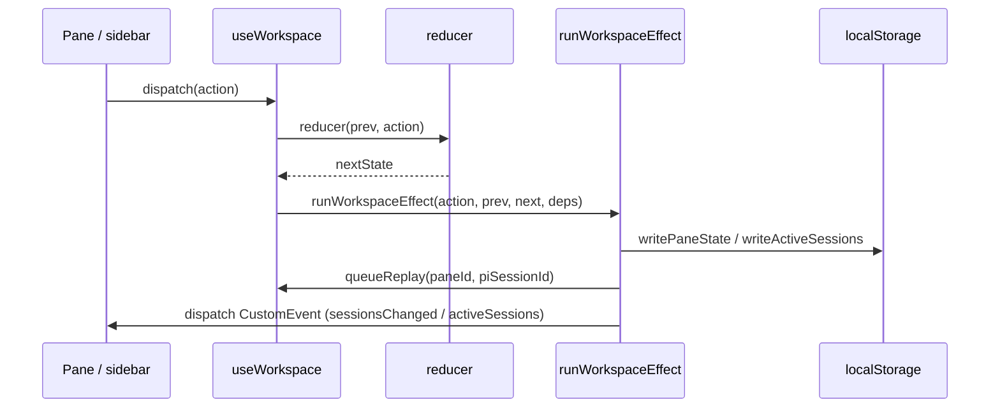

# Agent workspace

The agent workspace is the `/agent` UI: a grid of panes, each showing one active chat session, over a shared flat session map. State lives in a reducer-driven workspace store with side effects in `*-effects.ts` modules, never in React effect hooks, and is hydrated from localStorage and persisted active-session snapshots.

**Active contributors: Sero** (GitHub [0xSero](https://github.com/0xSero) / seroxdesign)

## Purpose

- Model the `/agent` layout as a binary split tree of panes, where each pane points at exactly one visible session.
- Keep all sessions in one flat `Map<SessionId, Session>` referenced by panes, so splitting, replacing, and closing panes never duplicate transcript state.
- Persist durable session metadata (not transcripts) and restore the workspace on reload, including auto-restoring previously active sessions once projects finish loading.
- Drive turns through the session engine and keep live/resumed sessions in sync with the in-process runtime.
- Hold to the no-effect-hooks rule: behavior lives in the reducer, external stores, and `*-effects.ts` modules consumed via `useSyncExternalStore`.

## Directory layout

```
frontend/src/lib/agent/workspace/
  store.ts            createInitialState, persistence (de)serialization, reducer re-export
  reducer.ts          pure reducer: status, pane-layout, session-open, session-edit groups
  pane-controller.ts  pane/session mutations (split, replace, focus, close, replay, ...)
  effects.ts          window-event bus + persistence + replay queue + active-session broadcast
  persistence.ts      localStorage read/write + legacy migrations
  layout.ts           binary split-tree helpers (collectLeaves, splitLeaf, removeLeaf)
  types.ts            WorkspaceState, WorkspaceAction, PaneState
  events.ts           window-event name constants (the workspace-internal bus)
frontend/src/lib/agent/
  sessions/           Session type, store helpers, selectors, engine, api
  sessions-store.ts   server-side JSONL session listing + findSessionFile + loadSession
  session-metadata-store.ts  archive state for sessions
  projects-store.ts   project registry used to resolve cwd
frontend/src/app/agent/_components/
  agent-workspace.tsx        thin mount: useWorkspace + AgentWorkspaceShell
  agent-workspace-shell.tsx  layout shell, pane grid, right panel
  use-workspace.ts           store wiring, handles, hydration/runtime-sync hooks
  pane-grid.tsx              renders the split tree, drag/drop, resize
  chat-pane.tsx              per-pane chat surface (composer + timeline)
  timeline/                  message/timeline rendering
frontend/src/hooks/agent/
  use-workspace-runtime-sync.ts  resume/poll live sessions against the runtime
  use-*-effects.ts               mount/cleanup side effects via useSyncExternalStore
```

## Key abstractions

| Symbol | File | Description |
| --- | --- | --- |
| `WorkspaceState` | `frontend/src/lib/agent/workspace/types.ts` | Flat `sessions` map, `panesById`, `layout` split tree, `focusedPaneId`, models, hydration flags. |
| `PaneState` | `frontend/src/lib/agent/workspace/types.ts` | `{ sessionId, runtimeSessionId }` — a layout slot pointing at one session, no transcript content. |
| `reducer` | `frontend/src/lib/agent/workspace/reducer.ts` | Pure reducer composed from four grouped sub-reducers (status, pane-layout, session-open, session-edit). |
| `pane-controller` functions | `frontend/src/lib/agent/workspace/pane-controller.ts` | `openNewSessionInFocusedPane`, `replaySessionInFocusedPane`, `splitPaneWithSession`, `closePane`, etc. |
| `createInitialState` | `frontend/src/lib/agent/workspace/store.ts` | One fresh pane (`p-init`) holding one fresh session; default unhydrated state. |
| `restorePersistedPaneState` / `sessionMetaForPersistence` | `frontend/src/lib/agent/workspace/store.ts` | Rebuild panes/sessions/selections from localStorage; serialize only durable metadata. |
| `runWorkspaceEffect` | `frontend/src/lib/agent/workspace/effects.ts` | Post-dispatch effects: persist pane state, queue replays, broadcast active sessions, refresh session lists. |
| `subscribeWorkspaceWindowEvents` | `frontend/src/lib/agent/workspace/effects.ts` | Bridge sidebar/project-nav window events (new/open/rename/projects-loaded) into dispatches. |
| `useWorkspace` | `frontend/src/app/agent/_components/use-workspace.ts` | Wires reducer + effects + hydration + runtime sync; exposes `WorkspaceHandles`. |
| `useWorkspaceRuntimeSync` | `frontend/src/hooks/agent/use-workspace-runtime-sync.ts` | Reconcile live sessions: resume subscriptions for unowned live sessions + 5s status poll. |
| `Session` | `frontend/src/lib/agent/sessions/types.ts` | One chat: `id`, `runtimeSessionId`, `piSessionId`, `messages`, `status`, `cwd`, `modelId`, ... |

## Panes, layout, and the session map

A pane is a layout slot, not a container of content. `WorkspaceState.layout` is a binary split tree (`layout.ts`); its leaves are pane ids. `panesById` maps each leaf to a `PaneState` of `{ sessionId, runtimeSessionId }`, and `sessions` is the single flat map holding the actual `Session` records. Splitting a pane allocates a new pane id and a new session in the map; closing a pane removes its leaf and prunes any orphaned sessions (`pruneOrphanSessions`). This keeps split layouts and "open the same session in two panes" coherent without copying transcripts.



## State flow



`useWorkspace` keeps the reducer state and runs `runWorkspaceEffect` after each dispatch. Effects are grouped: `persistActionEffects` writes pane state for layout/session actions and on metadata changes; `queueReplayEffects` schedules a transcript replay when a pane gains a `piSessionId`; `broadcastActiveSessions` writes the active-session snapshot and dispatches the `activeSessions` window event; and a debounced `sessionsChanged` event refreshes the sidebar list.

## Hydration and auto-restore

On mount, `persistence.ts` loads pane state (and per-session tool selections) from localStorage; `restorePersistedPaneState` rebuilds the layout, panes, and sessions but deliberately drops persisted `messages` (the canonical JSONL session log is the transcript source of truth). Active-session auto-restore is deferred until `ProjectsProvider` fires `PROJECTS_LOADED_EVENT`: the `hydrateActiveSessions` action filters snapshots to installed projects and, as a one-shot, restores them only if the user has not already touched the workspace (`state.hydrated`). This guards the "+ opens an old chat" race where a fresh empty session could be clobbered by a late restore.

## Runtime sync

`useWorkspaceRuntimeSync` keeps the visible sessions consistent with the in-process runtime without React effects (it uses `useSyncExternalStore` subscriptions purely for mount/cleanup). For every session that is live (`starting`/`running`) and not already owned by an in-page prompt stream (`stream-ownership.ts`), it opens an incremental resume subscription via `subscribeResumeRuntimeSession`; a transient `starting`→`running` flip never churns connections. A 5-second poll (`listRuntimeSessions`) reconciles status by runtime id or Pi session id, idling only sessions the runtime once acknowledged as running. Applied events route through the same coalescer and `applyPiEventToSession` used by the engine. See [Pi agent runtime](./pi-agent-runtime.md).

## The no-effect-hooks pattern

ESLint bans React effect hooks across the agent code. Behavior therefore lives in three seams: the pure `reducer.ts`, the `effects.ts` post-dispatch runner, and the `*-effects.ts` hook modules under `frontend/src/hooks/agent/` that wrap mount/cleanup logic in `useSyncExternalStore` with a constant snapshot so they never trigger re-renders. New workspace behavior should be added to the reducer (state) plus an effect module (side effects), not to a component body. See [patterns and conventions](../how-to-contribute/patterns-and-conventions.md).

## Integration points

- **Session engine** — panes submit turns through `useSessionEngine` (`frontend/src/lib/agent/sessions/engine.ts`), which streams runtime events back into the flat session map.
- **Runtime** — `useWorkspaceRuntimeSync` resumes/polls the `piRuntimeManager` sessions. See [Pi agent runtime](./pi-agent-runtime.md).
- **Projects** — `ProjectsProvider` resolves a pane's project/cwd and gates auto-restore via `PROJECTS_LOADED_EVENT`.
- **Tools** — per-session plugin/skill selections are persisted alongside pane state and restored as a `ToolSelection`. See [agent tools](../features/agent-tools.md) and [plugins and extensions](./plugins-and-extensions.md).
- **Sidebar** — the workspace listens for `newSession`/`open`/`rename` window events and broadcasts active sessions back to the sidebar.

## Entry points for modification

- Add or change a workspace action: extend `WorkspaceAction` in `frontend/src/lib/agent/workspace/types.ts` and handle it in the matching sub-reducer in `frontend/src/lib/agent/workspace/reducer.ts`.
- Change pane/session mutation logic (split, replace, replay, close): `frontend/src/lib/agent/workspace/pane-controller.ts`.
- Change persistence shape or migrations: `frontend/src/lib/agent/workspace/store.ts` and `frontend/src/lib/agent/workspace/persistence.ts`.
- Add a post-dispatch side effect: `frontend/src/lib/agent/workspace/effects.ts` (and a `*-effects.ts` module if it needs lifecycle).
- Change runtime reconciliation: `frontend/src/hooks/agent/use-workspace-runtime-sync.ts`.

## Key source files

| File | Description |
| --- | --- |
| `frontend/src/lib/agent/workspace/types.ts` | `WorkspaceState`, `WorkspaceAction`, `PaneState`. |
| `frontend/src/lib/agent/workspace/reducer.ts` | Pure reducer composed of four grouped sub-reducers. |
| `frontend/src/lib/agent/workspace/pane-controller.ts` | Pane/session mutations (split, replace, focus, close, replay). |
| `frontend/src/lib/agent/workspace/store.ts` | Initial state, persistence (de)serialization, reducer barrel. |
| `frontend/src/lib/agent/workspace/effects.ts` | Window-event bridge, persistence, replay queue, active-session broadcast. |
| `frontend/src/lib/agent/workspace/persistence.ts` | localStorage read/write and legacy migrations. |
| `frontend/src/lib/agent/workspace/layout.ts` | Binary split-tree helpers. |
| `frontend/src/lib/agent/workspace/events.ts` | Window-event name constants. |
| `frontend/src/lib/agent/sessions-store.ts` | Server-side session JSONL listing, `findSessionFile`, `loadSession`. |
| `frontend/src/lib/agent/session-metadata-store.ts` | Session archive state. |
| `frontend/src/lib/agent/projects-store.ts` | Project registry for cwd resolution. |
| `frontend/src/app/agent/_components/agent-workspace-shell.tsx` | Layout shell, pane grid, right panel. |
| `frontend/src/app/agent/_components/use-workspace.ts` | Store wiring + handles + hydration/runtime-sync hooks. |
| `frontend/src/app/agent/_components/pane-grid.tsx` | Split-tree rendering, drag/drop, resize. |
| `frontend/src/app/agent/_components/chat-pane.tsx` | Per-pane chat surface. |
| `frontend/src/hooks/agent/use-workspace-runtime-sync.ts` | Resume/poll live sessions against the runtime. |

## Related pages

- [Pi agent runtime](./pi-agent-runtime.md)
- [Plugins and extensions](./plugins-and-extensions.md)
- [Agent chat](../features/agent-chat.md)
- [Agent tools](../features/agent-tools.md)
- [Patterns and conventions](../how-to-contribute/patterns-and-conventions.md)
