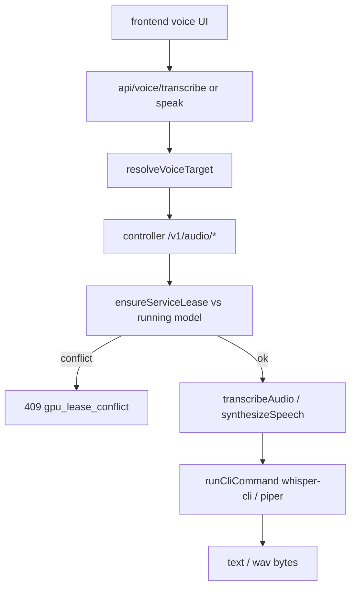

# Audio (STT/TTS)

The audio module adds OpenAI-compatible speech-to-text and text-to-speech endpoints to the controller, backed by local CLI tools (whisper.cpp for STT, piper for TTS). Because audio shares the GPU with inference, requests negotiate a GPU lease against any running model.

Active contributors: Sero

## Purpose

This page describes the `/v1/audio/transcriptions` and `/v1/audio/speech` endpoints, the pluggable STT/TTS CLI adapters, GPU lease handling, and the Next.js voice proxy routes the desktop/web UI calls. It is a thin module; deeper inference behavior is covered in [inference proxy](inference-proxy.md).

## Directory layout

```
controller/src/modules/audio/
├── routes.ts            /v1/audio/transcriptions, /v1/audio/speech
├── configs.ts           default mode, replace truthy values, temp path, transcode timeout
└── interfaces.ts        AudioRouteDependencies (injectable transcribe/synthesize/transcode)

controller/src/services/integrations/
├── stt/                 index.ts (backend select), whispercpp-adapter.ts, types.ts
├── tts/                 index.ts (backend select), piper-adapter.ts, types.ts
└── cli/cli-runner.ts    runCliCommand: spawn without shell, capture stdout/stderr

frontend/src/app/api/voice/
├── transcribe/route.ts  proxy → controller /v1/audio/transcriptions
├── speak/route.ts       proxy → controller /v1/audio/speech (mockable)
└── voice-target.ts      resolve controller-local vs external voice target
```

## Key abstractions

| Symbol | File | Description |
| --- | --- | --- |
| `registerAudioRoutes` | `controller/src/modules/audio/routes.ts` | Registers the transcription and speech endpoints; handles upload, transcode, lease, cleanup. |
| `transcribeAudio` | `controller/src/services/integrations/stt/index.ts` | Selects the STT backend (`whispercpp` default) and runs it. |
| `synthesizeSpeech` | `controller/src/services/integrations/tts/index.ts` | Selects the TTS backend (`piper` default) and runs it. |
| `runCliCommand` | `controller/src/services/integrations/cli/cli-runner.ts` | Spawns a CLI without shell interpolation, with timeout and stdin support. |
| `ensureServiceLease` | `controller/src/modules/audio/routes.ts` | Resolves GPU contention with a running model (replace / best_effort / conflict). |
| `resolveVoiceTarget` | `frontend/src/app/api/voice/voice-target.ts` | Chooses the controller-local or external voice base URL from settings. |

## How it works



### Transcription

`POST /v1/audio/transcriptions` (`controller/src/modules/audio/routes.ts`) reads a multipart `file`, parses `mode` (`strict`/`best_effort`) and `replace`, resolves the model path (under `models_dir/stt` or an absolute path, or `VLLM_STUDIO_STT_MODEL`), and negotiates a GPU lease. Non-WAV uploads are transcoded to 16kHz mono WAV with `ffmpeg` (`defaultTranscodeToWav`). It then calls `transcribeAudio`, which dispatches to `transcribeWithWhisperCpp` (`whispercpp-adapter.ts`): it runs `whisper-cli -m <model> -f <audio> -nt` (configurable via `VLLM_STUDIO_STT_CLI`/`VLLM_STUDIO_STT_BACKEND`), cleans the output, and returns `{ text }`. Temp files are always unlinked in `finally`.

### Speech

`POST /v1/audio/speech` reads JSON `input`, requires `response_format: "wav"`, resolves the TTS model (under `models_dir/tts` or `VLLM_STUDIO_TTS_MODEL`), negotiates a lease, and calls `synthesizeSpeech` → `synthesizeWithPiper` (`piper-adapter.ts`): it runs `piper --model <model> --output_file <out>` with the text on stdin (configurable via `VLLM_STUDIO_TTS_CLI`/`VLLM_STUDIO_TTS_BACKEND`) and returns the WAV bytes as `audio/wav`.

### GPU lease

`ensureServiceLease` checks for a running inference process. With `replace`, it evicts the model via `engineService.setActiveRecipe(null)` (see [engine lifecycle](engine-lifecycle.md)). In `best_effort` mode it proceeds alongside the model; in `strict` mode with a holder it returns a `409` `gpu_lease_conflict` payload listing `replace`/`best_effort` actions.

### Frontend voice proxy

The Next.js routes `frontend/src/app/api/voice/transcribe/route.ts` and `speak/route.ts` forward to the controller's audio endpoints, choosing the base URL with `resolveVoiceTarget` (controller-local vs an external voice service) and passing through auth. The speak route can return a silent WAV when `VLLM_STUDIO_MOCK_VOICE=1`.

## Integration points

- **Wiring**: `registerAudioRoutes(app, context)` is mounted in `controller/src/http/app.ts`; dependencies are injectable via `AudioRouteDependencies` (`controller/src/modules/audio/interfaces.ts`) for tests.
- **Engine lifecycle**: lease eviction calls `engineService.setActiveRecipe(null)` ([engine lifecycle](engine-lifecycle.md)).
- **CLI tools**: requires `whisper-cli`, `piper`, and `ffmpeg` on the host (or configured paths).
- **Frontend**: the voice UI calls the Next.js proxy routes, not the controller directly.

## Key source files

| File | Purpose |
| --- | --- |
| `controller/src/modules/audio/routes.ts` | STT/TTS endpoints, upload/transcode, GPU lease, cleanup |
| `controller/src/services/integrations/stt/index.ts` | STT backend selection |
| `controller/src/services/integrations/stt/whispercpp-adapter.ts` | whisper.cpp transcription via CLI |
| `controller/src/services/integrations/tts/index.ts` | TTS backend selection |
| `controller/src/services/integrations/tts/piper-adapter.ts` | piper synthesis via CLI |
| `controller/src/services/integrations/cli/cli-runner.ts` | Shell-free CLI runner with timeout and stdin |
| `frontend/src/app/api/voice/transcribe/route.ts` | Next.js proxy to controller transcription |
| `frontend/src/app/api/voice/speak/route.ts` | Next.js proxy to controller speech |
| `frontend/src/app/api/voice/voice-target.ts` | Resolve controller-local vs external voice target |
