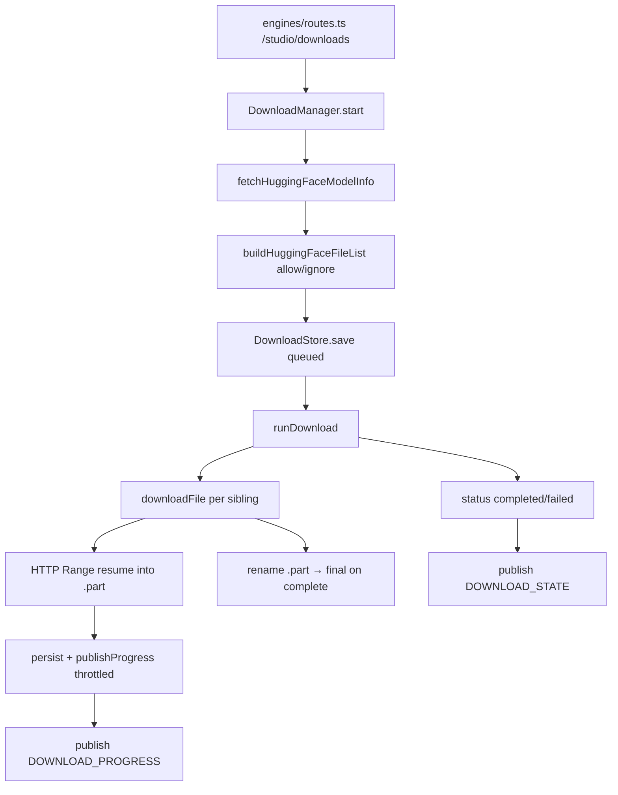

# Downloads

The download subsystem fetches model files from Hugging Face into the controller's models directory, with resumable per-file transfers, queue/pause/resume/cancel, persisted state, and progress events. A separate model browser scans the models directory to surface locally available models.

Active contributors: Sero

## Purpose

This page describes how a model download is started, streamed to disk, resumed after interruption, and reported via events, plus how the controller discovers already-downloaded models on disk. Downloaded models become launchable through [recipes](../features/recipes.md); progress is delivered over the event bus described in [eventing and SSE](eventing-and-sse.md).

## Directory layout

```
controller/src/modules/engines/downloads/
├── download-manager.ts     DownloadManager: start/pause/resume/cancel, file streaming, events
├── download-store.ts       SQLite persistence of ModelDownload records
├── huggingface-api.ts      fetch HF model info + build the file list
├── download-globs.ts       glob → regex matcher for allow/ignore patterns
├── download-math.ts        sum downloaded/total bytes across files
└── download-paths.ts       resolve + sanitize the on-disk target directory

controller/src/modules/models/
└── model-browser.ts        scan models dir, detect model dirs, read config metadata
```

## Key abstractions

| Symbol | File | Description |
| --- | --- | --- |
| `DownloadManager` | `controller/src/modules/engines/downloads/download-manager.ts` | Orchestrates downloads: queue, abortable per-file streaming, resume, state events. |
| `DownloadStore` | `controller/src/modules/engines/downloads/download-store.ts` | Persists each `ModelDownload` as JSON in the `model_downloads` SQLite table. |
| `fetchHuggingFaceModelInfo` / `buildHuggingFaceFileList` | `controller/src/modules/engines/downloads/huggingface-api.ts` | Reads `/api/models/:id` and turns siblings into a filtered file list. |
| `resolveDownloadRoot` | `controller/src/modules/engines/downloads/download-paths.ts` | Computes the target directory under `models_dir`, rejecting path traversal. |
| `matchesAny` | `controller/src/modules/engines/downloads/download-globs.ts` | Glob (`*`) matcher used for allow/ignore patterns. |
| `discoverModelDirectories` / `buildModelInfo` | `controller/src/modules/models/model-browser.ts` | BFS scan for model directories and metadata extraction. |

## How it works



### Starting a download

`DownloadManager.start` (`controller/src/modules/engines/downloads/download-manager.ts`) requires a `model_id`, merges default ignore filenames (`.gitattributes`, `.gitignore`) with caller ignore patterns, resolves the target directory, and verifies `models_dir` is writable (failing synchronously with a setup error otherwise). It fetches model info from `huggingface.co/api/models/:id`, builds the file list (filtering by allow/ignore globs via `matchesAny`), creates a `ModelDownload` record with a UUID and total byte estimate, saves it as `queued`, and kicks off `runDownload`.

### Per-file streaming and resume

`runDownload` marks the record `downloading` and iterates files, skipping completed ones and stopping on pause/cancel/abort. `downloadFile` streams each file to `<path>.part`:

- If a final file already exists at full size, it is marked complete.
- If a `.part` exists, an HTTP `Range: bytes=<existing>-` header resumes it; a `206` appends, otherwise it restarts.
- The URL is `https://huggingface.co/<model_id>/resolve/<revision>/<path>`, with a bearer token header when an HF token is supplied.
- Progress is persisted and a `DOWNLOAD_PROGRESS` event published, throttled to `DOWNLOAD_PROGRESS_THROTTLE_MS` (750ms).
- On completion the `.part` is renamed to the final path; a short read throws "Incomplete download".

When all files complete the record becomes `completed`, otherwise `failed`; aborts become `paused` or `canceled`. A final `DOWNLOAD_STATE` event is published.

### Queue control and restart recovery

`pause`, `resume`, and `cancel` update the record and abort the active `AbortController` for that id. On controller restart, `rehydrate()` marks any `downloading`/`queued` records as `paused` with "Restart required" so they do not appear stuck. The `EngineCoordinator` exposes `startDownload`/`pause`/`resume`/`cancel`/`list`/`get` passthroughs (see [engine lifecycle](engine-lifecycle.md)), and `searchHuggingFace` reuses `fetchHuggingFaceModelInfo`.

### Persistence

`DownloadStore` (`controller/src/modules/engines/downloads/download-store.ts`) stores each record as a JSON blob keyed by id in the `model_downloads` table (`bun:sqlite`), ordered by `updated_at`. Byte totals are computed by `sumDownloadedBytes`/`sumTotalBytes` (`download-math.ts`).

### Model discovery

`model-browser.ts` (`controller/src/modules/models/model-browser.ts`) finds models already on disk. `looksLikeModelDirectory` checks for known config filenames or weight extensions; `discoverModelDirectories` does a bounded BFS (depth and count capped) over the configured roots; `readConfigMetadata` parses `config.json` for architecture and context length; `estimateWeightsSizeBytes` sums weight file sizes; and `buildModelInfo` assembles a `ModelInfo` including which recipe ids reference the directory.

## Integration points

- **Routes**: `controller/src/modules/engines/routes.ts` exposes `/studio/downloads` (list/create) and `/studio/downloads/:id` (get/pause/resume/cancel). HF tokens come from the body, `x-hf-token`/`x-huggingface-token` headers, or `VLLM_STUDIO_HF_TOKEN`/`HF_TOKEN`/`HUGGINGFACE_TOKEN` env.
- **Events**: progress and state are published as `download_progress` and `download_state` (see [eventing and SSE](eventing-and-sse.md)).
- **Recipes**: discovered/downloaded model directories are referenced by recipe `model_path` ([recipes](../features/recipes.md)).
- **Config**: `models_dir` and the data directory determine where files land and where state is stored.

## Entry points for modification

- Change download streaming, resume, or throttling: `controller/src/modules/engines/downloads/download-manager.ts`.
- Change the HF API call or file filtering: `controller/src/modules/engines/downloads/huggingface-api.ts` and `download-globs.ts`.
- Change target-path resolution or traversal rules: `controller/src/modules/engines/downloads/download-paths.ts`.
- Change persisted shape or queries: `controller/src/modules/engines/downloads/download-store.ts`.
- Change local model discovery: `controller/src/modules/models/model-browser.ts`.

## Key source files

| File | Purpose |
| --- | --- |
| `controller/src/modules/engines/downloads/download-manager.ts` | Queue, resumable per-file streaming, state, progress events |
| `controller/src/modules/engines/downloads/download-store.ts` | SQLite persistence of `ModelDownload` records |
| `controller/src/modules/engines/downloads/huggingface-api.ts` | Fetch HF model info and build the filtered file list |
| `controller/src/modules/engines/downloads/download-globs.ts` | Glob-to-regex matcher for allow/ignore patterns |
| `controller/src/modules/engines/downloads/download-math.ts` | Sum downloaded/total bytes across files |
| `controller/src/modules/engines/downloads/download-paths.ts` | Resolve and sanitize the on-disk target directory |
| `controller/src/modules/models/model-browser.ts` | Scan the models directory and extract model metadata |
