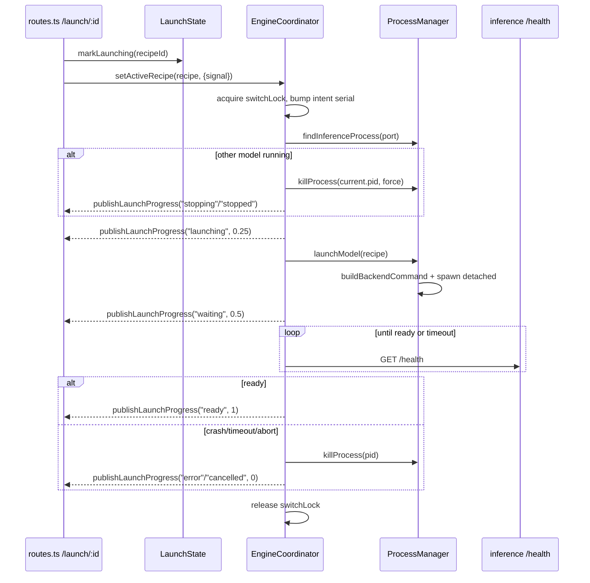

# Engine lifecycle

The engine lifecycle is the controller's state machine for launching and evicting inference processes. One inference process runs at a time, guarded by a switch lock; launches publish progress events through the launch/waiting/ready stages, and an abortable lifecycle intent lets an in-flight launch be cancelled or superseded.

Active contributors: Sero

## Purpose

This page describes how the controller turns a [recipe](../features/recipes.md) into a running inference server and how it stops one. It covers the `EngineCoordinator` that serializes launches, the `ProcessManager` that spawns and kills OS processes, the command builder that turns a recipe into an argv, and the routes that expose launch/evict/status. Backend discovery and runtime selection are documented separately in [runtime backends](runtime-backends.md); event delivery is documented in [eventing and SSE](eventing-and-sse.md).

## Directory layout

```
controller/src/modules/engines/
├── engine-coordinator.ts       EngineCoordinator: switch lock, abort/cancel, ready-wait
├── engine-service.ts           EngineService interface (the module's public contract)
├── configs.ts                  LIFECYCLE_READY_TIMEOUT_MS and other constants
├── routes.ts                   /recipes, /launch/:id, /evict, /wait-ready, /runtime/*
└── process/
    ├── launch-state.ts         idle/launching/preempting phase machine
    ├── process-manager.ts      spawn, kill, find inference process, evict
    ├── process-utilities.ts    ps parsing, backend detection, env building, pid checks
    ├── backend-builder.ts      builds the launch argv per backend
    └── model-runtime-defaults.ts   per-model reasoning/tool-call parser defaults
```

## Key abstractions

| Symbol | File | Description |
| --- | --- | --- |
| `EngineService` | `controller/src/modules/engines/engine-service.ts` | The single interface all consumers use: `setActiveRecipe`, `ensureActive`, `getCurrentRecipe`, `getCurrentProcess`, plus download passthroughs. |
| `EngineCoordinator` | `controller/src/modules/engines/engine-coordinator.ts` | Implements `EngineService`; owns the switch lock, the active lifecycle abort, and the launching pid. |
| `switchLock` (`AsyncLock`) | `controller/src/modules/engines/engine-coordinator.ts` | Serializes all launch/evict transitions so only one inference process is being started or stopped at a time. |
| `lifecycleIntentSerial` | `controller/src/modules/engines/engine-coordinator.ts` | Monotonic counter; a launch whose serial no longer matches the latest intent is treated as cancelled. |
| `ProcessManager` | `controller/src/modules/engines/process/process-manager.ts` | `findInferenceProcess`, `launchModel`, `evictModel`, `killProcess`. The only place processes are spawned or signalled. |
| `LaunchState` | `controller/src/modules/engines/process/launch-state.ts` | `idle` → `launching` → `preempting` phase tracker the routes consult to reject concurrent launches. |
| `buildBackendCommand` | `controller/src/modules/engines/process/backend-builder.ts` | Turns a recipe into an argv for vllm/sglang/llamacpp/mlx, or uses a `launch_command` override. |

## How it works

`setActiveRecipe(recipe)` is the launch/evict entry point. It increments `lifecycleIntentSerial`, acquires the switch lock, finds any current inference process, stops it if it does not already match the target recipe, spawns the new process, and waits for `/health` on the inference port before reporting ready. Passing `null` evicts the current process and blocks auto-activation. Each stage calls `publishLaunchProgress` (see [eventing and SSE](eventing-and-sse.md)).



### Switch lock and lifecycle intent

`setActiveRecipe` and `ensureActive` both acquire `switchLock` (an `AsyncLock` in `controller/src/modules/engines/engine-coordinator.ts`), so transitions never overlap. Before acquiring the lock, `setActiveRecipe` bumps `lifecycleIntentSerial`; `isAborted()` returns true when either the per-call `AbortController` fired or the stored serial advanced past this call's serial. At each checkpoint (after evict, after launch, after the ready wait) the coordinator calls `abortIfNeeded`, which kills the spawned pid and emits a `cancelled` progress event when the intent was superseded.

### Cancel and evict

The route `POST /launch/:recipeId/cancel` (`controller/src/modules/engines/routes.ts`) aborts the stored `AbortController` for that recipe and then calls `setActiveRecipe(null)`. `POST /evict` calls `setActiveRecipe(null)` directly. Setting a null recipe sets `autoActivationBlocked = true`, so a model that was manually stopped will not be auto-relaunched by `ensureActive` until a user launches it again.

### Ready detection and crash handling

`waitForReady` (`controller/src/modules/engines/engine-coordinator.ts`) polls the inference server's `/health` every 2s up to `LIFECYCLE_READY_TIMEOUT_MS` (300s, `controller/src/modules/engines/configs.ts`). It returns failure early if the pid disappears (reading the log tail via `readFileTailBytes`) or if a fatal log pattern is seen. `local-fetch` is used for the health probe against `config.inference_host`/`config.inference_port`.

### Launching a process

`ProcessManager.launchModel` (`controller/src/modules/engines/process/process-manager.ts`) overrides the recipe port with `config.inference_port`, calls `buildBackendCommand`, cleans up orphaned `VLLM::Worker` processes, opens a per-recipe log file, then `spawn`s the command detached with `stdio: ["ignore","pipe","pipe"]`. stdout/stderr lines are written to the log file and forwarded to `publishLogLine`. After a 3s settle it reports failure if the child errored or exited early, otherwise success with the child pid.

### Killing a process

`killProcess` builds the process tree from `ps` (`buildProcessTree` in `controller/src/modules/engines/process/process-utilities.ts`), collects descendants, stops any matching Docker inference container first (`stopDockerContainersForProcesses`), then sends `SIGTERM` (or `SIGKILL` when forced) to the whole tree, escalating to `SIGKILL` and finally `sudo -n kill` if needed. `findInferenceProcess` scans `ps` output, uses `detectBackend` to recognize vllm/sglang/llamacpp/mlx invocations, and extracts the model path and served name from the argv.

### Building the launch command

`buildBackendCommand` (`controller/src/modules/engines/process/backend-builder.ts`) first honors a `launch_command`/`custom_command` extra-arg override (tokenized by a quote-aware splitter). Otherwise it dispatches per `recipe.backend`: `buildVllmCommand` (prefers a venv `vllm` binary, then a system `vllm serve`, then `python -m vllm.entrypoints.openai.api_server`), `buildSglangCommand`, `buildLlamacppCommand` (validates the binary is `llama-server` and rejects path traversal), or `buildMlxCommand`. Recipe fields map to flags (`--tensor-parallel-size`, `--max-model-len`, `--gpu-memory-utilization`, etc.), and remaining `extra_args` are appended by `appendExtraArguments`, which skips internal keys (`venv_path`, `env_vars`, `visible_devices`, `docker_container`, …). When a recipe leaves `tool_call_parser`/`reasoning_parser` null, defaults come from `getDefaultToolCallParser`/`getDefaultReasoningParser` in `controller/src/modules/engines/process/model-runtime-defaults.ts`, which match on the model id (GLM, MiniMax M2, Qwen3, INTELLECT-3, …).

## Integration points

- **Routes**: `controller/src/modules/engines/routes.ts` mounts `/recipes`, `/recipes/:id` CRUD, `/launch/:id`, `/launch/:id/cancel`, `/evict`, `/wait-ready`, and the `/runtime/*` and `/studio/downloads` surfaces. `/launch/:id` rejects with 409 when `LaunchState` is not idle or another model is already running.
- **Wiring**: the coordinator is constructed in `controller/src/app-context.ts` with the config, logger, event manager, process manager, recipe store, download manager, and an `abortRunsForModel` callback used to cancel active chat runs when a model is evicted.
- **Inference proxy**: the proxy never launches models. It calls `findInferenceProcess` and returns 503 when the requested model is not the running one (see [inference proxy](inference-proxy.md)).
- **Events**: lifecycle stages and log lines are published through the `EventManager` (see [eventing and SSE](eventing-and-sse.md)).
- **Runtime targets**: which Python/binary/Docker target backs a backend is resolved separately (see [runtime backends](runtime-backends.md)).

## Entry points for modification

- Change launch staging, ready timeout behavior, or cancel semantics: `controller/src/modules/engines/engine-coordinator.ts` and `controller/src/modules/engines/configs.ts`.
- Add or change how a recipe maps to an argv: `controller/src/modules/engines/process/backend-builder.ts`.
- Adjust per-model parser defaults: `controller/src/modules/engines/process/model-runtime-defaults.ts`.
- Change process discovery, signalling, or Docker container handling: `controller/src/modules/engines/process/process-manager.ts` and `process-utilities.ts`.
- Add a launch-related HTTP endpoint: `controller/src/modules/engines/routes.ts`.

## Key source files

| File | Purpose |
| --- | --- |
| `controller/src/modules/engines/engine-coordinator.ts` | Switch lock, lifecycle intent, abort/cancel, ready wait, launch progress |
| `controller/src/modules/engines/engine-service.ts` | `EngineService` interface implemented by the coordinator |
| `controller/src/modules/engines/routes.ts` | Launch/evict/cancel/wait-ready and recipe CRUD endpoints |
| `controller/src/modules/engines/process/process-manager.ts` | Spawn, kill, evict, and find the inference process |
| `controller/src/modules/engines/process/process-utilities.ts` | `ps` parsing, `detectBackend`, env building, pid checks |
| `controller/src/modules/engines/process/backend-builder.ts` | Builds the launch argv per backend and applies overrides |
| `controller/src/modules/engines/process/launch-state.ts` | idle/launching/preempting phase machine used by routes |
| `controller/src/modules/engines/process/model-runtime-defaults.ts` | Per-model reasoning and tool-call parser defaults |
| `controller/src/modules/engines/configs.ts` | `LIFECYCLE_READY_TIMEOUT_MS` and related constants |
