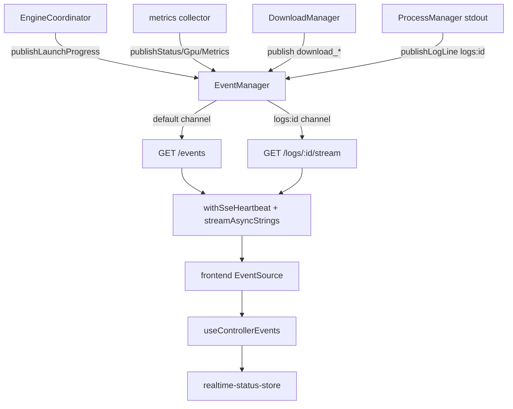

# Eventing and SSE

The controller has an in-process event bus that fans typed events out to channel subscribers, and HTTP endpoints that turn those subscriptions into Server-Sent Events streams. This is how launch progress, status, GPU, metrics, download progress, and log lines reach the frontend in real time.

Active contributors: Sero

## Purpose

This page describes the `EventManager` publish/subscribe core, the controller event names, the SSE plumbing (heartbeats, headers, async-iterable to stream), the `/events` and log-stream endpoints, and the frontend consumers. Producers of these events are documented in [engine lifecycle](engine-lifecycle.md), [downloads](downloads.md), and [metrics and observability](metrics-and-observability.md).

## Directory layout

```
controller/src/
├── modules/system/
│   ├── event-manager.ts        Event class + EventManager (channels, backpressure)
│   └── logs-routes.ts          /events, /logs, /logs/:id/stream, /events/stats
├── contracts/controller-events.ts   re-export of the shared event constants
├── http/sse.ts                 streamAsyncStrings, withSseHeartbeat, buildSseHeaders
└── core/
    ├── log-files.ts            per-session log file paths, tail, retention
    └── logger.ts               file + SSE logger

shared/contracts/controller-events.ts   CONTROLLER_EVENTS names + domain routing

frontend/src/hooks/
├── use-controller-events.ts    EventSource subscription to /events
└── realtime-status-store.ts    snapshot store fed by controller events
```

## Key abstractions

| Symbol | File | Description |
| --- | --- | --- |
| `Event` | `controller/src/modules/system/event-manager.ts` | A typed event with `type`, `data`, `timestamp`, `id`; `toSse()` renders an SSE frame. |
| `EventManager` | `controller/src/modules/system/event-manager.ts` | Channel-based pub/sub with bounded `AsyncQueue` per subscriber and dead-queue eviction. |
| `publishLaunchProgress` / `publishLogLine` / `publishStatus` / `publishGpu` | `controller/src/modules/system/event-manager.ts` | Typed helpers that publish on the right channel. |
| `CONTROLLER_EVENTS` | `shared/contracts/controller-events.ts` | Canonical event name constants (status, gpu, metrics, launch_progress, download_*, log, …). |
| `streamAsyncStrings` / `withSseHeartbeat` / `buildSseHeaders` | `controller/src/http/sse.ts` | Async-iterable to `ReadableStream`, keepalive injection, and SSE response headers. |
| `useControllerEvents` | `frontend/src/hooks/use-controller-events.ts` | Opens an `EventSource` on `/events` and dispatches domain events. |
| `realtime-status-store` | `frontend/src/hooks/realtime-status-store.ts` | `useSyncExternalStore` snapshot updated from controller events. |

## How it works



### Event bus

`EventManager` (`controller/src/modules/system/event-manager.ts`) keeps a `Map<channel, Set<AsyncQueue<Event>>>`. `subscribe(channel, signal)` is an async generator that registers a bounded `AsyncQueue` (capacity 100) and yields events until the signal aborts or the queue closes. `publish(event, channel)` pushes to every subscriber on that channel; a queue that rejects the push (slow/full) is evicted as a dead queue, so one stalled client cannot block others. Typed helpers wrap `publish`: `publishStatus`, `publishGpu`, `publishMetrics`, `publishRuntimeSummary`, `publishLaunchProgress`, and `publishLogLine` (which targets the `logs:<sessionId>` channel). `getStats()` returns event count and per-channel subscriber counts, surfaced by the metrics collector and `/events/stats`.

### Event names and domains

`CONTROLLER_EVENTS` (`shared/contracts/controller-events.ts`, re-exported by `controller/src/contracts/controller-events.ts`) lists every event type: `status`, `gpu`, `metrics`, `runtime_summary`, `launch_progress`, `model_switch`, `download_progress`, `download_state`, `recipe_*`, `mcp_*`, `runtime_*_upgraded`, and `log`. The same module maps each stream event to a domain (`recipe`/`runtime`/`controller`/`mcp`) and a browser channel via `getControllerEventDomain` / `getBrowserEventChannelForControllerEvent`, which the frontend uses for routing.

### SSE plumbing

`Event.toSse()` renders `id:`/`event:`/`data:` lines. `streamAsyncStrings` (`controller/src/http/sse.ts`) converts an async iterable of strings into a `ReadableStream<Uint8Array>`. `withSseHeartbeat` races each pending read against a timer and emits `: keepalive` comments on idle so proxies do not drop the connection and dead links surface; it reuses a single pending read so the source iterator is never advanced concurrently. `buildSseHeaders` sets `text/event-stream`, `no-cache, no-transform`, `keep-alive`, and `X-Accel-Buffering: no`.

### Endpoints

`controller/src/modules/system/logs-routes.ts` registers:

- `GET /events` — subscribes to the `default` channel and streams all controller events with a 15s heartbeat.
- `GET /logs` — lists log sessions (recipe-backed plus the controller session) with running status.
- `GET /logs/:sessionId` — returns a tail of the log file (or `docker logs` for container-backed recipes).
- `GET /logs/:sessionId/stream` — replays the tail then subscribes to `logs:<sessionId>` (or follows `docker logs --follow`).
- `GET /events/stats` — returns `EventManager.getStats()`.

Log session ids are sanitized (`sanitizeLogSessionId`) and file paths are resolved through `controller/src/core/log-files.ts`, which also handles retention. The streaming proxy for chat responses uses the same `buildSseHeaders` (see [inference proxy](inference-proxy.md)).

### Frontend consumers

`useControllerEvents` (`frontend/src/hooks/use-controller-events.ts`) opens an `EventSource` on `/events` (appending `api_key` when set), parses each frame, and dispatches it to domain handlers, with reconnect/backoff on failure. `realtime-status-store.ts` is a `useSyncExternalStore` snapshot (status, gpus, metrics, launch progress, runtime summary, services, lease) updated from those events plus fast polling fallbacks.

## Integration points

- **Producers**: `EngineCoordinator` (`publishLaunchProgress`, `model_switch`), the metrics collector (`publishStatus`/`publishGpu`/`publishMetrics`/`publishRuntimeSummary`), `DownloadManager` (`download_progress`/`download_state`), and `ProcessManager` log piping (`publishLogLine`).
- **Wiring**: the single `EventManager` instance is created in `controller/src/app-context.ts` and shared by all modules.
- **Logging**: `controller/src/core/logger.ts` can emit log lines to SSE; log files are managed by `controller/src/core/log-files.ts`.
- **Frontend**: `useControllerEvents` and `realtime-status-store` consume the streams ([frontend](../apps/frontend.md)).

## Entry points for modification

- Add an event type: add it to `shared/contracts/controller-events.ts` (and the domain map) and publish it via the `EventManager`.
- Change pub/sub or backpressure behavior: `controller/src/modules/system/event-manager.ts`.
- Change SSE framing, heartbeats, or headers: `controller/src/http/sse.ts`.
- Add or change a stream endpoint: `controller/src/modules/system/logs-routes.ts`.
- Change how the frontend consumes events: `frontend/src/hooks/use-controller-events.ts` and `frontend/src/hooks/realtime-status-store.ts`.

## Key source files

| File | Purpose |
| --- | --- |
| `controller/src/modules/system/event-manager.ts` | `Event` class and channel-based pub/sub bus |
| `controller/src/contracts/controller-events.ts` | Controller-side re-export of event constants |
| `shared/contracts/controller-events.ts` | Canonical event names and domain/channel routing |
| `controller/src/http/sse.ts` | Async-iterable to stream, heartbeats, SSE headers |
| `controller/src/modules/system/logs-routes.ts` | `/events`, `/logs`, log streaming, `/events/stats` |
| `controller/src/core/log-files.ts` | Per-session log paths, tail, and retention |
| `frontend/src/hooks/use-controller-events.ts` | `EventSource` subscription and event dispatch |
| `frontend/src/hooks/realtime-status-store.ts` | Snapshot store fed by controller events |
