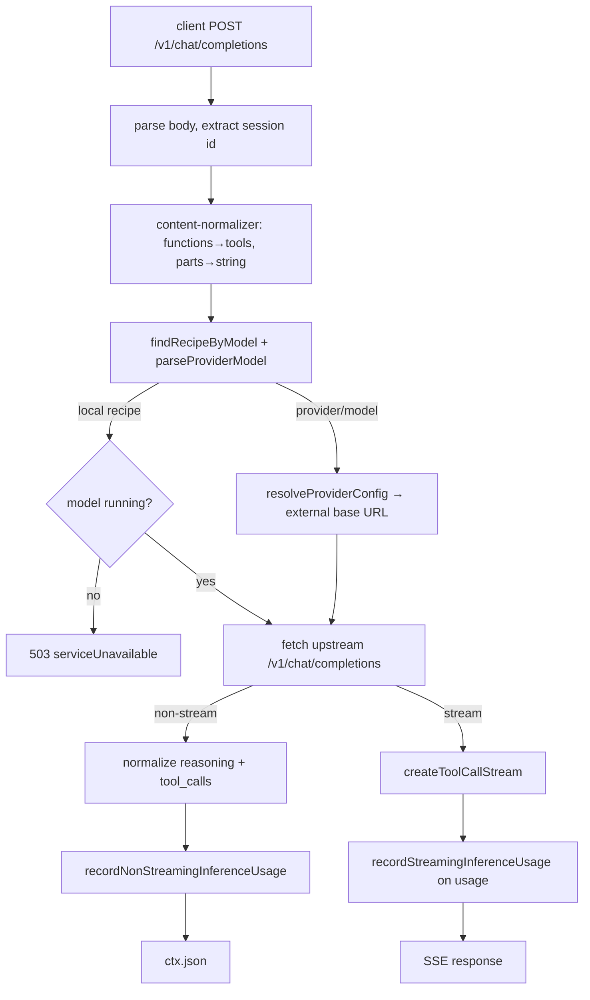

# Inference proxy

The inference proxy is the controller's OpenAI-compatible surface (`/v1/*`). It forwards chat completions to the locally running inference server (or a configured external provider), normalizes reasoning and tool-call output, records usage, and streams results back. The proxy never launches or switches models; it returns 503 when the requested model is not the one running.

Active contributors: Sero

## Purpose

This page describes how a chat request is routed, rewritten, streamed, and accounted for. It covers model matching against [recipes](../features/recipes.md), provider routing, the streaming tool-call/reasoning parser, and usage recording. Token counting helpers and a title endpoint live alongside it. The launch/evict authority is documented in [engine lifecycle](engine-lifecycle.md); usage analytics surfaces are documented in [metrics and observability](metrics-and-observability.md) and [primitives](../primitives/index.md).

## Directory layout

```
controller/src/modules/proxy/
├── routes.ts                 registerAllProxyRoutes: openai + tokenization
├── openai-routes.ts          /v1/chat/completions, model match, provider routing, stream wiring
├── tokenization-routes.ts    /v1/tokenize, /v1/detokenize, /v1/count-tokens, /api/title
├── content-normalizer.ts     functions→tools, content-parts→string, tool_choice cleanup
├── reasoning-extractor.ts    non-streaming <think> extraction into reasoning_content
├── reasoning-fields.ts       REASONING_FIELDS precedence (reasoning_content/reasoning/reasoning_text)
├── tool-call-parser.ts       parse tool calls out of XML/JSON content
├── tool-call-stream.ts       streaming SSE rewriter (reasoning + tool calls)
├── inference-accounting.ts   record usage to lifetime + inference request stores
└── configs.ts                proxy session header names

controller/src/services/
├── provider-routing.ts       provider/model parsing and provider config resolution
└── inference/inference-client.ts   buildInferenceUrl / fetchInference (local server)
```

## Key abstractions

| Symbol | File | Description |
| --- | --- | --- |
| `registerOpenAIRoutes` | `controller/src/modules/proxy/openai-routes.ts` | Registers `/v1/chat/completions`; handles matching, routing, streaming vs non-streaming. |
| `parseProviderModel` / `resolveProviderConfig` | `controller/src/services/provider-routing.ts` | Splits `provider/model` and resolves base URL + API key for non-local providers. |
| `createToolCallStream` | `controller/src/modules/proxy/tool-call-stream.ts` | Wraps the upstream SSE reader, rewriting deltas to emit `reasoning_content` and injected `tool_calls`. |
| `normalizeReasoningAndContentInMessage` | `controller/src/modules/proxy/reasoning-extractor.ts` | Non-streaming: moves `<think>` blocks to `reasoning_content`, strips tool-call XML. |
| `parseToolCallsFromContent` | `controller/src/modules/proxy/tool-call-parser.ts` | Extracts tool calls from `<tool_call>` XML or inline JSON, with JSON repair. |
| `recordStreamingInferenceUsage` / `recordNonStreamingInferenceUsage` | `controller/src/modules/proxy/inference-accounting.ts` | Adds lifetime token/request counters and writes an inference request record. |
| `firstReasoningField` | `controller/src/modules/proxy/reasoning-fields.ts` | Returns the first non-empty of `reasoning_content`/`reasoning`/`reasoning_text` to avoid double counting. |
| `fetchInference` / `buildInferenceUrl` | `controller/src/services/inference/inference-client.ts` | Calls the local inference server on `config.inference_host:inference_port`. |

## How it works



### Request rewriting and routing

`/v1/chat/completions` reads the raw body, extracts a session id from headers (`PROXY_SESSION_HEADER_NAMES` in `controller/src/modules/proxy/configs.ts`) or body fields, then normalizes it: `normalizeToolRequest` maps legacy `functions` to `tools` and drops `tool_choice: "auto"`; `normalizeChatMessageContentParts` collapses text content parts to a string (`content-normalizer.ts`). The model name is matched to a recipe by `served_model_name`/`id`/`name` and rewritten to the canonical served name. `parseProviderModel` (`controller/src/services/provider-routing.ts`) splits a `provider/model` id; when the provider is not the default, `resolveProviderConfig` supplies an external base URL and API key, otherwise the request goes to the local inference server via `buildInferenceUrl`. Streaming requests get `stream_options.include_usage = true` injected so usage is reported.

### No launching from the proxy

When the requested model maps to a recipe, the proxy calls `processManager.findInferenceProcess` and verifies it matches via `isRecipeRunning`. If not, it logs a rate-limited warning (`warnNonRunningModel`) and throws `serviceUnavailable` (503). Launching is exclusively the job of the `/launch` and `/evict` routes (see [engine lifecycle](engine-lifecycle.md)). Client disconnects/aborts return 499 rather than a misleading 400/500.

### Streaming rewrite

`createToolCallStream` (`controller/src/modules/proxy/tool-call-stream.ts`) consumes the upstream SSE byte stream line by line, parses each `data:` event, and rewrites choice deltas. A "think rewriter" tracks `<think>`/`<thinking>`/`<analysis>` open/close tags (including partial tags split across chunks) and moves that text into `reasoning_content`; visible content has tool-call XML stripped. `normalizeTextDelta` handles both incremental and cumulative-snapshot upstreams without duplicating text. When the model emits implicit reasoning (a closing tag with no opening tag, e.g. DeepSeek), `bufferImplicitReasoningContent` (set for deepseek_r1/minimax_m2/reasoning/thinking models) buffers the prefix as reasoning. At `[DONE]`, any buffered carry is flushed and `parseToolCallsFromContent` may inject a synthetic `tool_calls` chunk. Usage is captured once via `parseUsage`, and first-token timing fires `onFirstToken` for TTFT.

Narration that backends previously emitted as visible content is consolidated into `reasoning_content`; the proxy deletes the alternate `reasoning`/`reasoning_text` keys so downstream sees a single field (`reasoning-fields.ts`).

### Non-streaming rewrite

For non-streaming responses, each choice message runs through `normalizeToolCallsInMessage` (sets `finish_reason: "tool_calls"` when XML tool calls are found) and `normalizeReasoningAndContentInMessage` (`reasoning-extractor.ts`), which extracts `<think>` blocks into `reasoning_content`, strips tool-call XML, and collapses accidentally duplicated content.

### Tool-call parsing

`parseToolCallsFromContent` (`controller/src/modules/proxy/tool-call-parser.ts`) recognizes `<tool_call>…</tool_call>` blocks with `<function …>`/`<arguments>` or `<parameter>` children, and falls back to inline `"name": …, "arguments": …` JSON, using `parseJsonWithRepair` from `@earendil-works/pi-ai` for tolerant parsing. Each result is a standard OpenAI `tool_calls` entry.

### Usage accounting

`recordNonStreamingInferenceUsage` / `recordStreamingInferenceUsage` (`controller/src/modules/proxy/inference-accounting.ts`) read prompt/completion/reasoning/cache token totals from the usage object, increment the lifetime metrics store, and write a row to the inference request store with model, source, session id, provider, TTFT, duration, and status. See [usage](../features/usage.md) and [metrics and observability](metrics-and-observability.md).

### Tokenization and title

`tokenization-routes.ts` proxies `/v1/tokenize`, `/v1/detokenize`, `/v1/count-tokens`, and `/v1/tokenize-chat-completions` to the inference server (returning a zero/empty result when no model runs), and `/api/title` asks the running model for a short chat title.

## Integration points

- **Engine lifecycle**: the proxy reads the running process via `processManager.findInferenceProcess` and never mutates it ([engine lifecycle](engine-lifecycle.md)).
- **Recipes**: model matching uses `recipeStore.list()` and `served_model_name` ([recipes](../features/recipes.md)).
- **Providers**: external routing uses persisted provider config (`controller/src/services/provider-routing.ts`); see the studio settings module.
- **Stores**: usage is written to `lifetimeMetricsStore` and `inferenceRequestStore`, consumed by `/usage` ([metrics and observability](metrics-and-observability.md)).
- **Agent**: the Pi agent and other OpenAI SDK clients call `/v1/chat/completions` through the controller; primitives are summarized in [primitives](../primitives/index.md).

## Entry points for modification

- Change request rewriting, model matching, or the 503 policy: `controller/src/modules/proxy/openai-routes.ts`.
- Change streaming reasoning/tool-call handling: `controller/src/modules/proxy/tool-call-stream.ts`.
- Change non-streaming normalization: `controller/src/modules/proxy/reasoning-extractor.ts`.
- Add or change tool-call grammars: `controller/src/modules/proxy/tool-call-parser.ts`.
- Add a provider or change routing: `controller/src/services/provider-routing.ts`.
- Change what usage is recorded: `controller/src/modules/proxy/inference-accounting.ts`.

## Key source files

| File | Purpose |
| --- | --- |
| `controller/src/modules/proxy/openai-routes.ts` | `/v1/chat/completions`, matching, provider routing, streaming wiring |
| `controller/src/modules/proxy/tool-call-stream.ts` | Streaming SSE rewriter for reasoning and tool calls |
| `controller/src/modules/proxy/reasoning-extractor.ts` | Non-streaming `<think>` extraction and content cleanup |
| `controller/src/modules/proxy/reasoning-fields.ts` | Reasoning field precedence to prevent double counting |
| `controller/src/modules/proxy/tool-call-parser.ts` | Parse tool calls from XML/JSON content with JSON repair |
| `controller/src/modules/proxy/content-normalizer.ts` | functions→tools, content-parts→string, tool_choice cleanup |
| `controller/src/modules/proxy/inference-accounting.ts` | Record usage to lifetime and inference request stores |
| `controller/src/modules/proxy/tokenization-routes.ts` | Token count/tokenize/detokenize and `/api/title` |
| `controller/src/services/provider-routing.ts` | Provider/model parsing and provider config resolution |
| `controller/src/services/inference/inference-client.ts` | Local inference server URL builder and fetch helper |
