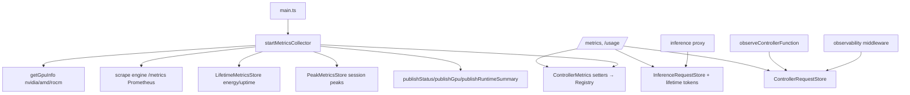

# Metrics and observability

This system collects GPU and runtime metrics, scrapes the inference engine's Prometheus endpoint, tracks peak and lifetime throughput, aggregates per-request inference usage, and records observability data for every controller HTTP request and instrumented internal function call.

Active contributors: Sero

## Purpose

This page describes the background metrics collector started at boot, the Prometheus registry exposed at `/metrics`, the SQLite stores for peak/lifetime/usage data, GPU/platform detection, and the per-request and per-function observability path. Inference usage is written by the [inference proxy](inference-proxy.md); the user-facing analytics surface is documented in [usage](../features/usage.md). Live publishing of metrics/status is documented in [eventing and SSE](eventing-and-sse.md).

## Directory layout

```
controller/src/modules/system/
├── metrics.ts               prom-client registry + ControllerMetrics setters
├── metrics-store.ts         PeakMetricsStore + LifetimeMetricsStore (SQLite)
├── metrics-routes.ts        /metrics, lifetime metrics, live throughput scrape
├── metrics-collector/
│   └── metrics-collector.ts startMetricsCollector: periodic GPU + Prometheus loop
├── usage-routes.ts          /usage, /usage/pi-sessions
├── usage/                   pi-sessions aggregation + usage utilities
└── platform/
    ├── gpu.ts               nvidia-smi GPU info + memory estimation
    ├── amd-gpu.ts           amd-smi / rocm-smi GPU info
    ├── rocm-info.ts         ROCm version + smi tool resolution
    ├── torch-info.ts        torch build (cuda/hip) probe
    ├── smi-tools.ts         resolve nvidia-smi / forced smi tool
    └── compatibility-report.ts   platform/runtime compatibility checks

controller/src/http/observability-middleware.ts   per-request recording
controller/src/core/function-observability.ts      observeControllerFunction wrapper
controller/src/stores/controller-request-store.ts  request + function-call records
controller/src/stores/inference-request-store.ts   per-inference-request records
```

## Key abstractions

| Symbol | File | Description |
| --- | --- | --- |
| `createMetrics` | `controller/src/modules/system/metrics.ts` | Builds the prom-client `Registry` and setter functions for model switch, active model, GPU, and SSE metrics. |
| `startMetricsCollector` | `controller/src/modules/system/metrics-collector/metrics-collector.ts` | Background loop: reads GPUs, scrapes engine `/metrics`, updates gauges, publishes status/gpu/runtime events, increments energy/uptime. |
| `PeakMetricsStore` | `controller/src/modules/system/metrics-store.ts` | Best observed prefill/generation tps and TTFT per model and per runtime session. |
| `LifetimeMetricsStore` | `controller/src/modules/system/metrics-store.ts` | Cumulative tokens, requests, energy, and uptime counters. |
| `InferenceRequestStore` | `controller/src/stores/inference-request-store.ts` | Per-request inference log; source of truth for `/usage`. |
| `ControllerRequestStore` | `controller/src/stores/controller-request-store.ts` | Per-HTTP-request and per-function-call records with aggregation queries. |
| `createControllerRequestObservabilityMiddleware` | `controller/src/http/observability-middleware.ts` | Times each request and records method/path/status/duration/error. |
| `observeControllerFunction` | `controller/src/core/function-observability.ts` | Wraps an internal call to record its duration and success/error. |
| `getGpuInfo` | `controller/src/modules/system/platform/gpu.ts` | Returns GPU info from nvidia-smi, amd-smi, or rocm-smi. |

## How it works



### Background collector

`startMetricsCollector` (`controller/src/modules/system/metrics-collector/metrics-collector.ts`) is started in `controller/src/main.ts` unless `VLLM_STUDIO_DISABLE_METRICS` is set. Each tick it finds the inference process, reads GPUs via `getGpuInfo`, updates the prom-client gauges (`updateActiveModel`, `updateGpuMetrics`, `updateSseMetrics`), increments lifetime energy (derived from total GPU power draw) and uptime, and publishes status/GPU events. On a slower cadence (`METRICS_RUNTIME_SUMMARY_INTERVAL_MS`) it publishes a runtime summary built from `getSystemRuntimeInfo` (see [runtime backends](runtime-backends.md)). It scrapes the engine's `/metrics` (parsing Prometheus lines into a map), and for llama.cpp it parses tokens-per-second out of the recipe log tail since llama.cpp does not expose Prometheus counters. Session peaks (prefill/generation tps, TTFT, KV cache, VRAM, power) feed `PeakMetricsStore`.

### Prometheus registry

`createMetrics` (`controller/src/modules/system/metrics.ts`) defines counters/gauges/histograms (`vllm_studio_model_switches_total`, `vllm_studio_model_switch_duration_seconds`, `vllm_studio_active_model`, `vllm_studio_gpu_*`, `vllm_studio_sse_*`) on a single `Registry`. The setters reset/relabel gauges as the active model and GPU readings change. `/metrics` (`controller/src/modules/system/metrics-routes.ts`) renders the registry; that file also re-scrapes the engine to compute live throughput as a rate from cumulative counters.

### Peak and lifetime stores

`PeakMetricsStore` keeps the best prefill/generation tps and the lowest TTFT per model (`updateIfBetter`) and per runtime session (`updateSessionPeak`), plus cumulative tokens/requests. `LifetimeMetricsStore` holds `tokens_total`, `prompt_tokens_total`, `completion_tokens_total`, `energy_wh`, `uptime_seconds`, `requests_total`, and `first_started_at` (seeded by `ensureFirstStarted()` at boot). Both use `bun:sqlite`.

### Inference usage

The [inference proxy](inference-proxy.md) writes to `InferenceRequestStore` (`controller/src/stores/inference-request-store.ts`) — one row per chat request with model, source, session, provider, token breakdown, TTFT, duration, status, and a streamed flag — and increments the lifetime store. `/usage` (`controller/src/modules/system/usage-routes.ts`) aggregates these rows restricted to known models and merges controller-request stats; `/usage/pi-sessions` aggregates Pi coding-agent activity from `controller/src/modules/system/usage/pi-sessions.ts`.

### Request and function observability

`createControllerRequestObservabilityMiddleware` (`controller/src/http/observability-middleware.ts`) wraps every request, recording method/path/status/duration/success and, on error, the error class and message (HTTP status errors keep their status; see `controller/src/core/errors.ts`). `observeControllerFunction` (`controller/src/core/function-observability.ts`) does the same for selected internal calls (used throughout the engines, proxy, and usage routes). Both write to `ControllerRequestStore` (`controller/src/stores/controller-request-store.ts`), which aggregates totals, latency, recent activity, by-path, by-status, recent errors, and per-function stats.

### GPU and platform

`getGpuInfo` (`controller/src/modules/system/platform/gpu.ts`) prefers a forced smi tool, then nvidia-smi, then amd-smi/rocm-smi (`amd-gpu.ts`, `rocm-info.ts`). `torch-info.ts` reports the torch build (cuda/hip), `smi-tools.ts` resolves the nvidia binary, and `compatibility-report.ts` produces platform/runtime compatibility checks. Observability contracts are in `shared/contracts/observability.ts` and usage shapes in `shared/contracts/usage.ts`.

## Integration points

- **Boot**: the collector is started and stopped from `controller/src/main.ts`; stores are wired in `controller/src/app-context.ts`.
- **Inference proxy**: writes inference usage and lifetime token/request counters ([inference proxy](inference-proxy.md)).
- **Eventing**: status, GPU, metrics, and runtime summary are published to SSE subscribers ([eventing and SSE](eventing-and-sse.md)).
- **Runtime backends**: the runtime summary reuses `getSystemRuntimeInfo` ([runtime backends](runtime-backends.md)).
- **Usage UI**: `/usage` and `/usage/pi-sessions` back the analytics dashboard ([usage](../features/usage.md)).

## Entry points for modification

- Add a Prometheus metric: `controller/src/modules/system/metrics.ts`.
- Change collection cadence or scraped values: `controller/src/modules/system/metrics-collector/metrics-collector.ts` and its `configs.ts`.
- Change peak/lifetime schema or aggregation: `controller/src/modules/system/metrics-store.ts`.
- Change per-request/per-function recording: `controller/src/http/observability-middleware.ts`, `controller/src/core/function-observability.ts`, `controller/src/stores/controller-request-store.ts`.
- Change inference usage shape or aggregation: `controller/src/stores/inference-request-store.ts` and `controller/src/modules/system/usage-routes.ts`.
- Change GPU/platform detection: `controller/src/modules/system/platform/`.

## Key source files

| File | Purpose |
| --- | --- |
| `controller/src/modules/system/metrics.ts` | prom-client registry and metric setters |
| `controller/src/modules/system/metrics-collector/metrics-collector.ts` | Background GPU + Prometheus collection loop |
| `controller/src/modules/system/metrics-store.ts` | Peak and lifetime metric stores |
| `controller/src/modules/system/metrics-routes.ts` | `/metrics` and live-throughput endpoints |
| `controller/src/modules/system/usage-routes.ts` | `/usage` and `/usage/pi-sessions` aggregation |
| `controller/src/http/observability-middleware.ts` | Per-request timing and recording |
| `controller/src/core/function-observability.ts` | Instrumented internal function recording |
| `controller/src/stores/controller-request-store.ts` | Request and function-call records + aggregation |
| `controller/src/stores/inference-request-store.ts` | Per-inference-request log for usage analytics |
| `controller/src/modules/system/platform/gpu.ts` | GPU info and memory estimation |
