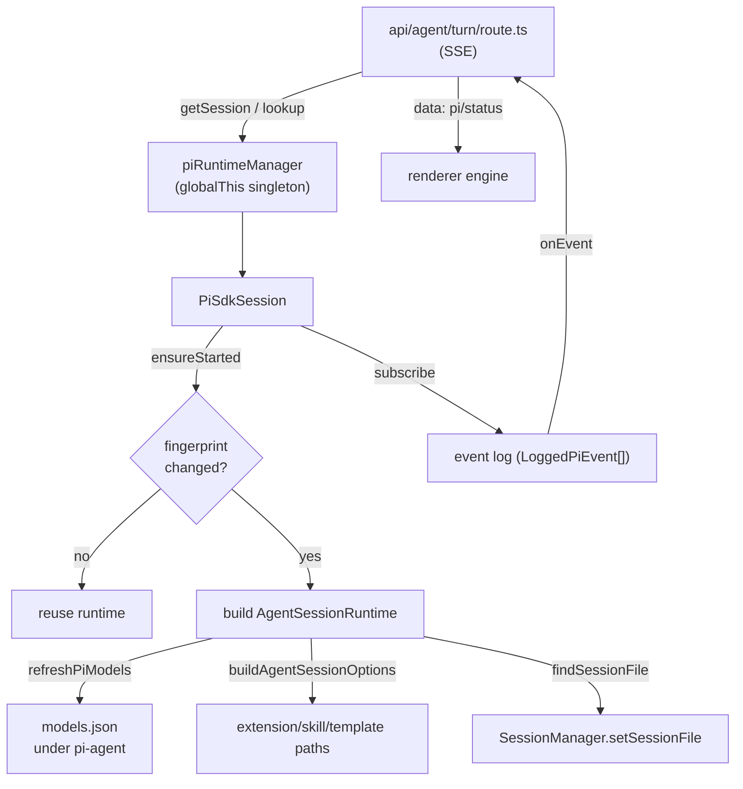

# Pi agent runtime

The Pi agent runtime hosts the `@earendil-works/pi-coding-agent` SDK directly inside the Next.js Node process. There is no `pi --mode rpc` subprocess and no bundled CLI: a `PiRuntimeManager` singleton owns one `PiSdkSession` per runtime session id, and the `api/agent/turn` route streams SDK events back to the browser over Server-Sent Events.

**Active contributors: Sero** (GitHub [0xSero](https://github.com/0xSero) / seroxdesign)

## Purpose

- Run the coding agent in-process by constructing an `AgentSessionRuntime` from the SDK and forwarding its event stream.
- Keep one cached runtime per runtime session id, keyed by a fingerprint of model, cwd, Pi session id, and the resolved plugin/extension set, so a turn reuses the existing runtime unless something material changed.
- Resume an existing Pi conversation by locating its JSONL log and rebinding the SDK's `SessionManager` before the runtime is built.
- Tolerate browser disconnects: the runtime keeps running and the renderer can reattach through `api/agent/runtime/events`.
- Write the SDK's `models.json` (and colocated `auth.json` / `settings.json`) into `<dataDir>/pi-agent` from the controller's `/v1/models`.

## Directory layout

```
frontend/src/lib/agent/
  pi-runtime.ts            PiRuntimeManager singleton (getSession / lookup / list)
  pi-sdk-runtime.ts        PiSdkSession: ensureStarted, event log, diagnostics, resume
  pi-runtime-helpers.ts    buildAgentSessionOptions, pluginFingerprint, resolveAgentCwd
  pi-runtime-models.ts     refreshPiModels, controller→Pi models.json, model selection
  pi-runtime-state.ts      piStatusFromEvents, piEventsAfter (pure status helpers)
  pi-runtime-types.ts      PiAgentSession interface, LoggedPiEvent, PiAgentStatus
  pi-events.ts             isAgentEndEvent
  trace-reasoning.ts       opt-in agent-reasoning console tracing
  models.ts                OpenAI→AgentModel normalization, modelsToPiModels
  sessions/
    runtime-resume.ts      reattach an in-flight runtime over SSE
    stream-ownership.ts    per-runtime prompt-stream ownership registry
    engine.ts              useSessionEngine: submit/steer/replay/compact
    pi-event-applier.ts    apply one Pi event to a session transcript
    text-delta-coalescer.ts coalesce message_update snapshots to one per frame
frontend/src/app/api/agent/
  turn/route.ts            SSE prompt/steer/follow_up turn endpoint
  runtime/events/route.ts  reattach stream (replay + live)
  runtime/status/route.ts  one-shot status + buffered events
```

## Key abstractions

| Symbol | File | Description |
| --- | --- | --- |
| `PiRuntimeManager` / `piRuntimeManager` | `frontend/src/lib/agent/pi-runtime.ts` | Singleton pinned on `globalThis.__vllmStudioPiRuntimeManager`; maps runtime session id → `PiAgentSession`. |
| `getSession` / `getSessionForLookup` / `listSessions` | `frontend/src/lib/agent/pi-runtime.ts` | Create-or-return a session; resolve by Pi session id for reattach; enumerate live sessions. |
| `PiSdkSession` | `frontend/src/lib/agent/pi-sdk-runtime.ts` | `PiAgentSession` implementation: builds the SDK runtime, records events, exposes status. |
| `ensureStarted` | `frontend/src/lib/agent/pi-sdk-runtime.ts` | Resolve cwd/model/options, compare fingerprint, (re)construct the `AgentSessionRuntime`, bind resume file. |
| `runtimeFingerprint` | `frontend/src/lib/agent/pi-sdk-runtime.ts` | `JSON.stringify` of model, cwd, Pi session id, and `pluginFingerprint(options)`; identical fingerprint ⇒ reuse runtime. |
| `piResourceDiagnostics` | `frontend/src/lib/agent/pi-sdk-runtime.ts` | Module-scope (globalThis-pinned) map of extension/skill load failures per `agentDir`, read by `api/agent/setup-checks`. |
| `buildAgentSessionOptions` | `frontend/src/lib/agent/pi-runtime-helpers.ts` | Resolve extension paths, skill paths, prompt-template paths, per-turn overrides, env injections from `RuntimeStartOptions`. |
| `pluginFingerprint` | `frontend/src/lib/agent/pi-runtime-helpers.ts` | Stable digest of selected plugins/skills/templates, browser backend, disabled overrides, and `packagesConfigToken()`. |
| `resolveAgentCwd` | `frontend/src/lib/agent/pi-runtime-helpers.ts` | Expand `~`, resolve to a real existing directory; defaults to selected project → repo root → home. |
| `refreshPiModels` | `frontend/src/lib/agent/pi-runtime-models.ts` | Fetch `/v1/models` from each controller, write `<dataDir>/pi-agent/models.json`, return models + agentDir. |
| `PiAgentSession` | `frontend/src/lib/agent/pi-runtime-types.ts` | Interface the rest of the app codes against (`ensureStarted`, `prompt`, `steer`, `followUp`, `abort`, `compact`, `status`, ...). |
| `LoggedPiEvent` | `frontend/src/lib/agent/pi-runtime-types.ts` | `{ seq, event, timestamp }` — the sequenced event record the event log stores and SSE replays. |

## How it works



A turn flows like this:

1. `api/agent/turn/route.ts` parses the request, resolves a session via `piRuntimeManager.getSession(sessionId)` (or `getSessionForLookup` for steer/follow-up control turns), and opens a `ReadableStream` that emits `data: {...}\n\n` SSE frames.
2. For a prompt turn it calls `session.ensureStarted(modelId, cwd, piSessionId, options)`. `ensureStarted` computes the runtime fingerprint; if it matches the live runtime it returns immediately, otherwise it stops the old runtime and builds a new one.
3. Building the runtime calls `refreshPiModels()` (writes `models.json`, returns the model list and `agentDir`), resolves the model selection, and `buildAgentSessionOptions()` for the extension/skill/template paths. `createAgentSessionRuntime` then constructs the SDK services with a `resourceLoaderOptions.extensionsOverride` filter that drops disabled extensions after they load (so load errors still surface as diagnostics).
4. `session.prompt(message, onEvent, options)` runs the turn. Every SDK `AgentSessionEvent` is recorded into the bounded event log (last 2000) as a `LoggedPiEvent` with a monotonic `seq`, then forwarded to the SSE stream as `{ type: "pi", seq, event }`.
5. When the browser disconnects, `request.signal` flips `open` to false and the SSE writes become no-ops, but `session.prompt` keeps running. The renderer reattaches by opening `api/agent/runtime/events?after=<seq>` which replays buffered events then streams live ones.

### Resume

When the turn request carries a `piSessionId`, `ensureStarted` calls `findSessionFile(cwd, id)` (`frontend/src/lib/agent/sessions-store.ts`) to locate the matching JSONL under the Pi sessions roots, calls `sessionManager.setSessionFile(...)` before the runtime is built, and tags the `sessionStartEvent.reason` as `"resume"` (vs `"startup"`). The agent directory is always `<dataDir>/pi-agent` — the runtime never points at the user's `~/.pi/agent`.

### Status and context usage

`PiSdkSession.status` is derived by `piStatusFromEvents` (`frontend/src/lib/agent/pi-runtime-state.ts`) and reports `running`, `active` (a prompt is in flight), `modelId`, `cwd`, `piSessionId`, `agentDir`, `eventSeq`, `lastError`, and `contextUsage`. Context usage is read from the SDK (`session.getContextUsage()` + compaction settings) and includes a `shouldCompact` flag.

## Renderer-side event handling

The browser side of a turn lives in `frontend/src/lib/agent/sessions/engine.ts` (`useSessionEngine`). It owns the optimistic user/assistant messages, opens the SSE stream via `api.submitTurnStream`, and routes each `{ type: "pi" }` payload through:

- `shouldApplyRuntimeSeq` — drop already-applied sequence numbers (idempotent replay).
- `text-delta-coalescer.ts` — `message_update` events carry the full accumulated snapshot, so superseded snapshots are dropped and at most one is applied per animation frame.
- `pi-event-applier.ts` — apply a single event to the session transcript.
- `stream-ownership.ts` — `claimRuntimePromptStream` / `releaseRuntimePromptStream` mark which client owns the live prompt stream for a runtime, so the workspace runtime-sync hook does not also open a competing resume subscription.

Reattaching a runtime the renderer does not own goes through `subscribeResumeRuntimeSession` in `frontend/src/lib/agent/sessions/runtime-resume.ts`, which applies the same coalescing and sequence-gating to the `runtime/events` SSE stream and reconciles liveness when the connection errors.

## Integration points

- **Controller** — `refreshPiModels` reads `/v1/models` from each configured controller and writes a `vllm-studio` provider block into `models.json`. See [controller](../apps/controller.md).
- **Plugins and extensions** — `buildAgentSessionOptions` and `pluginFingerprint` consume the resolved plugin/skill/extension set; toggling a Pi package invalidates the cached runtime. See [plugins and extensions](./plugins-and-extensions.md).
- **Agent workspace** — the workspace store drives turns through `useSessionEngine` and keeps live sessions in sync via the runtime-sync hook. See [agent workspace](./agent-workspace.md).
- **Setup checks** — `api/agent/setup-checks` surfaces `piResourceDiagnostics()` so broken drop-in extensions are visible without tailing logs.

## Entry points for modification

- Change turn streaming, disconnect tolerance, or control routing: `frontend/src/app/api/agent/turn/route.ts`.
- Change runtime construction, fingerprinting, resume, or diagnostics: `frontend/src/lib/agent/pi-sdk-runtime.ts`.
- Change which extensions/skills/templates load or how env is injected: `frontend/src/lib/agent/pi-runtime-helpers.ts`.
- Change controller→model mapping or `models.json` output: `frontend/src/lib/agent/pi-runtime-models.ts` and `frontend/src/lib/agent/models.ts`.
- Change reattach/replay behavior: `frontend/src/app/api/agent/runtime/events/route.ts` and `frontend/src/lib/agent/sessions/runtime-resume.ts`.

## Key source files

| File | Description |
| --- | --- |
| `frontend/src/lib/agent/pi-runtime.ts` | `PiRuntimeManager` singleton and session lookup. |
| `frontend/src/lib/agent/pi-sdk-runtime.ts` | `PiSdkSession`: SDK runtime construction, event log, status, resume, diagnostics. |
| `frontend/src/lib/agent/pi-runtime-helpers.ts` | Session options, plugin fingerprint, cwd resolution, env injection. |
| `frontend/src/lib/agent/pi-runtime-models.ts` | Controller model fetch + `models.json` writer + model selection. |
| `frontend/src/lib/agent/pi-runtime-state.ts` | Pure status/event-window helpers. |
| `frontend/src/lib/agent/pi-runtime-types.ts` | `PiAgentSession` interface and event/status types. |
| `frontend/src/lib/agent/pi-events.ts` | `isAgentEndEvent` predicate. |
| `frontend/src/lib/agent/trace-reasoning.ts` | Opt-in agent-reasoning console tracing. |
| `frontend/src/lib/agent/models.ts` | OpenAI model normalization and Pi-model mapping. |
| `frontend/src/app/api/agent/turn/route.ts` | SSE turn endpoint (prompt/steer/follow-up). |
| `frontend/src/app/api/agent/runtime/events/route.ts` | Reattach SSE (replay buffered + stream live). |
| `frontend/src/app/api/agent/runtime/status/route.ts` | One-shot status + buffered events. |
| `frontend/src/lib/agent/sessions/engine.ts` | Renderer turn orchestration (`useSessionEngine`). |
| `frontend/src/lib/agent/sessions/runtime-resume.ts` | Resume subscription for in-flight runtimes. |
| `frontend/src/lib/agent/sessions/stream-ownership.ts` | Per-runtime prompt-stream ownership registry. |
| `frontend/src/lib/agent/sessions/text-delta-coalescer.ts` | Coalesce `message_update` snapshots per frame. |

## Related pages

- [Agent workspace](./agent-workspace.md)
- [Plugins and extensions](./plugins-and-extensions.md)
- [Agent chat](../features/agent-chat.md)
- [Agent tools](../features/agent-tools.md)
- [Frontend](../apps/frontend.md)
