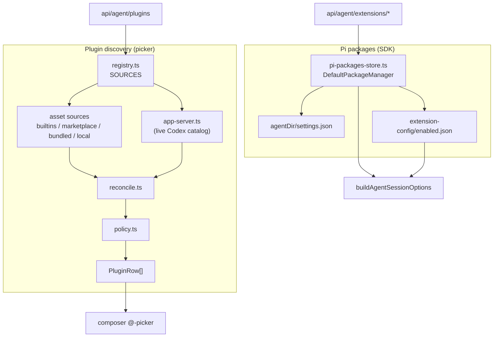

# Plugins and extensions runtime

This system loads everything the agent runs with beyond the base model: Pi packages, extensions, skills, prompt templates, and the built-in browser/canvas/computer-use tools. Two layers cooperate — a disk-plus-catalog plugin discovery registry that feeds the composer's picker, and the Pi package manager surface that installs and toggles packages under `<agentDir>`.

**Active contributors: Sero** (GitHub [0xSero](https://github.com/0xSero) / seroxdesign)

## Purpose

- Discover selectable plugins from disk asset sources (built-ins, marketplace cache, bundled Codex plugins, local helpers) with a best-effort live Codex app-server catalog overlay.
- Install, list, uninstall, update, enable/disable, and configure Pi packages via the SDK's `DefaultPackageManager`, persisted under `<agentDir>`.
- Register the built-in extensions (browser, parchi, cdp-browser, canvas, timeouts, mcp-plugin) explicitly, and auto-discover user extensions dropped into `<agentDir>/extensions` or `<cwd>/.pi/extensions`.
- Resolve per-extension on/off state from a persisted overrides file plus per-turn `/plugins` overrides, applied as a loader filter at session start.

## Directory layout

```
frontend/src/lib/agent/plugins/
  registry.ts         discoverPluginsSync / discoverPluginsAsync, SOURCES order
  internal.ts         shared dir-walk + manifest parse + readCodexConfig + dedupe/sort
  policy.ts           visibility + enable resolution (default show-all)
  reconcile.ts        left-join catalog rows onto disk asset rows
  types.ts            PluginRow, DiscoveryCtx, PluginSource (pure types)
  sources/
    builtins.ts       vLLM Studio first-party computer-use + chrome rows
    marketplace-cache.ts  marketplace + ~/.codex/plugins asset walk
    bundled.ts        bundled Codex.app plugin assets
    local-helpers.ts  local computer-use / sybil helper apps
    app-server.ts     live Codex catalog overlay (kind: "catalog")
frontend/src/lib/agent/
  plugin-discovery.ts  back-compat wrapper (discoverPlugins, loadPluginInstructions)
  plugin-config.ts     ~/.codex/config.toml read/write, pluginConfigKey, marketplaces
  plugin-response.ts   buildPluginsResponse + runtime checks for the plugins API
  pi-packages-store.ts DefaultPackageManager wrapper, enabled.json, extension config
  skill-discovery.ts   discover SKILL.md skills across known agent dirs
  browser/             browser command bridge + intent detection
  canvas-store.ts      per-session canvas document persistence
  comments-store.ts    inline comment persistence
  tools/               per-session ToolSelection context + persistence
frontend/src/app/api/agent/
  extensions/          GET + install/uninstall/update/enable/configure/catalog
  plugins/             plugin discovery API (+ load)
  skills/              skill discovery API (+ load)
  prompt-templates/    prompt-template discovery API (+ load)
```

## Key abstractions

| Symbol | File | Description |
| --- | --- | --- |
| `discoverPluginsSync` / `discoverPluginsAsync` | `frontend/src/lib/agent/plugins/registry.ts` | Disk-only sync discovery; hybrid disk + best-effort catalog overlay. Never throw. |
| `SOURCES` | `frontend/src/lib/agent/plugins/registry.ts` | Ordered source list: builtins → marketplace cache → bundled → local helpers → app-server catalog. |
| `applyPolicy` | `frontend/src/lib/agent/plugins/policy.ts` | Hide superseded OpenAI dups, resolve `enabled` from config; default shows everything. |
| `reconcile` | `frontend/src/lib/agent/plugins/reconcile.ts` | Overlay catalog install/enable state onto disk rows; disk paths always win. |
| `PluginRow` / `PluginSource` / `DiscoveryCtx` | `frontend/src/lib/agent/plugins/types.ts` | Row shape, source contract (`assets` vs `catalog`), and discovery context. |
| `listInstalledExtensions` | `frontend/src/lib/agent/pi-packages-store.ts` | Resolve packages + resources (extensions/skills/prompts/themes) with override state. |
| `installPackage` / `uninstallPackage` / `updatePackages` | `frontend/src/lib/agent/pi-packages-store.ts` | `DefaultPackageManager` install/remove/update persisted to `<agentDir>/settings.json`. |
| `readEnabledOverrides` / `setExtensionEnabled` | `frontend/src/lib/agent/pi-packages-store.ts` | Read/write `<agentDir>/extension-config/enabled.json` per-extension on/off map. |
| `packagesConfigToken` | `frontend/src/lib/agent/pi-packages-store.ts` | mtime/size token of `settings.json`; folded into the runtime fingerprint. |
| `readExtensionConfig` / `writeExtensionConfig` | `frontend/src/lib/agent/pi-packages-store.ts` | Per-package JSON config under `<agentDir>/extension-config/<sanitizedKey>.json`. |
| `discoverSkills` / `loadSkillInstructions` | `frontend/src/lib/agent/skill-discovery.ts` | Find `SKILL.md` skills across `~/.claude`, `~/.pi`, `~/.codex`, `~/.factory`, Codex.app. |
| `vllmStudioBuiltinsSource` | `frontend/src/lib/agent/plugins/sources/builtins.ts` | First-party `computer-use` (macOS MCP) and `chrome` (Brave + CDP) plugin rows. |

## Two layers

There are two distinct mechanisms that the wiki keeps separate:

1. **Plugin discovery (the picker)** — `frontend/src/lib/agent/plugins/registry.ts` aggregates `PluginRow`s from disk asset sources and an optional live Codex catalog. This drives the composer's `@`-picker and the plugins panel. It is read-only: disk is the source of truth and the registry never throws on a missing/unreachable source.
2. **Pi packages (the SDK)** — `frontend/src/lib/agent/pi-packages-store.ts` wraps the SDK's `DefaultPackageManager` against `<agentDir>` to actually install/remove/update Pi packages, list resolved resources, and persist enable/config state. The API routes under `frontend/src/app/api/agent/extensions/*` are thin wrappers over this store.



## How extensions load into a session

`buildAgentSessionOptions` (`frontend/src/lib/agent/pi-runtime-helpers.ts`) resolves the absolute extension/skill/prompt-template paths for a turn, and the runtime hands them to the SDK's resource loader:

- **Built-in extensions** (browser/parchi/cdp-browser, canvas, timeouts, mcp-plugin) are resolved from bundled `desktop/resources/pi-extensions/*.ts` via `resolveBundledPiExtensionPath` and passed explicitly through `additionalExtensionPaths`. The browser backend (`embedded` / `parchi` / `cdp`) selects which browser extension file loads; selecting `@chrome` implies the CDP bridge.
- **User extensions** are auto-discovered by the SDK package manager from `<agentDir>/extensions/` and `<cwd>/.pi/extensions/` — drop a `.ts`/`.js` file or a directory with a `pi` manifest and it loads on the next session start, no settings edit required.
- **Disable filter** — in `pi-sdk-runtime.ts`, `resourceLoaderOptions.extensionsOverride` filters the loaded extension list after each module executes (so load errors still surface as diagnostics) using `isEnabled`, which layers per-turn `/plugins` overrides over the persisted `enabled.json` map.

Toggling, installing, uninstalling, or updating a package changes `packagesConfigToken()` and/or the disabled-overrides set, both folded into `pluginFingerprint`, which invalidates the cached `PiSdkSession` runtime so the next `getSession()` reloads with the new resource set. See [Pi agent runtime](./pi-agent-runtime.md).

## Built-in tools

- **Browser** — `frontend/src/lib/agent/browser/command.ts` runs browser verbs against the embedded webview/iframe; `frontend/src/lib/agent/browser/intent.ts` (`promptRequestsBrowser`) turns the browser tool on when a prompt clearly asks for the web. The CDP backend drives a real logged-in browser via the bundled `brave-bridge` extension.
- **Canvas** — `frontend/src/lib/agent/canvas-store.ts` persists a per-session canvas document under the data dir; the canvas extension is loaded when `canvasEnabled` is set.
- **Comments** — `frontend/src/lib/agent/comments-store.ts` persists inline comments.
- **Computer use / chrome** — first-party rows from `frontend/src/lib/agent/plugins/sources/builtins.ts`; `policy.ts` hides OpenAI's bundled dup of the same name so `@computer-use` / `@chrome` resolve to ours. `host-app` plugins only load their MCP when the bundled helper binary actually resolves on disk (`pluginMcpConfigs` / `shouldLoadMcpConfig` in `pi-runtime-helpers.ts`).

## API routes

| Route | File | Role |
| --- | --- | --- |
| `GET /api/agent/extensions` | `frontend/src/app/api/agent/extensions/route.ts` | List installed packages + resolved resources with override state. |
| `POST /api/agent/extensions/install` | `frontend/src/app/api/agent/extensions/install/route.ts` | Install a Pi package via `DefaultPackageManager`. |
| `POST /api/agent/extensions/uninstall` | `frontend/src/app/api/agent/extensions/uninstall/route.ts` | Remove a Pi package. |
| `POST /api/agent/extensions/update` | `frontend/src/app/api/agent/extensions/update/route.ts` | Update one or all packages. |
| `POST /api/agent/extensions/enable` | `frontend/src/app/api/agent/extensions/enable/route.ts` | Toggle a package/extension in `enabled.json`. |
| `GET\|POST /api/agent/extensions/configure` | `frontend/src/app/api/agent/extensions/configure/route.ts` | Read/write per-package JSON config. |
| `GET /api/agent/extensions/catalog` | `frontend/src/app/api/agent/extensions/catalog/route.ts` | Browse the marketplace catalog. |
| `GET /api/agent/plugins` | `frontend/src/app/api/agent/plugins/route.ts` | Discovered plugin rows for the composer picker. |
| `GET /api/agent/skills` | `frontend/src/app/api/agent/skills/route.ts` | Discovered skills. |
| `GET /api/agent/prompt-templates` | `frontend/src/app/api/agent/prompt-templates/route.ts` | Discovered prompt templates. |

## Integration points

- **Runtime** — resolved extension/skill/template paths and the override/token state feed `buildAgentSessionOptions` and `pluginFingerprint`. See [Pi agent runtime](./pi-agent-runtime.md).
- **Workspace/tools** — per-session selections are stored as a `ToolSelection` (`frontend/src/lib/agent/tools/`) and persisted with pane state. See [agent workspace](./agent-workspace.md).
- **Setup checks** — extension load failures captured into `piResourceDiagnostics()` are surfaced via `GET /api/agent/setup-checks`.
- **Codex config** — `frontend/src/lib/agent/plugin-config.ts` reads/writes `~/.codex/config.toml` marketplaces and per-plugin enable flags consulted by `policy.ts`.

## Entry points for modification

- Add a plugin source: implement a `PluginSource` under `frontend/src/lib/agent/plugins/sources/` and add it to `SOURCES` in `frontend/src/lib/agent/plugins/registry.ts`.
- Change plugin visibility/enable rules: `frontend/src/lib/agent/plugins/policy.ts`.
- Change package install/list/toggle/config behavior: `frontend/src/lib/agent/pi-packages-store.ts` and the routes under `frontend/src/app/api/agent/extensions/`.
- Change which built-in extensions/skills load per turn: `frontend/src/lib/agent/pi-runtime-helpers.ts`.
- Add a skill source directory: `frontend/src/lib/agent/skill-discovery.ts`.

## Key source files

| File | Description |
| --- | --- |
| `frontend/src/lib/agent/plugins/registry.ts` | Discovery orchestration + source order. |
| `frontend/src/lib/agent/plugins/internal.ts` | Shared dir-walk, manifest parse, `readCodexConfig`, dedupe/sort. |
| `frontend/src/lib/agent/plugins/policy.ts` | Visibility + enable resolution. |
| `frontend/src/lib/agent/plugins/reconcile.ts` | Catalog overlay onto disk asset rows. |
| `frontend/src/lib/agent/plugins/types.ts` | `PluginRow`, `PluginSource`, `DiscoveryCtx`. |
| `frontend/src/lib/agent/plugins/sources/builtins.ts` | First-party computer-use + chrome rows. |
| `frontend/src/lib/agent/plugins/sources/marketplace-cache.ts` | Marketplace + cache asset walk. |
| `frontend/src/lib/agent/plugins/sources/bundled.ts` | Bundled Codex.app plugin assets. |
| `frontend/src/lib/agent/plugins/sources/local-helpers.ts` | Local computer-use / sybil helper apps. |
| `frontend/src/lib/agent/plugins/sources/app-server.ts` | Live Codex catalog overlay. |
| `frontend/src/lib/agent/plugin-discovery.ts` | Back-compat `discoverPlugins` + `loadPluginInstructions`. |
| `frontend/src/lib/agent/plugin-config.ts` | `~/.codex/config.toml` read/write + `pluginConfigKey`. |
| `frontend/src/lib/agent/plugin-response.ts` | Plugins API response + runtime checks. |
| `frontend/src/lib/agent/pi-packages-store.ts` | `DefaultPackageManager` wrapper + `enabled.json` + per-package config. |
| `frontend/src/lib/agent/skill-discovery.ts` | `SKILL.md` skill discovery. |
| `frontend/src/lib/agent/browser/command.ts` | Browser tooling command bridge. |
| `frontend/src/lib/agent/browser/intent.ts` | `promptRequestsBrowser` intent detection. |
| `frontend/src/lib/agent/canvas-store.ts` | Per-session canvas document persistence. |
| `frontend/src/lib/agent/comments-store.ts` | Inline comment persistence. |

## Related pages

- [Pi agent runtime](./pi-agent-runtime.md)
- [Agent workspace](./agent-workspace.md)
- [Agent tools](../features/agent-tools.md)
