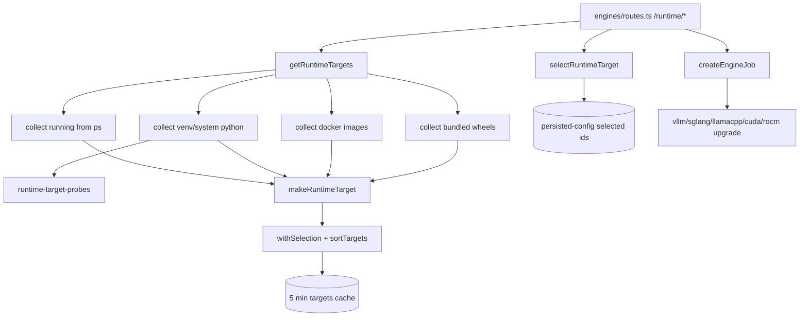

# Runtime backends

Runtime backends are the inference engine families (vllm, sglang, llamacpp, mlx) and the concrete runtime targets that can run them (a venv Python, a system binary, a Docker image, or a bundled wheel). This system discovers, probes, ranks, selects, and upgrades those targets so the [engine lifecycle](engine-lifecycle.md) has something to launch.

Active contributors: Sero

## Purpose

This page describes how the controller answers "which backends are installed, where, and at what version", how a user pins a preferred target, and how install/update jobs run. It does not cover the launch state machine itself ([engine lifecycle](engine-lifecycle.md)) or platform GPU detection beyond what backend probing needs ([metrics and observability](metrics-and-observability.md)). Backend-related environment variables are listed in [configuration](../reference/configuration.md).

## Directory layout

```
controller/src/modules/engines/runtimes/
├── runtime-targets.ts          discovery: collect venv/system/docker/bundled targets, rank, select
├── runtime-target-factory.ts   makeRuntimeTarget: id, capabilities, health, update metadata
├── runtime-target-probes.ts    probe a python/binary, parse versions, compare versions
├── runtime-info.ts             SystemRuntimeInfo: platform, cuda, per-backend info (cached)
├── vllm-runtime.ts             vLLM detect/config-help/upgrade (bundled wheel aware)
├── llamacpp-runtime.ts         llama.cpp --help config dump
├── vllm-python-path.ts         resolve the canonical controller-owned Python
├── runtime-upgrade.ts          sglang/llamacpp/cuda/rocm upgrade command runners
├── upgrade-config.ts           upgrade-command env keys and pinned-version helpers
└── engine-jobs.ts              in-memory install/update/download/inspect job queue
```

## Backend families and runtime targets

A `RuntimeTarget` (`shared/contracts/system.ts`) pairs an `EngineBackend` (`vllm` | `sglang` | `llamacpp` | `mlx`) with a `RuntimeKind` (`venv` | `docker` | `binary` | `system`) and a `source`:

| Source | Meaning |
| --- | --- |
| `running` | Discovered from the live inference process's argv (highest priority). |
| `configured` | From a config field or `VLLM_STUDIO_*` env var pointing at a Python/binary. |
| `discovered` | Found by scanning project venvs, system `PATH`, or Docker images. |
| `bundled` | A vLLM wheel shipped under `runtime/wheels/`. |

Each target also carries `installed`, `version`, `pythonPath`/`binaryPath`/`dockerImage`, a `capabilities` object (`canLaunch`, `canUpdate`, `canInspectOptions`, `supportsDocker`), a `health` status, and optional `update` metadata.

## Key abstractions

| Symbol | File | Description |
| --- | --- | --- |
| `getRuntimeTargets` | `controller/src/modules/engines/runtimes/runtime-targets.ts` | Discovers all targets for every backend, dedupes by id, ranks, and caches for 5 minutes. |
| `getDefaultRuntimeTarget` | `controller/src/modules/engines/runtimes/runtime-targets.ts` | Picks the active target, else the newest installed, else a configured one, for a backend. |
| `selectRuntimeTarget` | `controller/src/modules/engines/runtimes/runtime-targets.ts` | Persists the user's chosen target id per backend and clears the cache. |
| `makeRuntimeTarget` | `controller/src/modules/engines/runtimes/runtime-target-factory.ts` | Builds a target's id, capabilities, health, and update metadata. |
| `probePythonRuntime` / `probeBinaryRuntime` | `controller/src/modules/engines/runtimes/runtime-target-probes.ts` | Runs a Python import probe or a `--version`/`--help` call to detect install + version. |
| `getSystemRuntimeInfo` | `controller/src/modules/engines/runtimes/runtime-info.ts` | Aggregated platform + per-backend snapshot, cached 30s with in-flight dedupe. |
| `getVllmRuntimeInfo` / `upgradeVllmRuntime` | `controller/src/modules/engines/runtimes/vllm-runtime.ts` | vLLM detection, config help, and pip/uv/wheel upgrade. |
| `createEngineJob` | `controller/src/modules/engines/runtimes/engine-jobs.ts` | Starts an install/update/download/inspect job and tracks it in memory. |
| `RuntimeTarget` / `EngineJob` / `EngineBackend` | `shared/contracts/system.ts` | Cross-process types shared with the frontend. |

## How it works



### Discovery and ranking

`getRuntimeTargets` (`controller/src/modules/engines/runtimes/runtime-targets.ts`) iterates the four backends. For Python backends it calls `collectPythonTargets` (running argv, configured env paths, project-managed venvs under `runtime/venvs`/`.venv`/`/opt/venvs`, system `python3`, and for vLLM a system `vllm` binary). For llama.cpp it calls `collectLlamacppTargets` (configured `llama_bin` plus a system `llama-server`). Every backend also gets `collectDockerTargets` (matching `docker images`/`docker ps` by name pattern) and, for vLLM, `collectBundledTargets` (`runtime/wheels/vllm-*.whl`). `addTarget` dedupes by id and merges using `sourcePriority` (running > configured > bundled > discovered). `sortTargets` orders by backend, then active, installed, version, label. Results are cached for `TARGET_CACHE_TTL_MS` (5 minutes) keyed on `config.data_dir`.

### Probing

`probePythonRuntime` (`controller/src/modules/engines/runtimes/runtime-target-probes.ts`) runs `python --version` then a small import probe (`import vllm` / `import sglang` / `import mlx_lm`) that prints JSON with the version and `sys.executable`. `probeBinaryRuntime` and `probeVllmBinaryRuntime` call `--version`/`--help` and parse a version string; the vLLM binary probe also reads the shebang to recover the backing Python. `compareVersions` does numeric-part comparison used for ranking.

### Selection and capabilities

`selectRuntimeTarget` writes `selected_runtime_target_ids[backend] = id` via `savePersistedConfig` (`controller/src/config/persisted-config.ts`) and invalidates the cache; `withSelection` then marks that target `active` on later reads. `createCapabilities` (`controller/src/modules/engines/runtimes/runtime-target-factory.ts`) decides `canUpdate` (vLLM venv/system-with-python, or llama.cpp when an upgrade command env is set), `canInspectOptions` (not sglang/mlx), and `supportsDocker`.

### System runtime info

`getSystemRuntimeInfo` (`controller/src/modules/engines/runtimes/runtime-info.ts`) builds a `SystemRuntimeInfo`: GPU summary, detected `platform.kind` (cuda/rocm/unknown via `detectPlatformKind` using torch build flags and smi tools), CUDA info, and per-backend `RuntimeBackendInfo` for vllm/sglang/llamacpp/mlx. It is cached 30s with in-flight promise dedupe and is consumed by the metrics collector's runtime summary (see [metrics and observability](metrics-and-observability.md)).

### Install and update jobs

`createEngineJob` (`controller/src/modules/engines/runtimes/engine-jobs.ts`) creates an in-memory `EngineJob` (`queued` → `running` → `success`/`error`/`cancelled`) and runs it asynchronously. It resolves the target, checks `capabilities.canUpdate`, then dispatches to `upgradeVllmRuntime` (`vllm-runtime.ts`) or `runtime-upgrade.ts` (`upgradeSglangRuntime`, `upgradeLlamacppRuntime`, `runPlatformUpgrade` for cuda/rocm). vLLM upgrades prefer `uv pip install --python <path>` when `uv` is present, optionally install a bundled wheel, and honor a pinned version from `VLLM_STUDIO_VLLM_UPGRADE_VERSION` (`upgrade-config.ts`). On success the targets cache is cleared. Jobs hold only a tail of command output (`MAX_OUTPUT_TAIL_LENGTH`).

## Integration points

- **Routes**: `controller/src/modules/engines/routes.ts` exposes `/runtime/targets`, `/runtime/targets/:id`, `/runtime/targets/:id/select`, `/runtime/targets/:id/health`, `/runtime/jobs` (+`:id`/`cancel`), and per-backend `/runtime/{vllm,sglang,llamacpp,mlx,cuda,rocm}` info and `/upgrade` endpoints.
- **Engine lifecycle**: `buildBackendCommand` (`controller/src/modules/engines/process/backend-builder.ts`) resolves the vLLM Python via `resolveVllmRecipePythonPath` (`vllm-python-path.ts`); the launched argv is what `collectRunningTargets` later parses back into a `running` target.
- **Shared contracts**: `RuntimeTarget`, `EngineJob`, `EngineBackend`, `SystemRuntimeInfo`, and `RuntimeUpgradeResult` live in `shared/contracts/system.ts` and are consumed by the frontend runtime UI.
- **Config**: backend Python paths, `llama_bin`, and upgrade-command env keys are described in [configuration](../reference/configuration.md).

## Entry points for modification

- Add a discovery source or change ranking: `controller/src/modules/engines/runtimes/runtime-targets.ts`.
- Change capability/health/update rules: `controller/src/modules/engines/runtimes/runtime-target-factory.ts`.
- Adjust how a backend is probed or versions parsed: `controller/src/modules/engines/runtimes/runtime-target-probes.ts`.
- Change upgrade behavior or add a backend's upgrade path: `controller/src/modules/engines/runtimes/runtime-upgrade.ts`, `vllm-runtime.ts`, and `engine-jobs.ts`.
- Add or rename an upgrade env key or pinned version: `controller/src/modules/engines/runtimes/upgrade-config.ts`.

## Key source files

| File | Purpose |
| --- | --- |
| `controller/src/modules/engines/runtimes/runtime-targets.ts` | Discover, dedupe, rank, cache, select, and default runtime targets |
| `controller/src/modules/engines/runtimes/runtime-target-factory.ts` | Build target id, capabilities, health, and update metadata |
| `controller/src/modules/engines/runtimes/runtime-target-probes.ts` | Probe Python/binary runtimes and compare versions |
| `controller/src/modules/engines/runtimes/runtime-info.ts` | Aggregated platform + per-backend runtime snapshot (cached) |
| `controller/src/modules/engines/runtimes/vllm-runtime.ts` | vLLM detection, config help, and upgrade (wheel/uv/pip) |
| `controller/src/modules/engines/runtimes/llamacpp-runtime.ts` | llama.cpp `--help` config dump |
| `controller/src/modules/engines/runtimes/runtime-upgrade.ts` | sglang/llamacpp/cuda/rocm upgrade command runners |
| `controller/src/modules/engines/runtimes/upgrade-config.ts` | Upgrade-command env keys and pinned-version helpers |
| `controller/src/modules/engines/runtimes/engine-jobs.ts` | In-memory install/update/download/inspect job queue |
| `controller/src/modules/engines/runtimes/vllm-python-path.ts` | Resolve the canonical controller-owned Python path |
| `shared/contracts/system.ts` | `RuntimeTarget`, `EngineJob`, `EngineBackend`, `SystemRuntimeInfo` types |
